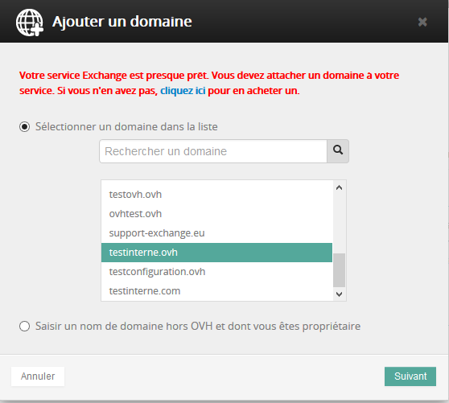
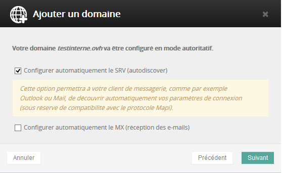
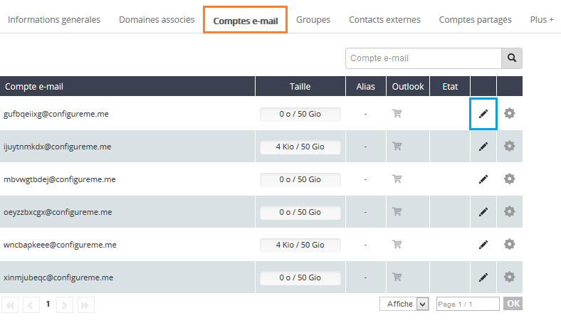

## Etapa 1: Acesso ao serviço.
Deve aceder ao seu Espaço de Cliente através deste link: [Espaço de Cliente OVH](https://www.ovh.com/manager/web/login.html)

Após ter efetuado o login, deverá aceder a esta interface:

* No nosso caso, trata-se de uma oferta Hosted

Na coluna à esquerda, na plataforma, selecione a oferta Hosted (no nosso caso, hosted-ab12345-1).

Veja as diferentes funcionalidades disponíveis:

- Informações Gerais
- Domínios associados
- Contas de e-mail
- Grupos: 
- Contactos externos
- Contas partilhadas

No segparador "Plus+":

- Recursos: 
- Assinatura automática: 
- Trabalhos recentes
- Gestão da política de segurança

{.thumbnail}

- Se deseja utilizar a sua oferta de e-mail paartilhado e a solução Exchange, tem à sua disposição o seguinte guia:

- Caso esteja a migrar uma ou várias contas de e-mail partilhado para o Exchange, consulte o seguinte guia:

## Etapa 2: Adição do domínio
Aquando da seleção da sua plataforma Exchange, será aberta um pop-up de maneira automática de forma a associar o seu domínio ao seu serviço Exchange.

Se o domínio estiver registado na OVH selecione-o na lista.

Se o domínio está registado noutro prestador, ou caso se trate de um subdomínio, queira colocá-lo manualmente.

ATENÇÃO
Se não possui nenhum nome de domínio, aparecerá no pop-up uma opção para que encomende um.

Para a configuração de um domínio externo (não alojado pela OVH), ser-lhe-á solicitado, no Espaço Cliente, a adição de um campo do tipo CNAME num subdomínio do seu domínio.

Selecione "Seguinte" para aceder à etapa seguinte.

{.thumbnail}

## Etapa 3: Configuração do domínio.
Aquando desta etapa ser-lhe-ão propostas 2 acções:

- Com os DNS OVH:

Selecione "Configurar automaticamente o SRV" se o domínio é gerido pelo mesmo identificador de cliente OVH que a sua plataforma Exchange.

o campo champ SRV serve para a configuração automática do seu software de email. Obrigatório para o Outlook 2016

Selecione a opção "Configurar automaticamente os MX". Esta ação é necessária para que receba e-mails através do seu serviço Exchange. Esta alteração implica a alteração automática dos servidores de e-mail.

- Se não desejar modificar os seus servidores de receção: deixe esta opção desmarcada, poderá depois, no separador "Domínios associados", clicar no diagnóstico MX a vermelho e valide a modificação.

{.thumbnail}

- Sem os DNS OVH :

Deverá configurar manualmente o campo SRV no seu domínio:

O SRV é composto por um subdomínio: _autodiscover._tcp.seu-dominio.com.

- Deve indicar as seguintes informações:

|A prioridade|0|
|O peso|0|
|A porta|443|
|O alvo oferta Hosted| ex.mail.ovh.net ou ex2.mail.ovh.net|
|O alvo oferta Private| Seu-nome-do-host|

Para todas as encomendas efetuadas a partir de dia 26/04/2016, o servidor MX para a coabitação Exchange e E-mails pop/imap não alojadas pela OVH, é necessário utilizar ex2.mail.ovh.net.
Se dispõe de um serviço Exchange e um serviço e-mail pop/imap alojado na OVH (MXPlan) poderá utilizar os servidores MX anti-spam Exchange em modo não autoritativo de forma a que possa beneficiar da opção Anti-Spam na totalidade das suas contas de e-mail.
Relativamente aos servidores de receção(MX), é necessário modificá-los manualmente a partir da zona DNS do seu domínio: 

|Oferta Hosted sem anti-spam (modo não autoritário)|ex.mail.ovh.net ou ex2.mail.ovh.net|

|Oferta Hosted com anti-spam (modo autoritário)|mx0.mail.ovh.net|mx1.mail.ovh.net|mx2.mail.ovh.net|mx3.mail.ovh.net|

Se escolheu a opção da configuração automática dos MX (necessário para a receção dos e-mails) e deve passar em modo não autoritário (compatibilidade com um serviço de e-mail pop/imap):

- clique no diagnóstico MX a vermelho (na secção "Domínios associados") e depois escolha o servidor de receção: ex.mail.ovh.net ou ex2.mail.ovh.net.

Serão necessárias 4-24 horas para que as modificações sejam aplicadas.

Selecione "Seguinte" e depois "Validar" para finalizar a operação.
Caso o serviço pop/imap esteja alojado na OVH poderá utilizar os mx antispam com o modo não autoritativo.
São necessárias 4 a 24 horas de forma a que as modificações sejam aplicadas>.

Selecione "Seguinte" e depois clique em "Validar" para terminar a operação.

## Etapa 3: Configuração das contas.
Selecione de seguida o separador "Conta de e-mail". As contas de e-mail são apresentadas sob a seguinte forma: gufbqeiixg@configureme.me.

Para a(s) configurar basta clicar no lápis à direita da conta.

« Se eliminar uma das suas contas de e-mail, ela reaparecerá sob a forma de uma conta virgem. Esta conta virgem será ainda sujeita à faturação.
Para eliminar definitivamente esta conta :

- Aceda ao separador "Modo de faturação"
- Selecione "Nenhuma" e "Validar"

{.thumbnail}

## Modificação da conta:
Veja a interface disponível no botão "Configuração":

Password

As passwords devem respeitar as seguintes exigências mínimas:

- Não conter toda ou parte do nome da conta de utilizador
- Dispor de no mínimo 8 caracteres
- Conter caracteres de três ou quatro categorias seguintes:

Caracteres maiúsculos do alfabeto (A a Z)
Caracteres minúsculos do alfabeto (a a z)
Números da base 10 (0 a 9)
Caracteres não alfanuméricos (por exemplo: !, $, #, %)

{.thumbnail}

## Conclusão
O seu serviço Hosted Exchange está agora configurado!

 É possível que consulte os seus e-mails através do OWA:

 ; 

Para ir mais longe consulte os diferentes [Guias Exchange 2013](https://www.ovh.pt/emails/hosted-exchange/guias/) e encontre a nossa [FAQ online](https://www.ovh.pt/emails/hosted-exchange/faq/).

