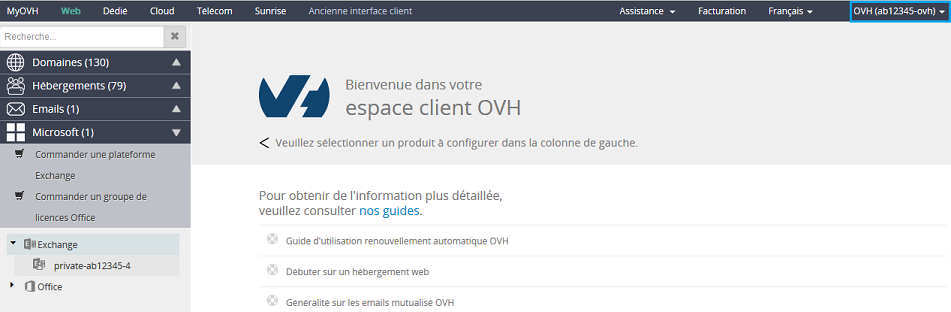
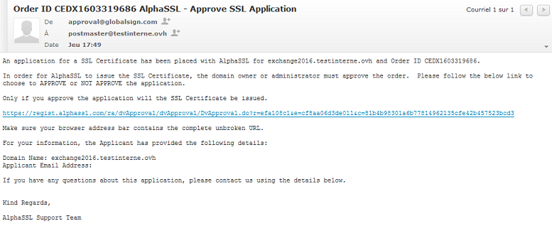
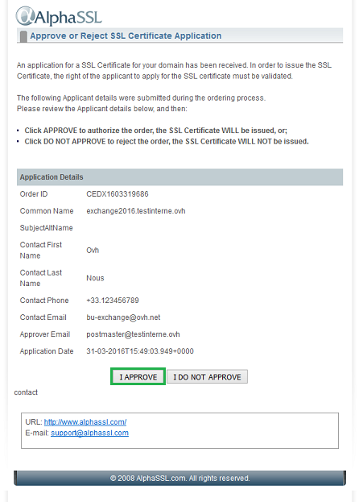

## 1. Recepción del correo de configuración del servidor
Una vez abonado el pedido, le enviaremos un mensaje de correo electrónico para que pueda instalar su servidor Private.
Recibirá este mensaje en la dirección de contacto indicada en su área de cliente (también podrá acceder directamente desde ahí).
Para ello, siga los siguientes pasos: 


- Haga clic en su ID de cliente (en la parte superior izquierda, en el ejemplo «ab12345-ovh») y seleccione «Mi cuenta».


{.thumbnail}

- Acceda a la sección «Mensajes recibidos».


{.thumbnail}
En esta sección podrá acceder al mensaje de correo para configurar el servidor Private Exchange. 

El asunto del correo es el siguiente:  

Su servicio Private Exchange 2016v1 está en proceso de entrega

{.thumbnail}
Y este será el mensaje que recibirá: 


```
OVH HISPANO S.L.U.
C/Alcalá, nº 21, 5º Dcha.
28014 Madrid
España

Estimado/a cliente:

Hemos procedido a la entrega de su solución de correo Private Exchange 2016v1. 

Sin embargo, para poder utilizar su servidor Private Exchange 2016v1, deberá ejecutar las siguientes acciones: 

- Personalizar el enlace de acceso al webmail (certificado SSL dedicado). 

- Indicar una dirección de correo de contacto para validar el certificado (atención: esta dirección de correo debe ser una dirección existente a la que ya tenga acceso). 

Para ello, haga clic en el siguiente enlace: 

https://www.ovh.es/emails/pedido/?offer=hosted&paymentType=yearly&standard=1#/identification

E identifíquese con su NIC Handle (ab12345-ovh) y contraseña. 

IMPORTANTE. Una vez que haya realizado estas dos acciones, deberá completar una última etapa: el subdominio que haya elegido debe apuntar a la IP de su servidor (le enviaremos esta dirección en un segundo mensaje de correo). 

¿Necesita ayuda?

Consulte todas nuestras guías Exchange:
https://www.ovh.es/emails/hosted-exchange/guias/

Tal y como se indica en el contrato, el servicio se renovará automáticamente en la fecha de expiración. Si no desea renovar el servicio, puede darlo de baja desde el área de cliente o a través de la API.  

Atentamente,

Atención al cliente de OVH
```


## 2. Configuración automática de la zona DNS
Al hacer clic en el enlace que se incluye en el mensaje de correo, será redirigido a la página de configuración de su servidor.

{.thumbnail}

- «Nombre de su servidor»: Indique el nombre del servidor o el enlace de acceso al webmail. Podrá elegir entre diversas opciones, por ejemplo: 

- Correo 
- Exchange 
- Exchange 2016


Una vez seleccionado el dominio, deberá indicar un dominio válido. El acceso al webmail (OWA) será, por ejemplo, el siguiente: 
exchange2016.sudominio.es
En segundo lugar, deberá seleccionar una dirección de correo electrónico en la que recibirá el mensaje de validación de su certificado SSL. Debe ser una dirección de correo válida; de lo contrario, no podrá validar su certificado SSL. 

La lista propuesta contiene direcciones de correo genéricas como: 


- postmaster@sudominio.es
- administrador@sudominio.es
- admin@sudominio.es


Si su dominio está alojado en OVH y no tiene contratado este servicio de correo, puede crear una redirección (alias) de una dirección@sudominio hacia una dirección existente desde el área de cliente. 

También puede crear una redirección de correo hacia una dirección existente.
DNS Assist: Esta opción permite la configuración automática de la zona DNS (creación de un registro de tipo ipv4 (A) en función del subdominio seleccionado).
Para ello, su dominio debe estar gestionado por el mismo identificador que el que indicó al contratar su servidor privado. En caso contrario, deberá configurar la zona DNS manualmente.
En nuestro ejemplo, hemos marcado la opción DNS Assist. A continuación, podrá validar la configuración. Si ha utilizado esta opción, no será necesario realizar los pasos de la etapa 3.


## 3. Configuración manual de la zona DNS
Si su dominio no está gestionado por el mismo ID de cliente o no está alojado en OVH, recibirá un segundo mensaje de correo con la información necesaria para modificar la zona DNS. 

Este es el mensaje que recibirá: 


```
OVH HISPANO S.L.U.
C/Alcalá, nº 21, 5º Dcha.
28014 Madrid
España

Asunto: [OVH] ¡Su servidor Exchange está casi listo!

Estimado/a cliente:

Para poder contratar el certificado SSL de su servidor, es necesario crear previamente la dirección a la que va a estar asociado dicho certificado en la zona DNS.
 
Dirección que ha elegido:  exchange2016.testinterne.ovh
IP del servidor:           149.202.xxx.103

Por favor, cree un campo de tipo A haciendo apuntar esa dirección hacia la IP indicada.

Atentamente,

Atención al cliente de OVH
```


En este caso, será necesario crear un registro de tipo A correspondiente a: 


- exchange2016.testinterne.ovh.ovh A 149.202.xxx.103


## 4. Validación del certificado SSL
Una vez que haya configurado, automática o manualmente, la zona DNS, recibirá un mensaje de correo de validación en la dirección que indicó durante el proceso de personalización del enlace de acceso al webmail.
Recibirá el mensaje de correo en un máximo de 4 horas.
Este es el mensaje que recibirá:

{.thumbnail}
A continuación, haga clic en el enlace para validar su certificado SSL.
Será redirigido a la interfaz de Global Sign para validar su certificado SSL. Haga clic en el botón «I APPROVE» para validarlo.

{.thumbnail}


## Último paso
Una vez que haya validado su certificado SSL, podrá disponer del servicio en un máximo de 4 horas. Durante las diferentes etapas, su servidor Private Exchange no estará visible en el área de cliente. 

Una vez que el servidor esté disponible, recibirá un mensaje de correo de confirmación al que podrá acceder desde el área de cliente. 

El asunto del mensaje será el siguiente: «Su servicio Private Exchange 2016 ya está disponible».

Para configurar su servicio de correo, consulte nuestra guía: [Primera configuración del servicio](https://www.ovh.es/g1311.exchange_20132016_primera_configuracion_del_servicio).

