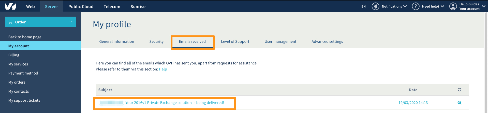

**Dernière mise à jour le 25/03/2020**

## Objectif

Vous venez d'effectuer la commande d'une plateforme Private Exchange. Ce guide détaille les étapes à réaliser pour votre première configuration.

**Découvrez comment configurer votre plateforme Private Exchange**

## Prérequis

- Avoir commandé une [offre Private Exchange OVHcloud](https://www.ovh.com/fr/emails/){.external}.
- Être connecté à [l'espace client OVHcloud](https://www.ovh.com/auth/?action=gotomanager).

## En pratique

### Étape 1 : réception de l'e-mail de configuration de votre plateforme

Une fois la commande réalisée, vous recevrez, sur l'adresse e-mail de référence de votre espace client, les informations pour configurer votre plateforme Private Exchange. 

Pour consulter cet e-mail depuis votre [espace client OVHcloud](https://www.ovh.com/auth/?action=gotomanager), cliquez sur votre profil en haut à droite puis cliquez sur `Mon compte`{.action}. Dirigez-vous sur l'onglet `Emails reçus`{.action} et recherchez l'e-mail ayant pour objet:

> **[xx-11111-ovh] Votre service Private Exchange est en cours de livraison !**

{.thumbnail}

Cet e-mail contient un lien permettant de compléter deux étapes de la configuration votre plateforme :

- personnaliser votre lien d'accès à votre webmail (certificat SSL dédié);
- renseigner l'adresse e-mail de correspondance pour valider votre certificat (attention : cette adresse e-mail doit être existante, et vous devez pouvoir y accéder).

Cliquez sur le lien présent dans l'e-mail, puis passez à [l'étape 2 ](./#etape-2-initialisation-de-votre-plateforme){.external} ci-dessous.

### Étape 2 : initialisation de votre plateforme

Après avoir cliqué sur le lien de l'e-mail à [l'étape 1 ](./#etape-1-reception-de-lemail-de-configuration-de-votre-serveur){.external}, identifiez-vous sur la page qui s'affiche.

Vous serez redirigé vers la page de configuration suivante :
{.thumbnail}

Complétez celle-ci selon les indications du tableau ci-dessous.

| Information          	| Description                                                                                                                                                                                                                             	|
|----------------------	|-----------------------------------------------------------------------------------------------------------------------------------------------------------------------------------------------------------------------------------------	|
| Nom de votre serveur 	| Dans le menu déroulant, choisissez le sous-domaine associé à votre nom de domaine.   Dans le champ libre, tapez le nom de domaine que vous souhaitez associer.                                                                   	|
| E-mail               	| Choisissez une adresse e-mail dans la liste proposée. Celle-ci servira à recevoir l'e-mail de validation du certificat SSL de votre plateforme, il est donc impératif qu'elle soit valide ou qu'elle redirige vers une adresse e-mail accessible pour le recevoir.
| DNS Assist           	| En cochant cette case vous autorisez la configuration automatique de votre zone DNS pour le nom de domaine de votre plateforme. Le domaine doit être géré sur le même compte OVHcloud que votre plateforme. Si vous ne cochez pas lq case, un e-mail avec les informations de configuration de votre zone DNS vous sera envoyé. 	|

Après validation de cette étape, un message vous indique que la configuration a bien été effectuée. Vous sont également rappelées l'adresse e-mail de validation du certificat SSL et l'adresse d'accès au webmail de votre plateforme.

### Étape 3 : configuration manuelle de la zone DNS du nom de domaine de votre plateforme

> [!primary]
>
> Cette étape est facultative si vous avez coché « **DNS Assist** » à [l'étape 2 ](./#etape-2-initialisation-de-votre-plateforme){.external}.
> 

Si votre nom de domaine n'est pas géré sur le même compte client ou non-hébergé par OVHcloud, un second e-mail vous sera envoyé et contiendra les informations nécessaires pour configurer manuellement votre zone dns.

L'e-mail contient les adresses IPv4 et IPv6 de votre plateforme. Renseignez ces adresses dans la zone DNS du sous-domaine préalablement créé à [l'étape 2 ](./#etape-2-initialisation-de-votre-plateforme){.external}, sous les formes respectives d'un enregistrement de type « A » et d'un enregistrement de type « AAAA ». Pour un nom de domaine OVHcloud, consultez notre guide [« Éditer une zone DNS »](https://docs.ovh.com/fr/domains/editer-ma-zone-dns/) pour vous aider.

### Étape 4: validation du certificat SSL

Après avoir effectué [l'étape 2 ](./#etape-2-initialisation-de-votre-plateforme){.external}, un e-mail vous est envoyé à l'adresse que vous avez choisie pour valider votre certificat SSL.

Cet e-mail vous est envoyé par l'organisme qui délivre le certificat SSL avec pour objet :

> **ORDER #1111111 - Domain Control Validation for exchange.votredomaine.com**

Copiez le code contenu dans l'e-mail et cliquez sur le lien de validation du certificat SSL.

La fenêtre ci-dessous apparaît, collez le code dans la case puis cliquez sur `Next`{.action}.

{.thumbnail}

Un message vous informe si le code renseigné est valide. Si c'est le cas, cliquez sur `Close window`{.action}.

### Finalisation

Une fois votre certificat SSL validé, un délai de 4 heures peut encore être nécessaire pour la livraison de votre service. Durant cette période, votre plateforme private Exchange n'est pas visible dans votre espace client.

Une fois votre serveur prêt et disponible, un e-mail de confirmation vous est envoyé avec pour objet :

> **[xx-11111-ovh] Votre service Private Exchange  est prêt !**

Pour ajouter votre premier nom de domaine à votre plateforme et configurer les comptes, consultez notre guide [« ajouter un nom de domaine sur son service Exchange »](https://docs.ovh.com/fr/microsoft-collaborative-solutions/ajouter-domaine-exchange/) 

## Aller plus loin

[Éditer une zone DNS](https://docs.ovh.com/fr/domains/editer-ma-zone-dns/)

[Ajouter un nom de domaine sur son service Exchange ](https://docs.ovh.com/fr/microsoft-collaborative-solutions/ajouter-domaine-exchange/) 

Échangez avec notre communauté d'utilisateurs sur <https://community.ovh.com>.
