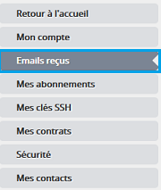
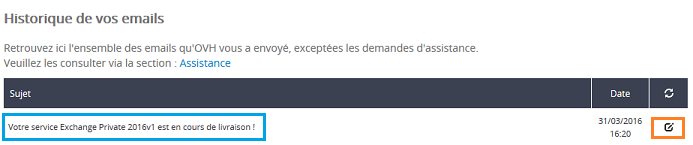
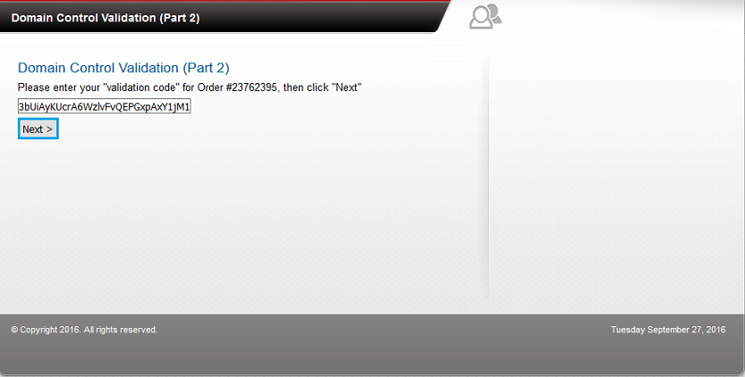

## Étape 1 &#58; reception de l'e-mail de configuration de votre serveur
Une fois votre bon de commande réglé, un e-mail vous sera envoyé pour réaliser l'installation de votre serveur "Private". L'e-mail est envoyé sur votre adresse de contact indiquée dans votre espace client, il est aussi disponible depuis celui-ci. Pour consulter cet e-mail depuis votre espace client :

- cliquez sur votre identifiant (en haut à droite, sous la forme ab12345-ovh) puis "Mon compte"


{.thumbnail}

- Emails reçus


{.thumbnail}

Vous pourrez retrouver à ce niveau l'e-mail envoyé afin de réaliser la configuration de votre serveur private Exchange :

- le sujet de l'e-mail est :


{.thumbnail}

Voici le détail du mail reçu suite à votre commande :


```None
1. SAS OVH - http://www.ovh.com
2. 2 rue Kellermann
3. BP 80157
4. 59100 Roubaix
5. 
6. Cher client,
7. 
8. Votre offre e-mail Exchange Private 2016v1 est en cours de livraison.
9. 
10. Quelques étapes sont encore nécessaires afin de pouvoir utiliser votre serveur Exchange Private 2016v1 :
11. 
12. - Personnaliser votre lien d'accès à votre webmail (certificat SSL dédié)
13. - Renseigner l'adresse e-mail de correspondance pour valider votre certificat (attention : cette adresse e-mail doit être existante, et vous devez pouvoir y accéder)
14. 
15. Pour cela veuillez cliquer sur le lien :
16. 
17. https://www.ovh.com/fr/emails/commande/?orderId=5035xxxx&orderPassword=nqiJ#/serverConfig
18. 
19. Il faudra vous authentifier à l'aide de votre NicHandle (ab12345-ovh) et mot de passe associé.
20. 
21. IMPORTANT : une fois ces deux actions réalisées, il restera une dernière étape : pointage du sous-domaine choisi vers l'IP de votre serveur (celle-ci vous sera communiquée dans un second e-mail).
22. 
23. Besoin d'aide ?
24. Découvrez tous nos guides Exchange :
25. 
26. https://www.ovh.com/fr/emails/hosted-exchange/guides
27. 
28. Cordialement,
29. 
30. Votre Service Client OVH
```


### Choix du lien d'acces au webmail (SSL dedie) et configuration de la zone dns

## Étape 2 &#58; Configuration automatique de la zone dns
Cliquez sur le lien contenu dans l'e-mail que vous avez reçu, vous serez alors redirigé vers la page de configuration de votre serveur.


{.thumbnail}

- "Nom de votre serveur" : Vous devez définir le nom de votre serveur ou encore le lien d'accès au webmail. Plusieurs choix vous seront proposés.

Exemple :

- mail
- exchange
- exchange2016

Une fois le sous domaine sélectionné, il est nécessaire d'indiquer un domaine valide. Le lien d'accès au webmail (owa) sera par exemple : exchange2016.votredomaine.fr La seconde étape consiste à choisir une adresse e-mail pour la réception du mail de validation de votre certificat SSL. Cette adresse e-mail doit être valide. Dans le cas contraire vous ne pourrez pas valider votre certificat SSL.

La liste proposée contient des adresses e-mails génériques tels que :

- [postmaster@votredomaine.fr](mailto:postmaster@votredomaine.fr){.external}
- [administrateur@votredomaine.fr](mailto:administrateur@votredomaine.fr){.external}
- [admin@votredomaine.fr](mailto:admin@votredomaine.fr){.external}


> [!success]
>
> Si votre domaine est hébergé par OVH et que vous n'avez pas ce service de
> messagerie, vous pouvez créer une redirection (Alias) d'une
> adresse@votredomaine vers une adresse existante depuis votre espace client.
> Il est aussi possible de créer une redirection e-mail vers une adresse
> existante.
> 

L'option DNS Assist : Cette option permet la configuration automatique de votre zone dns (création du champ de type ipv4 (A) en fonction du sous domaine sélectionné)


> [!alert]
>
> Il est nécessaire que votre domaine soit géré par le même identifiant que
> celui utilisé lors de la commande de votre serveur private. Dans le cas
> contraire la configuration de la zone dns est à réaliser manuellement.
> 

Dans notre exemple l'option DNS Assist a été cochée. vous pouvez ensuite valider la configuration. Si vous avez utilisé l'option DNS Assist il n'est pas nécessaire de réaliser l'étape 3.


## Étape 3 &#58; Configuration manuelle de la zone dns
Si votre domaine n'est pas géré sur le même identifiant client ou non hébergé par OVH, un second e-mail vous sera envoyé contenant les informations nécessaires pour modifier votre zone dns.

voici le contenu de l'e-mail :


```None
1. SAS OVH - http://www.ovh.com
2. 2 rue Kellermann
3. BP 80157
4. 59100 Roubaix
5. 
6. Subject: [OVH-EXCHANGE] Votre serveur exchange est presque prêt !
7. 
8. Bonjour,
9. 
10. Afin de pouvoir commander le certificat SSL de votre serveur, il est nécessaire de créer son adresse dans votre zone DNS.
11. 
12. L'adresse que vous avez choisi est : exchange2016.testinterne.ovh
13. L'IP de votre server est :           149.202.xxx.103
14. 
15. Merci de créer un enregistrement A pour celui-ci.
16. 
17. Cordialement,
18. 
19. Votre Service Client OVH
```

Il est necessaire dans ce cas de créer l'enregistrement type A correspondant à :

- exchange2016.testinterne.ovh A 149.202.xxx.103


## Étape 4 &#58; Validation de votre certificat SSL
Une fois votre zone dns configurée de manière automatique ou manuelle, vous recevrez le mail de validation sur l'adresse choisie lors de la personnalisation de votre lien d'accès au webmail. Cela peut prendre jusque 4 heures afin de recevoir ce mail. voici le contenu de l'e-mail reçu :


{.thumbnail}

Cliquez ensuite sur le  lien  afin de valider votre certificat SSL. Vous serez redirigé vers une page "ovhssl Security Services" afin de valider votre certificat SSL. Il sera necessaire de copier/coller le token reçu dans l'e-mail et de cliquer sur "Next" pour valider l'installation de votre certificat.


{.thumbnail}


## Finalisation
Une fois votre certificat SSL validé, un délai de 4 heures peut encore intervenir pour la livraison de votre service. Durant ces différentes étapes, votre serveur private Exchange n'est pas visible dans votre espace client.

Une fois votre serveur prêt et disponible, un e-mail de confirmation vous sera envoyé. Celui-ci est disponible depuis votre Manager.

Le sujet de cet e-mail est :  Votre service Private Exchange 2016 est prêt !

Pour réaliser la configuration de votre service de messagerie, suivez notre [guide de première configuration]({legacy}1311){.ref}.