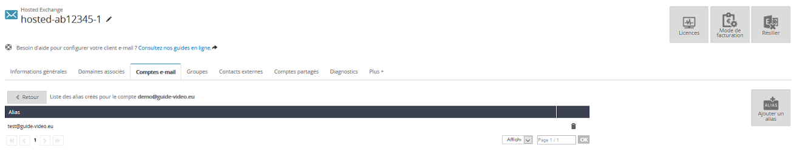
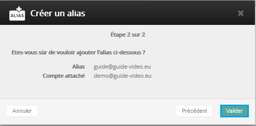
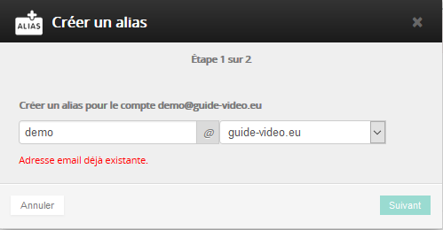

Voici comment ajouter un alias sur un e-mail avec l'offre Exchange depuis le [Manager](https://www.ovh.com/auth/?action=gotomanager&from=https://www.ovh.com/fr/&ovhSubsidiary=fr)){.external}. Vous devez vous munir de vos identifiants OVH afin de réaliser la manipulation.

Cliquez [ici](https://www.ovh.com/fr/emails/hosted-exchange/guides/){.external} pour retrouver nos différents guides.

## Mise en place des alias sur l'offre Exchange.

### Ajouter un alias &#58; Partie 1
Vous devez réaliser la manipulation depuis votre [espace client](https://www.ovh.com/auth/?action=gotomanager&from=https://www.ovh.com/fr/&ovhSubsidiary=fr)){.external}.

Une fois connecté, sélectionnez votre service Exchange.

Dans la rubrique "Compte e-mail", cliquez sur la roue crantée à droite du compte puis "Configurer les Alias"

{.thumbnail}

### Ajouter un alias &#58; Partie 2
Une nouvelle interface apparaît. Il vous est possible d'ajouter un alias ou de le supprimer. Il est aussi possible de vérifier les alias présents sur le compte e-mail.

{.thumbnail}

### Ajouter un alias &#58; Partie 3
Lors de l'ajout d'un alias, on vous demande de choisir le login de l'alias et le domaine associé.

Il suffit de valider la seconde étape en cliquant sur `Valider`{.action}.

Un message apparaît ensuite, précisant que l'alias va être ajouté.

{.thumbnail}

### Supprimer un alias.
Il vous est possible de supprimer un alias via un clic sur la corbeille à côté de celui-ci.

Vous devrez ensuite valider la demande en confirmant via un clic sur le bouton `Supprimer`{.action}.

{.thumbnail}

### Erreur classique
Voici enfin un exemple d'erreur si vous ajoutez un alias qui a pour adresse un compte e-mail Exchange existant.

Il n'est en effet pas possible d'ajouter un alias si ce compte e-mail existe déjà.

{.thumbnail}