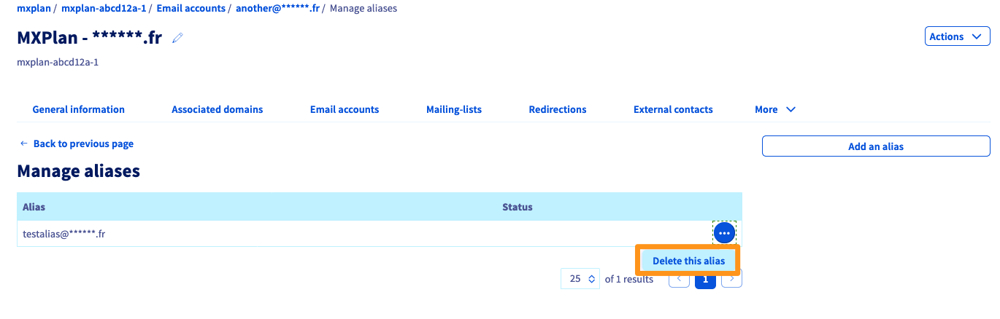

**Dernière mise à jour le 20/09/2021**

## Objectif

Créer un alias pour votre adresse e-mail vous permet de pourvoir communiquer une adresse "masque" à vos contacts sans devoir donner votre adresse email personnel à l'expéditeur. Il est possible d'attribuer plusieurs alias sur une adresse e-mail.

{.thumbnail}

Exemple: votre adresse e-mail est **john.smtih@mydomain.ovh** et votre alias **anonymous@mydomain.ovh**. Vous pouvez alors communiquer à vos contacts l'adresse **anonymous@mydomain.ovh** et recevoir sur **john.smtih@mydomain.ovh** sans que l'expéditeur est connaissance de **john.smtih@mydomain.ovh**. 

**Découvrez comment ajouter un alias sur une adresse e-mail depuis votre espace client**
 
## Prérequis

- Être connecté à votre [espace client OVHcloud](https://www.ovh.com/auth/?action=gotomanager&from=https://www.ovh.com/fr/&ovhSubsidiary=fr){.external}.
- Disposer d'une solution e-mail OVHcloud qui doit avoir été configurée au préalable. **MX Plan** (Nouvelle version), proposée parmi nos [offres d’hébergement web](https://www.ovh.com/fr/hebergement-web/)) ou commandée séparément comme solution autonome, telles que [**Hosted Exchange**](https://www.ovh.com/fr/emails/hosted-exchange/) ou [**Email Pro**](https://www.ovh.com/fr/emails/email-pro/)
 

## En pratique

### Créer un alias

Connectez-vous à votre [espace client OVHcloud](https://www.ovh.com/auth/?action=gotomanager&from=https://www.ovh.com/fr/&ovhSubsidiary=fr) et dirigez-vous dans la section `Web`. En fonction de votre Offre e-mail, dirigez -vous:

- **Exchange**: Dans `Microsoft`{.action} dans la barre de services à gauche puis sur `Exchange`{.action} et sélectionnez la plateforme concernée. Cliquez sur l'onglet `Comptes e-mail`{.action}.

- **E-mail Pro**: Dans `E-mail Pro`{.action} dans la barre de services à gauche puis cliquez sur l'onglet `Comptes e-mail`{.action}.

- **Emails**(MXplan): Dans `Emails`{.action} dans la barre de services à gauche puis cliquez sur l'onglet `Comptes e-mail`{.action}.

Dans le tableau qui s'affiche, vous observerez une colonne `Alias`.

> [!warning]
>
> Si vous avecz une offre e-mail de type MXplan et que vous n'avez pas la colonne `Alias`, vous êtes sur la version historique du MXplan. Dans ce cas, les alias se créer sous forme de redirection. N'hésitez pas à consulter notre guide [Utiliser les redirections e-mail](https://docs.ovh.com/fr/emails/guide-des-redirections-emails/#version-historique-de-loffre-mx-plan).

{.thumbnail}

Pour ajouter un alias à votre compte e-mail: 

- Cliquez sur le bouton `...`{.action} puis sur `Configurer les alias`{.action} ( ou `Gérer les alias`{.action}).

{.thumbnail}

- Cliquez sur `Ajouter un alias`{.action}, puis saisissez l'adresse que vous avez choisie pour votre alias et validez votre choix.

{.thumbnail}

### Suprimer un alias

Depuis l'onglet `Comptes e-mail`{.action}, cliquez sur le bouton `...`{.action} à droite l'adresse e-mail concernée. Cliquez sur `Configurer les alias`{.action} ( ou `Gérer les alias`{.action}).

Depuis le panneau de gestion des alias, cliquez sur le bouton `...`{.action} à droite l'alias concernée. Pour supprimer, cliquez sur `Supprimer l'alias`{.action}

{.thumbnail}

## Aller plus loin

[Consulter son compte Exchange depuis l’interface OWA](https://docs.ovh.com/fr/microsoft-collaborative-solutions/exchange-2016-guide-utilisation-outlook-web-app/)

[Règles de boîte de réception depuis l’interface OWA](https://docs.ovh.com/fr/microsoft-collaborative-solutions/regles-boite-de-reception-owa/)
 
Échangez avec notre communauté d'utilisateurs sur <https://community.ovh.com/>.