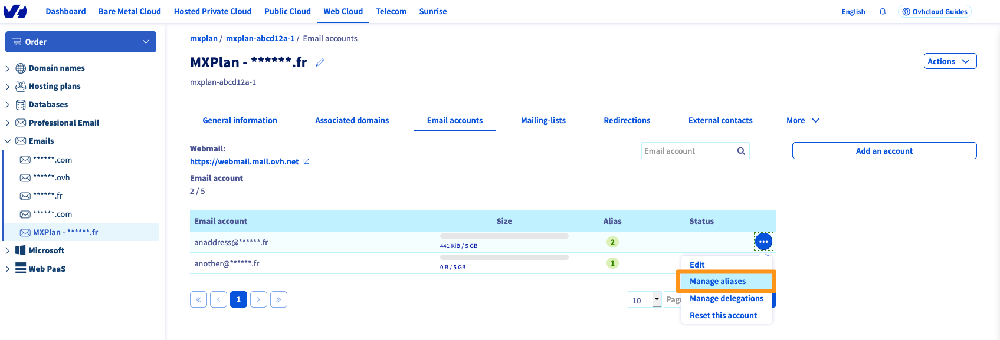

> [!primary]
> Tłumaczenie zostało wygenerowane automatycznie przez system naszego partnera SYSTRAN. W niektórych przypadkach mogą wystąpić nieprecyzyjne sformułowania, na przykład w tłumaczeniu nazw przycisków lub szczegółów technicznych. W przypadku jakichkolwiek wątpliwości zalecamy zapoznanie się z angielską/francuską wersją przewodnika. Jeśli chcesz przyczynić się do ulepszenia tłumaczenia, kliknij przycisk „Zaproponuj zmianę” na tej stronie.
>

**Ostatnia aktualizacja z dnia 20-09-2021**

## Wprowadzenie

Utworzenie aliasu dla Twojego konta e-mail pozwala na przekazanie nadawcy adresu "maska". Jeden adres e-mail może mieć kilka aliasów.

{.thumbnail}

Na przykład adres e-mail to **john.smith@mydomain.ovh** oraz alias **anonymous@mydomain.ovh**. Możesz wówczas podać do wiadomości swoich kontaktów adres **anonymous@mydomain.ovh** i otrzymywać e-maile na stronie **john.smith@mydomain.ovh** bez wiedzy nadawcy o **john.smith@mydomain.ovh**.

**Dowiedz się, jak dodać alias do konta e-mail w Panelu klienta OVHcloud**

> [!ostrzeżenie]
>
> Aliasy OVHcloud działają tylko dla przychodzących wiadomości e-mail. Nie można wysyłać wiadomości e-mail przy użyciu aliasu jako nadawcy wiadomości e-mail.
>

## Wymagania początkowe

- Dostęp do [Panelu klienta OVHcloud](https://www.ovh.com/auth/?action=gotomanager&from=https://www.ovh.pl/&ovhSubsidiary=pl).
- Posiadanie rozwiązania poczty elektronicznej OVHcloud, które musi zostać wcześniej skonfigurowane (**MX Plan** (Nowa wersja), proponowane w naszej [ofercie hostingu](https://www.ovhcloud.com/pl/web-hosting/) lub zamówione oddzielnie jako rozwiązanie autonomiczne, [**Hosted Exchange**](https://www.ovhcloud.com/pl/emails/hosted-exchange/) lub [**Email Pro**](https://www.ovhcloud.com/pl/emails/email-pro/))

## W praktyce

### Utwórz alias

Zaloguj się do [Panelu klienta OVHcloud](https://www.ovh.com/auth/?action=gotomanager&from=https://www.ovh.pl/&ovhSubsidiary=pl) i przejdź do sekcji `Web Cloud`. Następnie wybierz menu w zależności od oferty e-mail:

- **Exchange**: w `Microsoft`{.action}, następnie w `Exchange`{.action} i wybierz odpowiednią platformę. Kliknij kartę `Konta e-mail`{.action}.

- **E-mail Pro**: w `E-mail Pro`{.action}  wybierz odpowiednią platformę i kliknij zakładkę `Konta e-mail`{.action}.

- **E-maile** (MXplan): w `e-maili`{.action}  wybierz odpowiednią platformę i kliknij zakładkę `Konta e-mail`{.action}.

W tabeli, która się wyświetli znajdziesz kolumnę `Alias`.

{.thumbnail}

> [!warning]
>
> Jeśli posiadasz ofertę e-mail typu MXplan i kolumna Alias nie wyświetla się, jesteś na starej wersji oferty. W tym przypadku aliasy są tworzone w formie przekierowań. W tym celu zapoznaj się z naszym przewodnikiem "[Korzystanie z przekierowań e-mail](https://docs.ovh.com/pl/emails/hosting_www_przekierowania_e-mail/#poprzednia-wersja-uslugi-mx-plan)".
>

Aby dodać alias do konta e-mail:

- Kliknij przycisk `...`{.action} a następnie `Skonfiguruj aliasy`{.action} (lub `Zarządzaj aliasami`{.action}).

{.thumbnail}

- Kliknij `Dodaj alias`{.action}, po czym wprowadź adres, który wybrałeś dla swojego aliasu i zatwierdź wybór.

{.thumbnail}

### Usuń alias

W zakładce `Konta e-mail`{.action} kliknij przycisk `...`{.action} po prawej stronie odpowiedniego konta e-mail, a następnie `Konfiguracja aliasów`{.action} (lub `Zarządzanie aliasami`{.action}).

Kliknij przycisk `...`{.action} po prawej stronie odpowiedniego aliasu w menu zarządzania aliasami. Na koniec kliknij `Usuń alias`{.action}

{.thumbnail}

## Sprawdź również

[Sprawdź konto Exchange w interfejsie OWA](https://docs.ovh.com/pl/microsoft-collaborative-solutions/exchange_2016_przewodnik_dotyczacy_korzystania_z_outlook_web_app/)

[Reguły skrzynki odbiorczej w interfejsie OWA](https://docs.ovh.com/pl/microsoft-collaborative-solutions/tworzenie-regul-skrzynki-odbiorczej-w-owa/)

Dołącz do społeczności naszych użytkowników na stronie <https://community.ovh.com/en/>.
