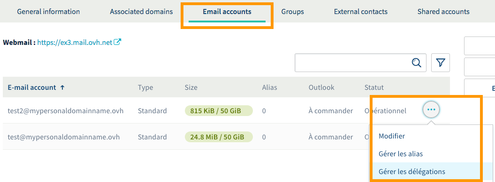
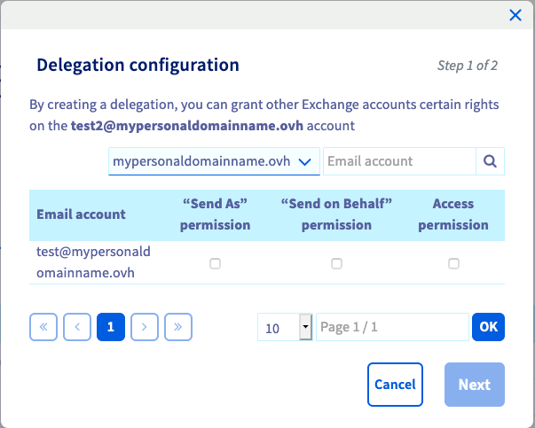
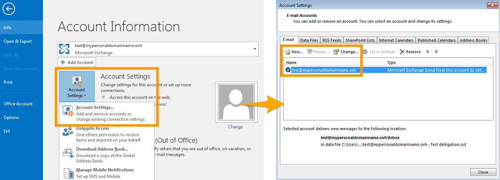
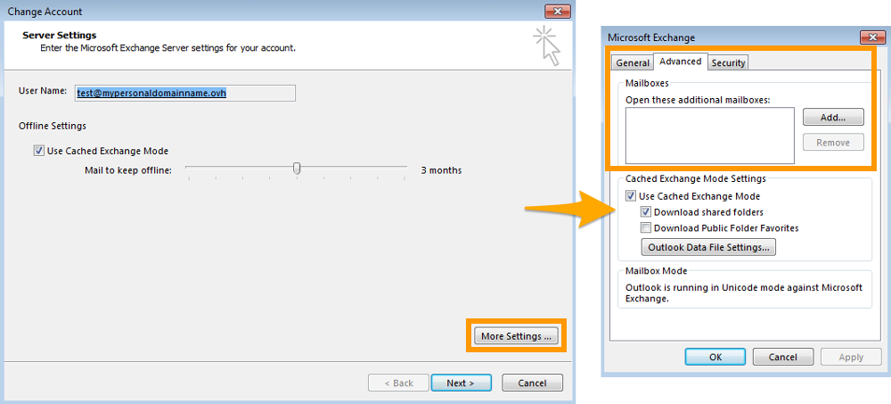

**Stand 27.11.2018**

## Einleitung

Mit Exchange verfügen Sie über professionelle E-Mail-Adressen mit erweiterten Funktionen für kollaboratives Arbeiten. Sie können unter anderem spezifische Berechtigungen (zum Beispiel Versand- oder Zugriffsrechte) zwischen verschiedenen Exchange Accounts vergeben.

**In dieser Anleitung erfahren Sie, wie Sie anderen Accounts Berechtigungen für Ihren Exchange Account zuweisen.**

## Voraussetzungen

- Sie besitzen ein [Exchange](https://www.ovh.de/emails/){.external} Angebot.
- Sie verfügen über mindestens zwei aktive Exchange Accounts, die auf derselben OVHcloud Exchange Plattform eingerichtet sind.
- Sie sind im [OVHcloud Kundencenter](https://www.ovh.com/auth/?action=gotomanager) eingeloggt.
- Sie verfügen über die Login-Informationen für den Exchange Account, dem Sie neue Berechtigungen zuweisen möchten.

## In der praktischen Anwendung

Legen Sie zunächst fest, welche Berechtigungen Sie vergeben möchten. Zur Erinnerung: Bei einer Delegation übertragen Sie einem oder mehreren Exchange Accounts zusätzliche Rechte für einen ausgewählten Exchange Account.

|Berechtigungen|Beschreibung|
|---|---|
|„Senden als“|Erlaubt dem Benutzer, Nachrichten von einem anderen Account aus zu versenden. Nicht der Benutzer, der die E-Mail versendet, wird als Absender angezeigt, sondern der Account, für den dieser die „Senden als“-Berechtigung hat. Der Empfänger kann nicht erkennen, dass die Nachricht von einem anderen Account aus versandt wurde.|
|„Senden im Auftrag von“|Erlaubt dem Benutzer, Nachrichten von einem anderen Account aus zu versenden. Nicht der Benutzer, der die E-Mail versendet, wird als Absender angezeigt, sondern der Account, für den dieser die „Senden im Auftrag von“-Berechtigung hat. Im Gegensatz zur „Senden als“-Berechtigung wird in diesem Fall eine Anmerkung hinzugefügt, dass die Nachricht von einem anderen Benutzer im Auftrag des angezeigten Accounts versandt wurde.|
|Zugangsrechte|Mit dieser Berechtigung vergeben Sie für den betreffenden Account reine Leserechte. Nachrichten können nicht versandt werden. Es ist nur möglich, Inhalte zu lesen.|

> [!warning]
>
> Sie können nicht gleichzeitig „Senden als“- und „Senden im Auftrag von“-Berechtigungen vergeben. Andere Kombinationen sind jedoch möglich.
> 

Wählen Sie zunächst den Account aus, für den Sie Berechtigungen vergeben möchten. Bestimmen Sie dann die entsprechenden Rechte sowie den oder die Accounts, die zusätzliche Berechtigungen erhalten sollen. Folgen Sie nun Schritt 1 der vorliegenden Anleitung.

### Schritt 1: Delegation einrichten

Loggen Sie sich zunächst in Ihrem [OVHcloud Kundencenter](https://www.ovh.com/auth/?action=gotomanager){.external} ein. Klicken Sie links im Menü auf `Microsoft`{.action} und dann auf `Exchange`{.action}. Klicken Sie dann auf den Namen des Exchange Dienstes, in dem sich der Account befindet, für den Sie Rechte vergeben möchten. Gehen Sie nun auf den Tab `E-Mail-Accounts`{.action}.

Die Tabelle zeigt alle Accounts an, die mit Ihrem Exchange Dienst verbunden sind. Klicken Sie auf die drei Punkte rechts neben dem Account, für den Sie Berechtigungen vergeben möchten, und gehen Sie dann auf `Berechtigungen verwalten`{.action}.

{.thumbnail}

Wählen Sie im angezeigten Fenster die Berechtigungen aus, die Sie übertragen möchten. Weisen Sie die Rechte einem oder mehreren Accounts zu. Klicken Sie anschließend auf `Weiter`{.action}.

{.thumbnail}

Überprüfen Sie die Änderungen in der Übersicht und klicken Sie anschließend auf `Bestätigen`{.action}. Innerhalb weniger Minuten wird die Delegation auf unseren Servern eingerichtet.

Sobald die Delegation konfiguriert ist, kann *test@mypersonaldomain.ovh* die ausgewählten Berechtigungen für* test2@mypersonaldomain.ovh* nutzen und die entsprechenden Aktionen ausführen (siehe Grafik).

### Schritt 2: Berechtigungen nutzen

Nun, da die Delegation eingerichtet ist, können Sie die vergebenen Berechtigungen nutzen. Vergewissern Sie sich zunächst, dass Sie über die Login-Informationen für den Exchange Account verfügen, der die neuen Berechtigungen erhalten hat.

Die Vorgehensweise für die Nutzung variiert je nach den vergebenen Rechten und der Software bzw. dem Webinterface, das Sie für den Zugang zu Ihrem Exchange Account verwenden. Folgen Sie dieser Anleitung deshalb entsprechend der Berechtigungen, die Sie vergeben haben.

- [Zugangsrechte nutzen](https://docs.ovh.com/de/microsoft-collaborative-solutions/exchange_2013_send_as_versand_als/#21-zugangsrechte-nutzen){.external}

- [„Senden als“-Berechtigung nutzen](https://docs.ovh.com/de/microsoft-collaborative-solutions/exchange_2013_send_as_versand_als/#22-senden-als-berechtigung-nutzen){.external}

- [„Senden im Auftrag von“-Berechtigung nutzen](https://docs.ovh.com/de/microsoft-collaborative-solutions/exchange_2013_send_as_versand_als/#23-senden-im-auftrag-von-berechtigung-nutzen){.external}

> [!warning]
>
> Für die nachstehenden Aktionen sind Kenntnisse über die von Ihnen verwendete Software bzw. das Interface erforderlich. Im Folgenden haben wir einige Informationen zur Vorgehensweise zusammengetragen. Dennoch empfehlen wir Ihnen, falls Sie Hilfe brauchen, einen spezialisierten Dienstleister und/oder den Herausgeber der Software oder des Interface zu kontaktieren. Leider können wir Ihnen für externe Dienstleistungen keine weitergehende Unterstützung anbieten.
>

#### 2.1 Zugangsrechte nutzen

- **Über die Outlook Web Application (OWA)**

Gehen Sie auf <https://www.ovh.de/mail/> und geben Sie die Login-Informationen des Exchange Accounts ein, der die Berechtigungen erhalten hat. Wenn Sie eingeloggt sind, klicken Sie links im Menü auf den betreffenden Account und wählen Sie `Freigegebenen Ordner hinzufügen`{.action}.

Geben Sie im angezeigten Fenster den Namen des Accounts ein, für den Sie Zugangsrechte erhalten haben, und klicken Sie dann auf `Hinzufügen`{.action}. Der neue Account erscheint dann links im Menü und Sie können die Inhalte einsehen.

{.thumbnail}

- **Über Outlook für Windows**

Öffnen Sie Outlook 2016 und klicken Sie oben im Menü auf `Datei`{.action} und dann auf `Kontoeinstellungen`{.action}. Wählen Sie im Drop-down-Menü erneut `Kontoeinstellungen`{.action} aus. Wählen Sie im angezeigten Fenster den Account mit zugewiesenen Berechtigungen aus und klicken Sie dann auf `Ändern`{.action}. 

{.thumbnail}

Klicken Sie nun auf `Weitere Einstellungen`{.action}. Gehen Sie im neuen Fenster auf den Tab `Erweitert`{.action} und dann auf `Hinzufügen`{.action}. Geben Sie den Namen des Accounts ein, für den Sie die Berechtigungen erhalten haben, und bestätigen Sie die Änderung. Der neue Account erscheint dann links im Menü von Outlook und Sie können die Inhalte einsehen.

{.thumbnail}

#### 2.2 „Senden als“-Berechtigung nutzen

- **Über die Outlook Web Application (OWA)**

Gehen Sie auf <https://www.ovh.de/mail/> und geben Sie die Login-Informationen des Exchange Accounts ein, der die Berechtigungen erhalten hat. Wenn Sie eingeloggt sind, klicken Sie auf den Button `+ Neu`{.action}, um eine neue Nachricht zu verfassen.

Klicken Sie im angezeigten Bereich oben rechts auf die drei Punkte und dann auf `Absender anzeigen`{.action}. Klicken Sie danach auf den Button `Von`{.action} und wählen Sie die Adresse aus, die als Absender erscheinen soll (d. h. die Adresse, für die Ihnen die Berechtigung übertragen wurde). Wird diese nicht angezeigt, löschen Sie die vorausgefüllte Adresse und geben Sie die gewünschte Adresse ein. 

Verfassen Sie nun Ihre Nachricht und versenden Sie diese. 

{.thumbnail}

- **Über Outlook für Windows**

Öffnen Sie Outlook 2016 und beginnen Sie eine neue Nachricht. Vergewissern Sie sich, dass der Button `Von`{.action} im geöffneten Fenster angezeigt wird. Ist das nicht der Fall, gehen Sie oben im Menü auf den Tab `Optionen`{.action} und klicken Sie dann bei `Felder anzeigen`{.action} auf `Von`{.action}.

Klicken Sie danach auf den Button `Von`{.action} und wählen Sie die Adresse aus, die als Absender erscheinen soll (d. h. die Adresse, für die Ihnen die Berechtigung übertragen wurde). Wird diese nicht angezeigt, klicken Sie auf `Weitere E-Mail-Adresse`{.action}, geben Sie die gewünschte Adresse ein und bestätigen Sie diese. 

Verfassen Sie nun Ihre Nachricht und versenden Sie diese. 

{.thumbnail}

#### 2.3 „Senden im Auftrag von“-Berechtigung nutzen

- **Über die Outlook Web Application (OWA)**

Gehen Sie auf <https://www.ovh.de/mail/> und geben Sie die Login-Informationen des Exchange Accounts ein, der die Berechtigungen erhalten hat. Wenn Sie eingeloggt sind, klicken Sie auf den Button `+ Neu`{.action}, um eine neue Nachricht zu verfassen.

Klicken Sie im angezeigten Bereich oben rechts auf die drei Punkte und dann auf `Absender anzeigen`{.action}. Klicken Sie danach auf den Button `Von`{.action} und wählen Sie die Adresse aus, die als Absender erscheinen soll (d. h. die Adresse, für die Ihnen die Berechtigung übertragen wurde). Wird diese nicht angezeigt, löschen Sie die vorausgefüllte Adresse und geben Sie die gewünschte Adresse ein. 

Verfassen Sie nun Ihre Nachricht und versenden Sie diese. 

{.thumbnail}

- **Über Outlook für Windows**

Öffnen Sie Outlook 2016 und beginnen Sie eine neue Nachricht. Vergewissern Sie sich, dass der Button `Von`{.action} im geöffneten Fenster angezeigt wird. Ist das nicht der Fall, gehen Sie oben im Menü auf den Tab `Optionen`{.action} und klicken Sie dann bei `Felder anzeigen`{.action} auf `Von`{.action}.

Klicken Sie danach auf den Button `Von`{.action} und wählen Sie die Adresse aus, die als Absender erscheinen soll (d. h. die Adresse, für die Ihnen die Berechtigung übertragen wurde). Wird diese nicht angezeigt, klicken Sie auf `Weitere E-Mail-Adresse`{.action}, geben Sie die gewünschte Adresse ein und bestätigen Sie diese. 

Verfassen Sie nun Ihre Nachricht und versenden Sie diese. 

{.thumbnail}

## Weiterführende Informationen

Für den Austausch mit unserer User Community gehen Sie auf <https://community.ovh.com/en/>.