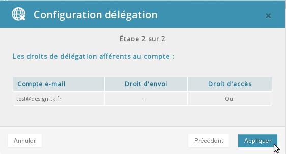
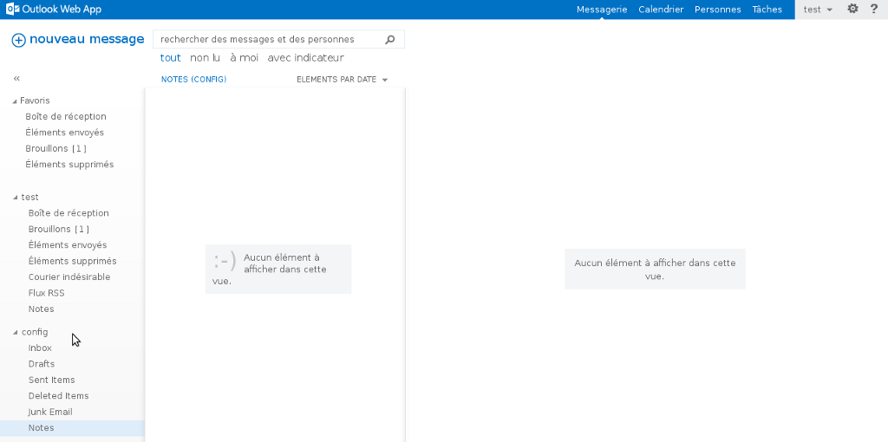

## Implementação das permissões "Full Access" Parte 1:
Deverá realizar a operação a parir da interface [Manager](https://www.ovh.com/auth/?action=gotomanager&from=https://www.ovh.pt/&ovhSubsidiary=pt)).

Uma vez ligado, selecione o seu serviço Exchange.

Na secção Conta de email, clique no ícone formado por 3 pontos.

Selecione "Gerir as delegações".

{.thumbnail}

## Implementação das permissões "Full Access" Parte 2:
Uma nova interface será apresentada.

Poderá aqui escolher para a conta selecionada atribuir permissões "full access", bem como "direito de envio".

Clique de seguia em "Seguinte"

{.thumbnail}

## Implementação das permissões "Full Access" Parte 3:
Eis o aspeto da interface que será apresentada. Deva validar aí as suas ações.

Aguarde alguns minutos até que as alterações sejam efetivas.

Valide as operações através de um clique em "Aplicar"

{.thumbnail}

## Implementação através da interface OWA Parte 1:
Agora deverá verificar que a conta de email "test" tem a possibilidade de ver a conta de email "config".

Se deseja poder visualizar tudo na mesma interface

Deverá fazer clique na sua conta de email e depois selecionar "adicionar uma pasta partilhada"

{.thumbnail}

## Implementação através da interface OWA Parte 2:
Adicione a caixa de email "config", clique de seguida em "adicionar".

{.thumbnail}

## Implementação através da interface OWA Parte 3:
A conta de email "config" aparecerá agora corretamente na interface [Webmail Exchange](https://ex.mail.ovh.net/owa).

{.thumbnail}

