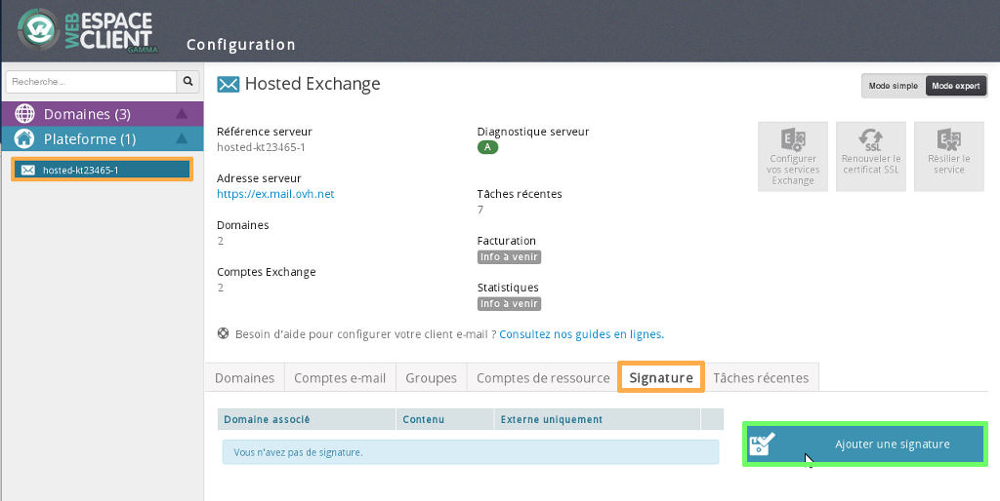
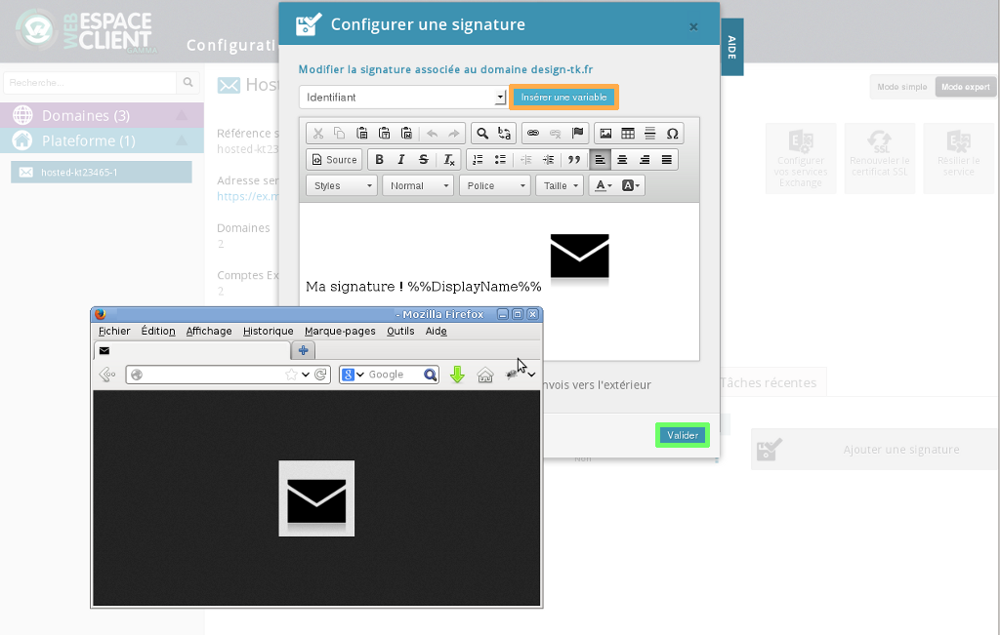
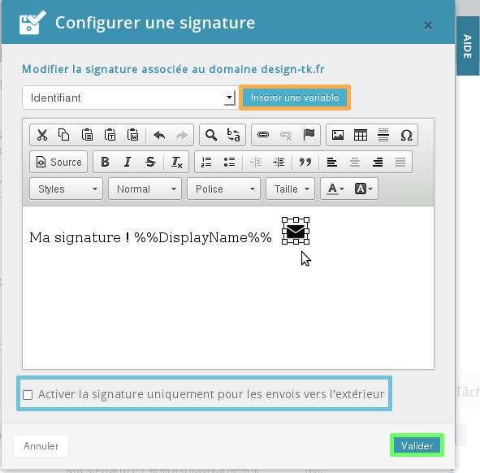
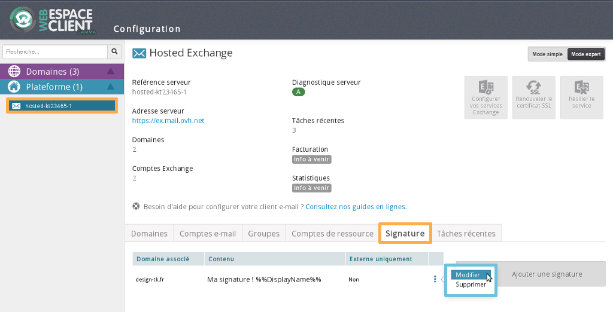

## Step 1: Setup
To create your email signature, log in to your [OVH Control Panel](https://www.ovh.com/manager/web/login.html). 

Under "Exchange", select your Exchange platform.

Select "Advanced Mode" in the top right-hand corner. 

Click on the "Signature" tab and then "Add a signature".

{.thumbnail}

## Step 2: Setup
Use the available tools to customise and format your signature.

You can also customise the generic signature with each user's contact details using variables.

To insert an image or logo, click the "image" button and enter the image or logo's URL.

To do this more quickly, you can also drag and drop the image or logo from your browser to the signature tool.

{.thumbnail}

## Step 3: Setup
You will then be able to resize the image as you wish. 

You can activate the signature only for outgoing emails (to an email address not linked to your domain) by ticking the relevant box.

Click "Confirm" to save your signature.

It will be added to all the emails sent from the domain name you've chosen.

{.thumbnail}

## Step 4: Setup
Once you have created your signature, it will appear in the Web Control Panel.

Here you can modify or delete it.

You will have access to general information about your signature.

{.thumbnail}

## Step 1: Add signature to an email
Here's how to add your signature to an email via [Exchange Webmail](https://ex.mail.ovh.net/owa/).

Log in with your full email address and password.

Then click on "Mail" and select "new mail" in the top left-hand corner.

Write your email. To add your signature, click "Insert" then "Signature".

The signature won't appear in the message body. This is normal.

Complete your email by clicking "Send".

{.thumbnail}

## Step 2: Add signature to an email
The email has been received and the signature is correctly displayed.

{.thumbnail}

