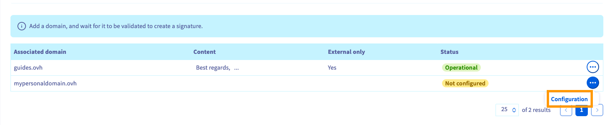
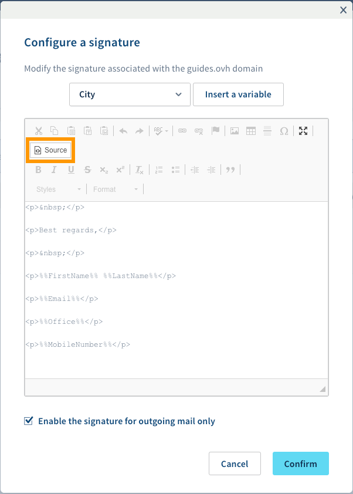
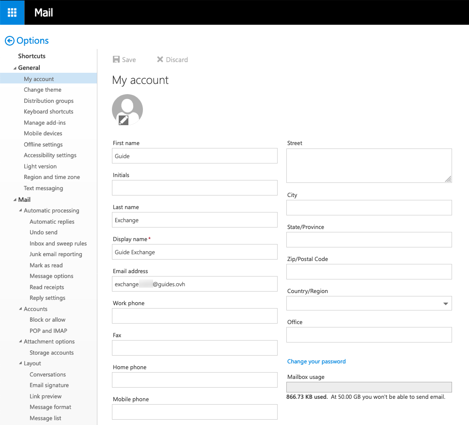

**Last updated 26th March 2020**

## Step 1: Setup

To create your email signature, log in to your [OVH Control Panel](https://www.ovh.com/manager/web/login.html). 

## Objective

In the OVHcloud Control Panel, you can create universal signatures (footers) for email addresses using the same domain ("corporate" signature). They will be attached automatically to emails sent from a user's account.

**This guide explains how to create an automatic signature using the OVHcloud Control Panel.**

> [!primary]
>
> Although this guide will refer to our Exchange services, you can follow the instructions for Email Pro accounts as well.
>

## Step 2: Setup

Use the available tools to customise and format your signature.

- access to the [OVHcloud Control Panel](https://www.ovh.com/auth/?action=gotomanager)
- an [OVHcloud Exchange](https://www.ovh.co.uk/emails/hosted-exchange) or [Email Pro](https://www.ovh.co.uk/emails/email-pro) solution already set up

## Instructions

First, log in to your [OVHcloud Control Panel](https://www.ovh.com/auth/?action=gotomanager), navigate to the "Web" section, and select your Exchange service from the column under `Microsoft`{.action} `Exchange`{.action} on the left-hand side. Click on the `More+`{.action} tab in the horizontal menu and select `Footers`{.action}.

## Step 3: Setup

You will then be able to resize the image as you wish. 

In this section you will see your attached domains, for each of which you can create a footer scheme. Click on `...`{.action} and then on `Configuration`{.action} to open the HTML editor.

{.thumbnail}

The editor offers a selection of variables that correspond to the user's data in their account settings. You can, for example, compose a generic closing message and add an appropriate sign-off or some contact information below it, using the variables. Click on the down-arrow to select a variable, then click `Insert a variable`{.action} to add it into the editing pane.

{.thumbnail}

The footer is created using HTML tags, which allow for some formatting options. Use the tool bar on the top to customise the signature. You can also verify the HTML code by clicking on `Source`{.action}.
 
{.thumbnail}

## Step 4: Setup

Once you have created your signature, it will appear in the Web Control Panel.

Please take the following specifics into consideration before applying signatures for users:

- Apart from "First name", "Surname", and "Display name", the account details cannot be edited from the OVHcloud Control Panel but need to be specified in the user's OWA ("Options", "General", "My account").

{.thumbnail}

- The signature will be added to the email's body without gap, meaning it is advisable to begin the signature with at least one empty line.
- It is not indicated in OWA whether a footer is enabled on this domain. If users add their [own signatures](../exchange_2016_outlook_web_app_user_guide/#adding-a-signature), emails will include both the individual and the domain-wide footer.
- The editor supports HTML formatting, hyperlinks, images, etc. However, signatures should not rely on these options too heavily. Recipients may use email clients that prevent HTML and embedded images, or the signatures will appear in a different way than intended. Note that HTML tags will be completely removed if a message is sent as "Plain text" from OWA.
- "Initials" are not active on the service. Adding this variable will have no effect.

## Step 1: Add signature to an email

Here's how to add your signature to an email via [Exchange Webmail](https://www.ovh.co.uk/mail/).

[Using the Outlook Web App with an Exchange account](../exchange_2016_outlook_web_app_user_guide)

[Delegating permissions on an Exchange account](../exchange_2013_how_to_grant_full_access_permissions_for_an_account)

[How to share calendars via OWA](../exchange_2016_how_to_share_calendars_via_owa)

Join our community of users on <https://community.ovh.com/en/>.
