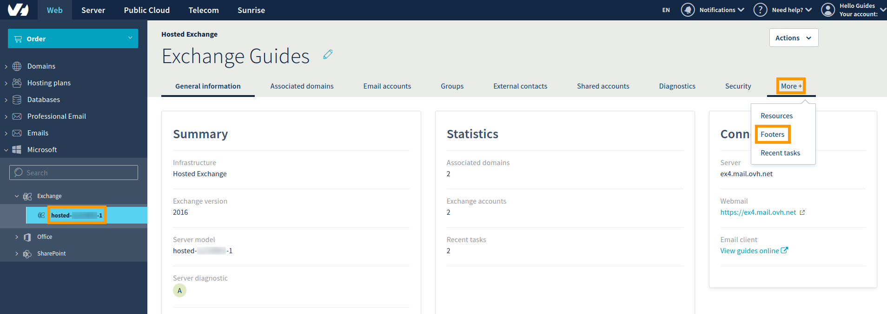

**Dernière mise à jour le 26/03/2020**

## Objectif

Dans votre espace client OVHcloud, vous pouvez créer des signatures universelles (pieds de page) pour les adresses e-mail utilisant le même domaine (signature « d’entreprise »). Elles apparaîtront automatiquement dans les e-mails envoyés depuis le compte d'un utilisateur.

**Découvrez comment créer une signature automatique depuis l’espace client OVHcloud.**

## Prérequis

- Être connecté à votre [espace client OVHcloud](https://ca.ovh.com/auth/?action=gotomanager&from=https://www.ovh.com/ca/fr/&ovhSubsidiary=qc)
- Avoir souscrit une offre [Exchange OVHcloud](https://www.ovhcloud.com/fr-ca/emails/hosted-exchange/) 

## En pratique

Connectez-vous  à votre [espace client OVHcloud ](https://ca.ovh.com/auth/?action=gotomanager&from=https://www.ovh.com/ca/fr/&ovhSubsidiary=qc). Accédez à la section `Webcloud`{.action} et sélectionnez votre service Exchange dans la colonne figurant sous `Microsoft`{.action} puis `Exchange`{.action}. Cliquez sur l’onglet `Plus+`{.action} dans le menu horizontal et sélectionnez `Pieds de page`{.action}.

{.thumbnail}

Dans cette section se trouvent vos domaines rattachés, pour chacun desquels vous pouvez créer un modèle de pied de page. Cliquez sur `...`{.action} puis sur `Configuration`{.action} pour ouvrir l’éditeur HTML.

{.thumbnail}

L'éditeur propose une sélection de variables qui correspondent aux données de l'utilisateur selon les paramètres de son compte. Vous pouvez, par exemple, rédiger un message de fin générique et ajouter une signature adaptée ou des informations de contact grâce aux variables. Cliquez sur la flèche vers le bas pour sélectionner une variable, puis cliquez sur `Insérer une variable`{.action} pour l'ajouter dans le volet d'édition.

{.thumbnail}

Le pied de page est créé à l'aide de balises HTML, qui permettent certaines options de formatage. Utilisez la barre d'outils en haut pour personnaliser votre signature. Vous pouvez également vérifier le code HTML en cliquant sur `Source`{.action}.
 
{.thumbnail}

Cochez la case « Activer la signature pour le courrier sortant uniquement » pour éviter d'ajouter ce pied de page aux e-mails envoyés entre utilisateurs d'un même domaine. Cliquez sur `Confirmer`{.action} une fois votre signature terminée. Elle apparaîtra désormais dans les e-mails envoyés à partir des comptes d'utilisateurs de ce domaine. Vous pouvez modifier ou supprimer des signatures dans votre espace client OVHcloud après leur création.

Veillez à prendre en considération les spécificités suivantes avant de créer des signatures pour les utilisateurs :

- En dehors des « Prénom », « Nom » et « Nom d'affichage », les informations du compte ne peuvent pas être éditées à partir de l’espace client OVHcloud et doivent donc être spécifiées dans l'OWA de l'utilisateur (« Options », « Général », « Mon compte »).

{.thumbnail}

- La signature sera ajoutée au corps de l’e-mail sans espace, il est donc conseillé de commencer la signature par au moins une ligne vide.
- Dans OWA, il n'est pas indiqué si un pied de page est activé sur ce domaine et il n'y a **pas de synchronisation**. Si les utilisateurs ajoutent [leurs propres signatures](../exchange-2016-guide-utilisation-outlook-web-app/#ajouter-une-signature), les e-mails comprendront à la fois le pied de page individuel et celui de l'ensemble du domaine.
- L'éditeur prend en charge le formatage HTML, les hyperliens, les images, etc. Toutefois, les signatures ne devraient pas trop s'appuyer sur ces options. Les destinataires peuvent utiliser des clients de messagerie électronique qui empêchent le HTML et les images intégrées, les signatures apparaîtront alors d'une manière différente de celle prévue. Attention : les balises HTML seront complètement supprimées si un message est envoyé en « texte brut » depuis OWA.
- Les « initiales » ne sont pas actives sur ce service. Ajouter cette variable n’aura donc aucun effet.

## Aller plus loin

[Consulter son compte Exchange depuis l’interface OWA](../exchange-2016-guide-utilisation-outlook-web-app/)

[Déléguer des permissions sur un compte Exchange](../exchange-donner-les-droits-full-access-sur-un-compte/)

[Partager un calendrier via le webmail OWA](../exchange-2016-partager-un-calendrier-via-le-webmail-owa/)

Échangez avec notre communauté d'utilisateurs sur <https://community.ovh.com/>.
