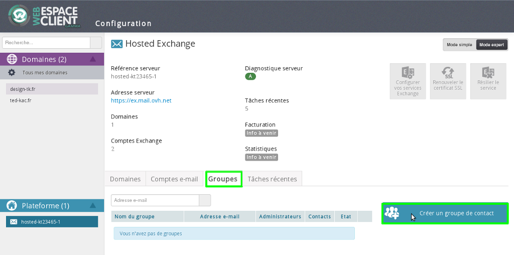
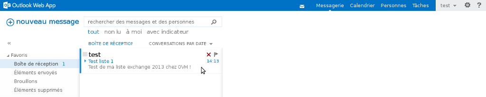

## Step 1: Setup via the Web Control Panel
First log in to your [Customer account](https://www.ovh.com/manager/web/login.html).

Then select your Exchange service by clicking on it in the left-hand column under "Exchange".

Click on the "Groups" tab, and then "Create a contact group" on the right.

{.thumbnail}

## Step 2: Setup via the Web Control Panel
A new window will open. Please enter the following information:

"Email address": the email address that will send messages to the mailing list. Please note: you cannot enter an existing email address.

"Name of group": the display name that appears in your [Web Control Panel](https://www.ovh.com/manager/web/login.html) and in [OVH webmail](https://ex.mail.ovh.net/owa/).

"Max size incoming": you can specify the size of attachments for incoming and outgoing emails.

"Manage subscribers": specifies the security level of access to the group.
Open: anyone can subscribe to the group.
Moderate: an administrator validates the subscription.
Closed: the administrator subscribes group members to the list.
The same applies for "Manage un-subscribers"

"Hide in Outlook": if this box is ticked, the group address will not appear in the Exchange service list of addresses.

"Authentication required": if this box is ticked, only group members will be able to send a message using the group address.

Click on "Next" to continue.

{.thumbnail}

## Step 3: Setup via the Web Control Panel
Simply follow these two steps:

Firstly, define your subscribers and who will be the "Administrators" and "Contacts".
Please note: only the email addresses entered as "Contacts" will receive the emails sent to the mailing list.
Click "Next" to continue.

Secondly, finalise your choices by clicking "Confirm".

{.thumbnail}

## Step 4: Setup via the Web Control Panel
Your group will appear in the [Web Control Panel](https://www.ovh.com/manager/web/login.html) within minutes.

You can adjust the settings of your groups using the various icons that appear on the left.

{.thumbnail}

## Step 1: Example of usage in OWA
You can now test your mailing list via [OVH webmail](https://ex.mail.ovh.net/owa/).

Simply send an email to the group address.

{.thumbnail}

## Step 2: Example of usage in OWA
Your email should be correctly sent.

{.thumbnail}

