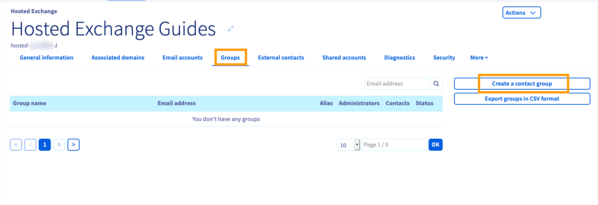
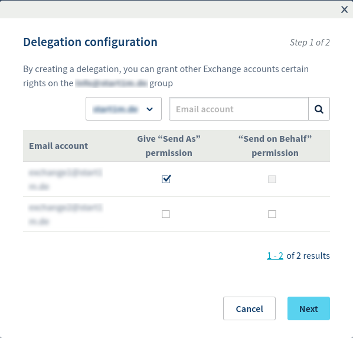
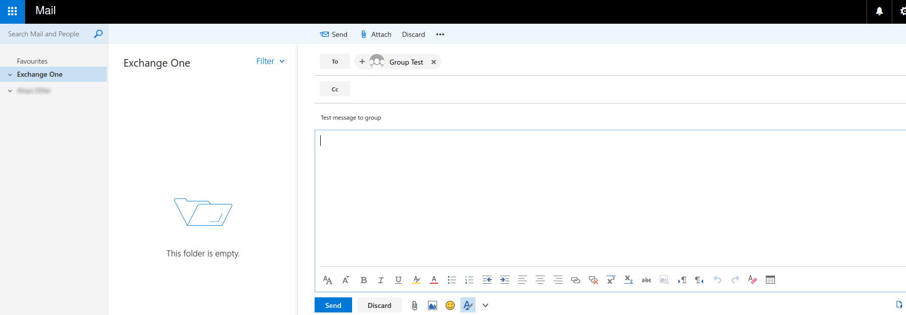

**Dernière mise à jour le 26/02/2020**

## Objectif

Grâce aux groupes Exchange, de nombreux participants peuvent communiquer par envoi d’ e-mails à une seule adresse, celle du groupe.  Cette fonction collaborative vous permet de créer et gérer des listes de diffusion constituées aussi bien d’utilisateurs d’Exchange que de contacts externes.

**Ce guide va vous expliquer comment utiliser les groupes Exchange via l’espace client OVHcloud et le service Outlook Web App (OWA).**

## Prérequis

- Etre connecté à votre [espace client OVHcloud](https://www.ovh.com/auth/?action=gotomanager)
- Avoir installé une [solution OVHcloud Exchange](https://www.ovh.com/fr/emails/hosted-exchange/) 

## Instructions

### Étape 1 : Créez un nouveau groupe

Connectez-vous d’abord à votre [espace client OVHcloud ](https://www.ovh.com/auth/?action=gotomanager). Accédez à la section « Web » et sélectionnez votre service Exchange à partir de la colonne figurant sous `Microsoft`{.action} `Exchange`{.action} située sur le coté gauche. Cliquez sur l'onglet `Groupes`{.action} dans le menu horizontal.

{.thumbnail}

Cliquez sur `Créer un groupe de contacts`{.action} afin d’ouvrir une nouvelle fenêtre à partir de laquelle vous pourrez définir les paramètres du groupe :

{.thumbnail}

|Nom|Description|
|---|---|
|Adresse e-mail|Une nouvelle adresse pour envoyer des messages à la liste de diffusion. Veuillez à ne pas utiliser une adresse déjà fonctionnelle. |
|Nom du Groupe|Utilisez le nom apparaissant dans votre [ espace client OVHcloud](https://www.ovh.com/auth/?action=gotomanager) et dans votre [messagerie Web d’ OVHcloud](https://www.ovh.com/fr/mail/) (OWA).|
|Taille maximale d’entrée ou de sortie|Vous pouvez spécifier la taille maximale des e-mails entrants et des e-mails sortants.|
|Masquer dans Outlook|Lorsque cette case est cochée, l’adresse du groupe ne s’affichera pas dans la liste des adresses du service Exchange.|
|Authentication requise|Lorsque cette case est cochée, seuls les utilisateurs de la même plate-forme pourront envoyer des messages avec l’adresse du groupe.|

> [!primary]
>
Veuillez remarquer que pour des raisons de sécurité, les administrateurs ont désactivé les options « Gérer les abonnés » et « Gérer les désabonnés ». Nous nous excusons des désagréments.
>

Cliquez sur `Suivant`{.action} pour continuer.

Sur la deuxième page, sélectionnez les membres du groupe et désignez les « Administrateurs ». Ces choix se feront uniquement parmi les adresses e-mail et les contacts externes déjà répertoriés dans le service.

{.thumbnail}

Veuillez noter que les administrateurs doivent être configurés en tant que « Contacts » afin de recevoir les e-mails du groupe. 
Cliquez sur `Suivant`{.action} pour continuer et cliquez sur `Confirmer`{.action} pour finaliser vos choix.

### Étape 2 : Gérez les groupes

Votre groupe nouvellement créé sera opérationnel en quelques minutes. Vous pouvez modifier les paramètres décrits plus haut à  partir de la liste du groupe. Pour cela, cliquez sur`...`{.action} et sélectionnez le paramètre à modifier dans le menu.

{.thumbnail}

De plus, l’option `Gérer les délégations`{.action} du menu s’affichera. Cette option vous permet de déléguer l’accès de la même manière qu’on le fait pour un compte Exchange. Veuillez retrouver tous les détails dans [ce guide](https://docs.ovh.com/fr/microsoft-collaborative-solutions/exchange-donner-les-droits-full-access-sur-un-compte/).

{.thumbnail}

> [!primary]
>
Veuillez noter que chaque modification à ce service peut prendre quelques minutes pour être appliquée. Vous pouvez vérifier l’état de la plupart des opérations en sélectionnant les options `Plus`{.action} et `Taches récentes`{.action} à partir du menu horizontal.
>

### Étape 3 : Ecrivez à un groupe via OWA

Vous pouvez déjà  tester votre liste de diffusion via [la messagerie Web d ’OVHcloud](https://www.ovh.com/fr/mail/) (OWA)! Il suffit d’envoyer un e-mail à l’adresse du groupe.

{.thumbnail}

## Aller plus loin

[Déléguer des permissions sur un compte Exchange](https://docs.ovh.com/fr/microsoft-collaborative-solutions/exchange-donner-les-droits-full-access-sur-un-compte/)

[Consulter son compte Exchange depuis l’interface OWA ](https://docs.ovh.com/fr/microsoft-collaborative-solutions/exchange-2016-guide-utilisation-outlook-web-app/)

[Partager des calendriers via l’interface OWA](https://docs.ovh.com/fr/microsoft-collaborative-solutions/exchange-2016-partager-un-calendrier-via-le-webmail-owa/)

Échangez avec notre communauté d'utilisateurs sur <https://community.ovh.com/en/>.