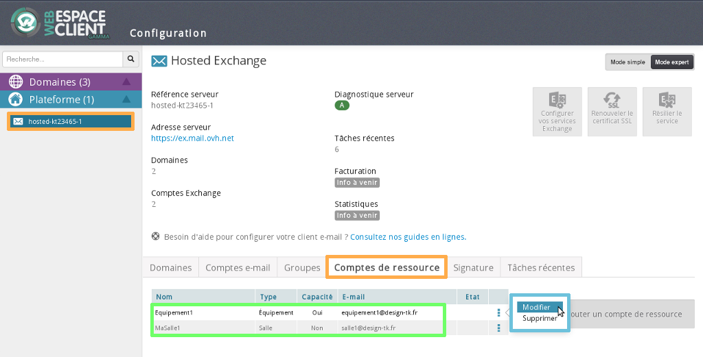
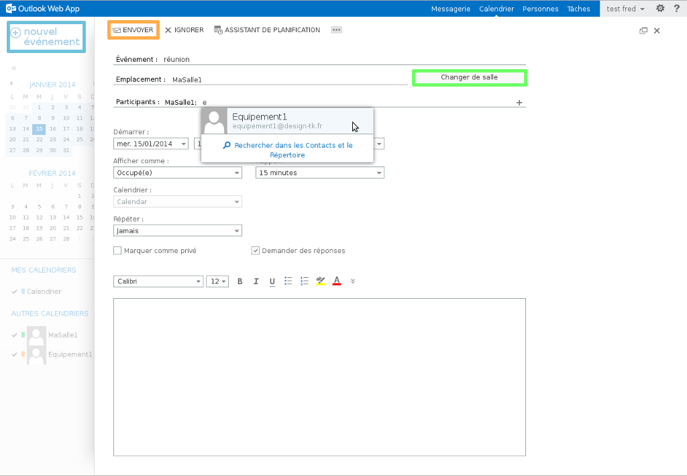
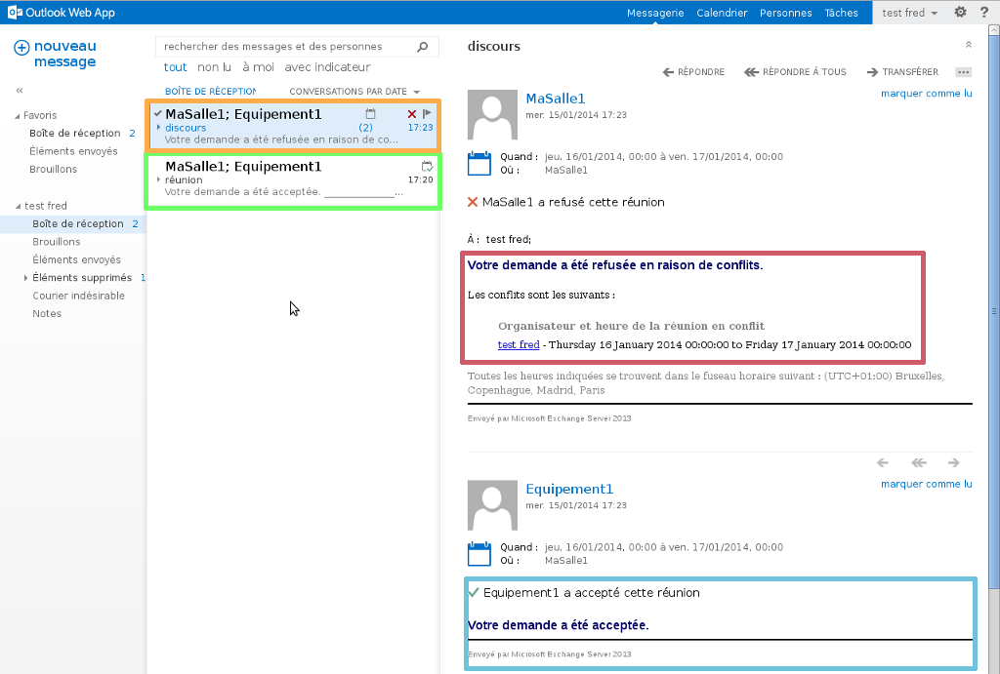

## Step 1: Create a resource
In your [Customer account](https://www.ovh.com/manager/web/login.html), select your Exchange service under "Exchange".

Select "Advanced Mode" in the top right-hand corner. 

Click "Resources" then "Add a resource account" on the right.

{.thumbnail}

## Step 2: Create a resource
Fill in the required fields:

Resource name: enter the resource display name of your choice.

Resource email: enter the email address for the resource.  It must not be an  existing email address.

Capacity: specify the size of your resource.

Resource type: two types of resources are available: "Room" and "Equipment".

Click "Next" to proceed to step 3, then confirm the task by clicking "Create".

{.thumbnail}

## Step 3: Create a resource
Once your resource is created, you can modify or delete it.

The image shows a screenshot of the resource summary table, including the resource name, resource type (room or equipment) and the resource email address.

The resource accounts are now activated. We will explain how to use them later on in this guide.

{.thumbnail}

## Step 1: Resource calendar
Here's how to view the resource calendar via OWA.

Open [OWA](https://ex.mail.ovh.net/owa/).

Log in with your full email address and password.

Select "Calendar", right-click on "OTHER CALENDARS", then choose "Open Calendar".

{.thumbnail}

## Step 2: Resource calendar
Enter the resource name. As it is part of the GAL (Global address list), the Exchange server will find it automatically.

Select "Open" to complete the task.

{.thumbnail}

## Step 3: Resource calendar
You can now see the resource calendars you've created in OWA.

Note that there is a "new event" button in the top left-hand corner. You can select this to create an event for your employees.

{.thumbnail}

## Step 1: Manage a resource
We will create an event using the resources we've just created.

To do this, select "new event" under "Calendar".

You will see the adjacent window:

Fill in the required fields:

Event: the name of your event.

Location: you can now enter your resource type, e.g. room.

Participants: enter your staff and "equipment" resources.

Start: enter the event start time.

Duration: specify the event duration.

Show as: enter the status that you want to appear in the calendar.

Reminder: specify when a reminder for the event should take place.

Repeat: specify the event frequency.

Select "Send" to finish creating your event.

{.thumbnail}

## Step 2: Manage a resource
The event "meeting" was accepted by room resource "MyRoom1" and equipment resource "equipment1".

You will receive email notification to inform you if the event has been accepted or refused.

{.thumbnail}

## Step 3: Manage a resource
You can view the status of resources in the calendar interface.

We can see that after the event has been added, the resource status is showing as "Busy".

{.thumbnail}

## Step 4: Manage a resource
We will now add a new event on the same date as the previous one.

We will be notified if the event is accepted or refused.

Because the first event that is already scheduled on that date, there is a conflict between the first and second event. "speech" and "MyRoom1" resources therefore refused the second event.

Resource "equipment1" accepted the event.
Even though an event is already scheduled for that date, conflict management is disabled on this resource.

{.thumbnail}

