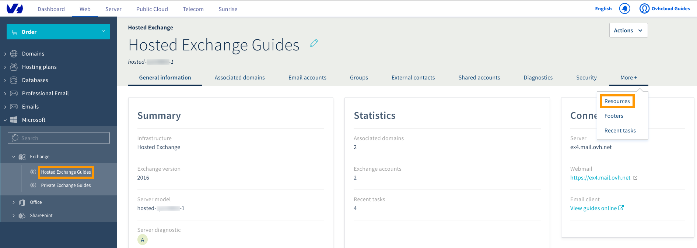
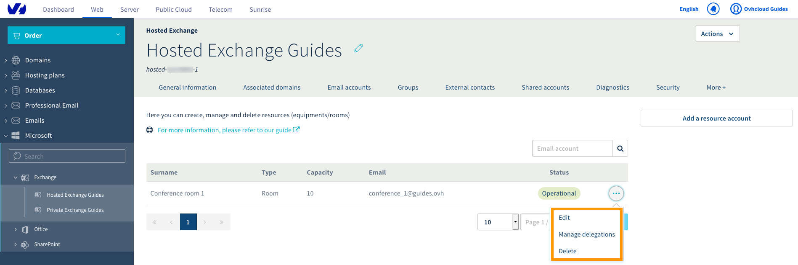
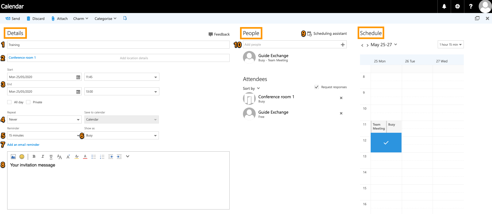
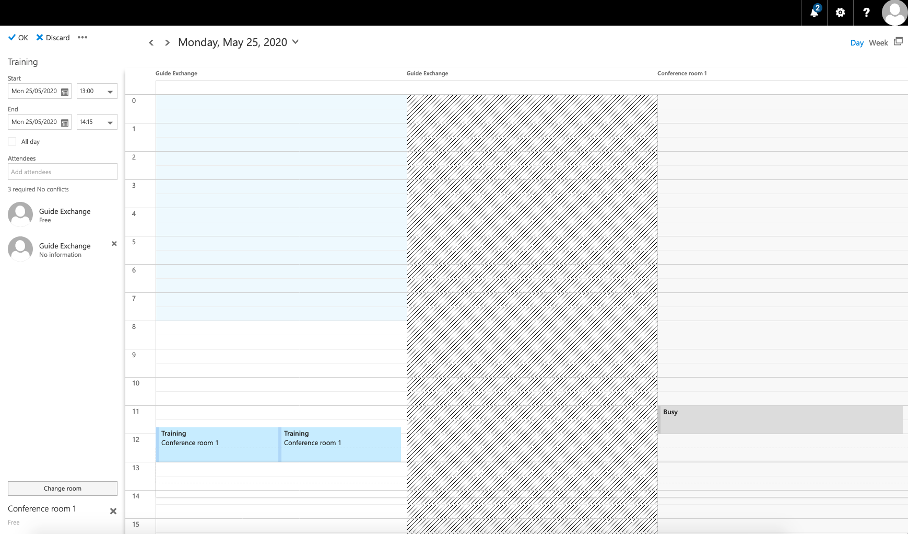

**Last updated 5th June 2020**

## Objective

This Exchange collaborative feature enables the creation of email addresses dedicated to resources in your organisation, such as conference rooms and shared equipment. Using these resource accounts helps with organising events in a collaborative environment by providing availability checks and seamlessly integrating resources with your Exchange calendars.

**This guide explains the managing of resources using the OVHcloud Control Panel and the Outlook Web App (OWA).**

## Requirements

- an [OVHcloud Exchange solution](https://www.ovhcloud.com/en-ie/emails/hosted-exchange/) already set up
- access to the [OVHcloud Control Panel](https://www.ovh.com/auth/?action=gotomanager&from=https://www.ovh.ie/&ovhSubsidiary=ie)
- login credentials for the email account(s) accessing the resource

## Instructions

Log in to your [OVHcloud Control Panel](https://www.ovh.com/auth/?action=gotomanager&from=https://www.ovh.ie/&ovhSubsidiary=ie) and select `Web Cloud`{.action} in the top navigation bar. Click `Microsoft`{.action}, then `Exchange`{.action}. Next, select the Exchange service concerned. Click on `More +`{.action} in the horizontal menu, then on `Resources`{.action}.

### Step 1: Creating a resource

{.thumbnail}

Click on the button `Add a resource account`{.action} to create your first resource. In the new window, fill in the fields:

{.thumbnail}

|Name|Description|
|---|---|
|Resource email|Enter the address for the resource. Please note that you cannot choose an existing email address.|
|Resource name|The display name that appears in your [OVHcloud Control Panel](https://www.ovh.com/auth/?action=gotomanager&from=https://www.ovh.ie/&ovhSubsidiary=ie) and in [OVHcloud webmail](https://www.ovh.ie/mail/) (OWA).|
|Capacity|You can define the maximum size of a resource (specifiying for example the seating capacity of a room or the seats in a shared company vehicle).|
|Allow conflicts|If this box is ticked, you will be able to create overlapping calendar events involving the same resource.|
|Resource type|Choose the resource type: "Equipment" or "Room".|

Click `Next`{.action} to proceed to the summary, then confirm the task by clicking `Create`{.action}.

### Step 2: Utilising resources

Your resources can be managed from the table in the `Resources` tab. Click on `...`{.action} to modify or delete a resource. Additionally, the menu item `Manage delegations`{.action} will be displayed. With this option you will be able to delegate access in the same way as for an Exchange account. Please find the details in [this guide](../exchange_2013_how_to_grant_full_access_permissions_for_an_account).

{.thumbnail}

### Adding a resource calendar in OWA

> [!primary]
>
Please also refer to our guide on [Sharing calendars in OWA](../exchange_2016_how_to_share_calendars_via_owa).
>

Log in to your Exchange account via the [OVHcloud webmail](https://www.ovh.co.uk/mail). Switch to the "Calendar" interface by clicking on the "app launcher" in the top left-hand corner and then selecting the `Calendar`{.action} icon.

{.thumbnail}

In the top navigation bar, click on `Add a calendar`{.action} and then on `From directory`{.action}.

{.thumbnail}

Start typing to display suggestions from your contacts, enter a full email address or use the search option via `Search Directory`{.action}. However, the resource email address should be suggested at this point because it was automatically added to the global address list (GAL) at creation. Click on `Open`{.action} to add the resource calendar to your calendar overview.

### Creating an event in OWA

To schedule an event, first click on `New`{.action} in the top menu bar and select `Calendar event`{.action}. In the new window you can set the details for your event and add your required  equipment and the location by adding the corresponding resource(s).

{.thumbnail}

The event planner consists of three panes:

#### **Details**

- (1) Add a title for the event: this will be displayed in calendars.
- (2) Add a location or room: here you can choose from your resource accounts.
- (3) Start / End: define the duration of the event.
- (4) Repeat: choose a repetition cycle if appropriate (daily, same day every month, etc.).
- (5) Reminder: OWA will display a reminder window at the specified time.
- (6) Show as: choose a status for your availability calendar.
- (7) Add an email reminder: an option to send reminders via email to yourself or all attendees.

Type your invitation message into the editor below (8) and proceed to add attendees to your event.

If you attempt to add a resource that is already booked ("busy"), a message will appear and suggest to use the ["Scheduling assistant"](./#schedule) (9) which provides a larger calendar overview of the chosen time frame.

#### **People**

Since a resource account is also a contact, you can add rooms and equipment in this pane, exactly as with other participants (10). Start typing to display suggestions from your contacts, enter a full email address or use the search option via `Search Directory`{.action}. (A click on `+`{.action} will open your contacts.)

Once you have finalised the scheduling by clicking `Send`{.action} in the top menu bar, the resource account will send you a message to confirm that it is booked for your event. Tick the box "Request responses" if you require active confirmation from the invitees to auto-update your calendar.

#### **Schedule**

A calendar excerpt of your own events labelled **Schedule** will show up on the right-hand side as soon as you add a resource or person to the event. It provides a graphical preview of resource availability on the chosen day; you can set the time and duration of the event directly via mouse clicks and the selection menu on the top-right.

If needed, click on `Scheduling assistant`{.action} in the **People** pane to open an even more detailed overview. This assistant is helpful for bigger events or if you have to manage conflicts, because it visualises the entire scheduling process. You can verify availability and adjust your planning by selecting locations and contacts, without leaving this interface.

{.thumbnail}

### Resource response messages

After creating the event (clicking `Send`{.action} in the top menu bar) Exchange will send out messages:

- Attendees will receive invitations (to update the involved calendars or only their own, depending on whether you chose "Request responses" before).

- You will receive a confirmation email by every chosen resource account (if the resource is available or if it is booked but you **did tick** "Allow conflicts" at creation).

{.thumbnail}

- You will receive a decline email by every chosen resource account (if the resource is unavailable and you **did not tick** "Allow conflicts" at creation).

{.thumbnail}

## Go further

[Using the Outlook Web App with an Exchange account](../exchange_2016_outlook_web_app_user_guide)

[Sharing calendars in OWA](../exchange_2016_how_to_share_calendars_via_owa)

[Sharing folders in OWA](../exchange_2016_how_to_share_a_folder_via_owa)

Join our community of users on <https://community.ovh.com/en/>.
