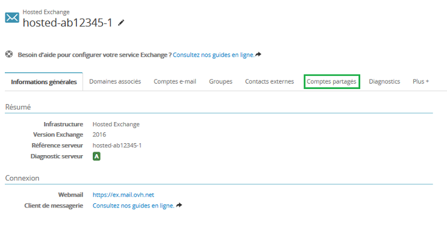
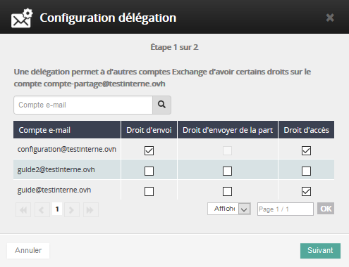
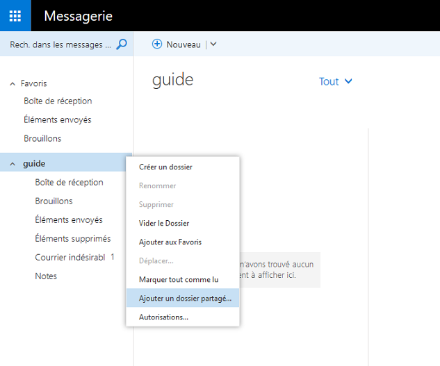
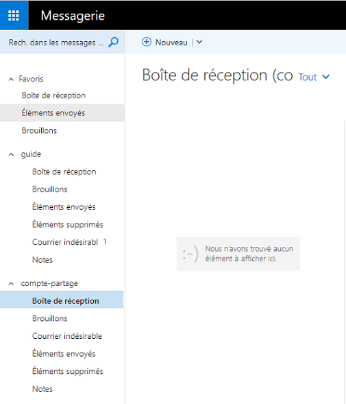

Accessible depuis Outlook et OWA (webmail Exchange) grâce à une délégation. Ce type de compte vous permet par exemple de créer une boîte générale à laquelle chaque compte Exchange peut avoir accès. Un compte partagé ne possède pas de mot de passe, il est donc nécessaire de déléguer son accès à un compte standard.

Vous devez avoir accès à votre [Espace client](https://www.ovh.com/auth/?action=gotomanager&from=https://www.ovh.com/fr/&ovhSubsidiary=fr)){.external}.

Cliquez [ici](https://www.ovh.com/fr/emails/hosted-exchange-2013/documents/){.external} pour retrouver nos différents guides.

## Ajouter un compte partage

### Création du compte
Afin de créer votre compte, connectez-vous à votre [Espace client](https://www.ovh.com/auth/?action=gotomanager&from=https://www.ovh.com/fr/&ovhSubsidiary=fr)){.external}.

Sélectionnez votre offre Exchange dans le menu **"Microsoft"**.

Choisissez l'onglet **"Comptes partagés"** puis **"Ajouter un compte partagé"**

{.thumbnail}

{.thumbnail}

Renseignez les champs demandés :

**Compte e-mail** :  choisissez le nom de votre compte partagé. *Il ne doit pas s'agir d'une adresse e-mail existante.*

**Quota** :  indiquez le quota souhaité pour votre compte partagé. Le quota maximal est de **10 Go pour l'ensemble de vos comptes partagés**.

**Nom à afficher** : Le nom ou ce que vous souhaitez afficher lors d'un envoi depuis votre compte partagé.

**Cacher l'adresse dans l'annuaire** : Cacher l’adresse dans l’annuaire permet que l’adresse du groupe ne soit pas visible dans la liste des adresses du service Exchange.

- Cliquez sur `Suivant`{.action} pour accéder au récapitulatif.
- Finalisez l'opération en cliquant sur `Valider`{.action}.

## Acces et utilisation du compte partage

### Acces au compte partage
Une fois votre compte partagé créé, il est nécessaire de déléguer l'accès à un compte **"standard"**.

Un compte partagé n'est pas directement accessible car celui-ci ne possède pas de mot de passe. Il n'est donc pas configurable directement dans un client type Outlook ou accessible depuis le webmail.

Une délégation doit nécessairement être mise en place entre un compte et le compte partagé.

Cliquez sur l'engrenage à droite de votre compte puis **"Configurer les délégations"**. Vous pourrez ensuite choisir dans votre liste de compte, ceux qui auront la possibilité d'accèder au compte partagé.

Vous pouvez ici choisir les actions possibles sur le compte sélectionné :

- **“Droit d’envoi”** : Permet de réaliser un envoi en tant que.
- **“Droit d’envoyer de la part”** : Permet de réaliser un envoi de la part de.
- **“Droit d’accès”** : Permet d’accéder à la boîte e-mail.

{.thumbnail}

Dans notre exemple, nous permettons aux comptes **guide@** et **configuration@** d'avoir accès au compte partagé, **configuration@** aura aussi le droit d'envoyer en tant que.

Cliquez ensuite sur `Suivant`{.action} et `Valider`{.action} pour enregistrer les modifications. Quelques minutes sont nécessaires pour que les délégations soient en place.

### Utilisation du compte partage depuis OWA
Connectez-vous au webmail Exchange (OWA) avec un compte qui a le droit d'accès au compte partagé. Dans notre exemple nous nous connectons avec le compte **guide@**.

{.thumbnail}

Une fois connecté, dans la partie de gauche, sélectionnez via un clic droit votre e-mail puis `Ajouter un dossier partagé`{.action}. Saisissez ensuite le nom de votre compte partagé.

Ajoutez le comme cela est décrit dans les 3 étapes ci-dessous, puis cliquez sur `ajouter`{.action}.

{.thumbnail}

Votre compte partagé est maintenant accessible depuis le compte **guide@**.

Si votre compte est paramétré dans un client Outlook celui-ci sera automatiquement synchronisé.

{.thumbnail}

Nous pouvons maintenant réaliser un envoi depuis le compte **configuration@** vers le compte partagé :

{.thumbnail}