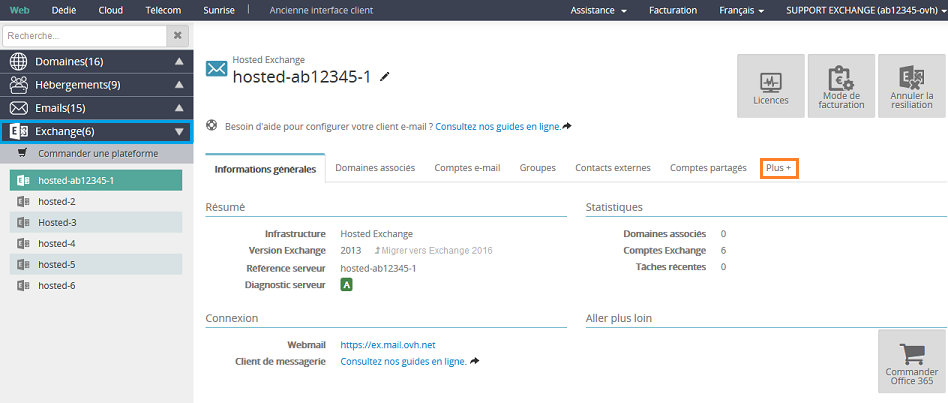
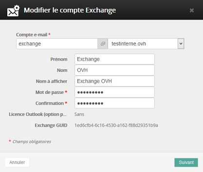

## Step 1: accedi al servizio
Accedi al tuo [Spazio Cliente OVH](https://www.ovh.com/manager/web/login.html).

Visualizzi questa interfaccia:

*nel nostro caso, utilizziamo un'offerta Hosted

Nella colonna di sinistra, nella sezione Microsoft, seleziona l'offerta Hosted (nel nostro esempio, hosted-ab12345-1).

Visualizzi le funzionalità disponibili:

- Informazioni generali
- Domini associati
- Account email
- Gruppi ()
- Contatti esterni
- Account condivisi

Nel tab Altre opzioni:

- Risorse ()
- Firma ()
- Task recenti
- Gestisci la politica di sicurezza

{.thumbnail}

- Se vuoi utilizzare contemporaneamente il servizio email OVH e la tua soluzione Exchange, consulta questa guida:

- Per trasferire uno o più account email su Exchange, consulta questa guida:

## Step 2: aggiungi il tuo dominio
Una volta selezionata la tua piattaforma Exchange, si apre automaticamente una finestra pop-up, per associare il tuo dominio alla tua soluzione Exchange.

Se il dominio è registrato in OVH, selezionalo dalla lista.

Se il dominio è registrato presso un altro provider o se vuoi aggiungere un sottodominio, inseriscilo manualmente.

ATTENZIONE
Se non hai un dominio, puoi registrarne uno cliccando sul link presente nella finestra.

Per configurare un dominio esterno (non registrato in OVH), ti viene richiesto di aggiungere un record di tipo CNAME a un sottodominio del tuo sito.

Clicca su Seguente per continuare.

{.thumbnail}

## Step 3: configura il tuo dominio
In questa fase, puoi configurare il tuo dominio in 2 modi:

- Con i DNS OVH:

Seleziona l'opzione Configura automaticamente l'SRV se il tuo dominio è gestito con lo stesso identificativo OVH della tua piattaforma Exchange.

Il record SRV serve per configurare automaticamente il tuo client di posta ed è obbligatorio con Outlook 2016.

Seleziona l'opzione Configura automaticamente l'MX per ricevere le email tramite il tuo servizio Exchange. Questa operazione comporta la modifica automatica dei tuoi server di posta.

- Se non vuoi modificare i tuoi server di posta in entrata, non spuntare questa casella. Seleziona il tab Domini associati e clicca sulla diagnostica MX in rosso per confermare la modifica.

{.thumbnail}

- Senza i DNS OVH:

Configura manualmente il record SRV sul tuo dominio.

Il SRV è composto da un sottodominio: _autodiscover._tcp.tuo-dominio.com.

- Inserisci queste informazioni:

|Priorità|0|
|Peso|0|
|Porta|443|
|Destinazione offerta Hosted| ex.mail.ovh.net o ex2.mail.ovh.net |
|Destinazione offerta Private| tuo-hostname|

Per gli ordini effettuati dal 26/04/2016, per il server MX che permette l'utilizzo di Exchange con email POP/IMAP non ospitate in OVH, è necessario utilizzare ex2.mail.ovh.net.
Se la tua soluzione Exchange e il tuo servizio email POP/IMAP sono ospitati in OVH (MX Plan), puoi utilizzare gli MX Antispam Exchange in modalità "Non autoritativa" per usufruire dell'Antispam su tutti i tuoi account.
Relativamente ai server autorizzati alla ricezione (MX), sarà necessario modificarli manualmente dalla zona DNS del tuo dominio:

|Offerta Hosted senza Antispam (modo "Non autoritativo")|ex.mail.ovh.net o ex2.mail.ovh.net|

|Offerta Hosted con Antispam (modo "Autoritativo"/"Non autoritativo")|mx0.mail.ovh.net|mx1.mail.ovh.net|mx2.mail.ovh.net|mx3.mail.ovh.net|

Se hai scelto la configurazione automatica degli MX (necessaria per la ricezione delle email) e devi passare alla modalità "Non autoritativa" (compatibilità con un servizio email POP/IMAP):

- clicca sulla diagnostica MX in rosso (nella sezione "Domini associati") e seleziona il server di ricezione ex.mail.ovh.net o ex2.mail.ovh.net.

Se il tuo servizio POP/IMAP è ospitato in OVH, puoi utilizzare gli MX Antispam in modalità "Non autoritativa".
L'applicazione delle modifiche può richiedere da 4 a 24 ore.

Clicca su Seguente e poi su Conferma per completare l'operazione.

## Step 4: configura gli account
Seleziona il tab Account email.
Visualizzi la lista dei tuoi account, con formato di questo tipo: gufbqeiixg@configureme.me.

Per configurarli, clicca sull'icona a forma di matita.

Se elimini uno dei tuoi account email, lo visualizzerai dopo qualche minuto come se fosse un nuovo account, che continuerà a essere fatturato.
Per eliminarlo definitivamente:

- clicca su "Modalità di fatturazione"
- seleziona "Nessuna" e conferma

{.thumbnail}

## Modifica il tuo account
Cliccando sul tasto di Configurazione visualizzi questa interfaccia: 

Password

Le password devono rispettare questi requisiti:

- non contenere il nome dell'account dell'utente, totalmente o in parte 
- avere una lunghezza di almeno 8 caratteri
- contenere caratteri di 3 di queste 4 categorie:

Caratteri maiuscoli dell'alfabeto (dalla A alla Z)
Caratteri minuscoli dell'alfabeto (dalla a alla z)
Cifre in base 10 (da 0 a 9)
Caratteri speciali, ad esempio !, $, #, %

{.thumbnail}

## Finalizzazione
Il tuo servizio Hosted Exchange è configurato!

Consulta le tue email via OWA:

- 
- 

Per maggiori informazioni, accedi a tutte le nostre [Guide Exchange](https://www.ovh.it/emails/hosted-exchange/guide/) e alle [FAQ online](https://www.ovh.it/emails/hosted-exchange/faq/).

