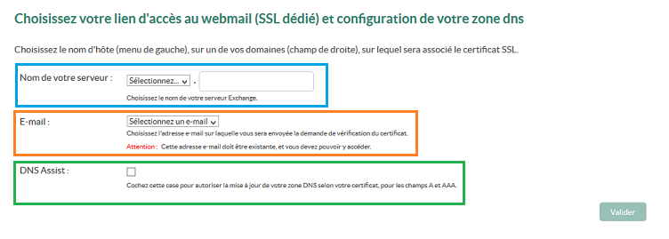

## Step 1: ricezione dell'email di configurazione del tuo server
Una volta saldato il tuo ordine, ricevi un'email per eseguire l'installazione del tuo server Private.
L'email viene inviata all'indirizzo email che hai indicato nel tuo Spazio Cliente OVH.
Il messaggio sarà disponibile anche nel tuo Spazio Cliente OVH. Per visualizzarlo, clicca sul tuo identificativo in alto a destra e poi su Il tuo account

{.thumbnail}
Clicca su Email ricevute

{.thumbnail}
In questa sezione puoi visualizzare l'email ricevuta per effettuare la configurazione del tuo server Private Exchange.


- L'oggetto dell'email è:

Il tuo servizio Private Exchange 2016v1 è in consegna!


{.thumbnail}
Ecco il testo del messaggio:


```
Gentile Cliente,

   ti informiamo che la tua offerta Private Exchange 2016v1 è quasi pronta!

Per utilizzare il tuo server, è necessario:
- personalizzare il link di accesso alla tua Webmail (certificato SSL dedicato)
- inserire un indirizzo email valido a cui ricevere il messaggio per la conferma del tuo certificato

Puoi eseguire queste due operazioni cliccando sul link:
https://www.ovh.it/emails/ordine/?orderId=5035xxxx&orderPassword=nqiJ#/serverConfig

Per accedere dovrai inserire il tuo NicHandle (ab12345-ovh) e la tua password.

ATTENZIONE: dopo aver eseguito quanto richiesto, imposta il puntamento del sottodominio scelto verso l'IP del tuo server, che ti verrà comunicato tramite email.

Hai bisogno di aiuto?
Scopri tutte le nostre guide Exchange:
https://www.ovh.it/emails/hosted-exchange/guide

Come specificato nel nostro contratto, il servizio si rinnova automaticamente alla scadenza. Se non vuoi rinnovarlo, puoi disattivarlo direttamente dal tuo Spazio Cliente OVH o tramite l'API OVH.

A presto,

Il team OVH
```


## Step 2: configurazione automatica della tua zona DNS
Clicca sul link indicato nell'email ricevuta per accedere alla pagina di configurazione del tuo server.

{.thumbnail}

- Nome del server: definisci il nome del tuo server e il link di accesso alla tua Webmail. Ti vengono proposte più opzioni:

- mail
- exchange
- exchange 2016
- ex
- mailex


Una volta selezionato il sottodominio, inserisci un dominio valido. Il link di accesso alla Webmail (OWA) sarà ad esempio: exchange2016.tuodominio.it
Scegli un indirizzo emailvalido a cui ricevere l'email di conferma del tuo certificato SSL.

Il menu contiene indirizzi email generici, come:


- postmaster@tuodominio.it
- administrator@tuodominio.it
- admin@tuodominio.it
- hostmaster@tuodominio.it
- webmaster@tuodominio.it


Se il tuo dominio è ospitato in OVH e non hai attivato un servizio di posta, dal tuo Spazio Cliente OVH puoi creare un reindirizzamento (Alias) da indirizzo@tuodominio verso un indirizzo esistente.
Utilizza l'opzione DNS Assist per eseguire la configurazione automatica della tua zona DNS (creazione del record di tipo ipv4 (A) in base al sottodominio selezionato)
Questa operazione è possibile se il tuo dominio è associato allo stesso identificativo OVH utilizzato per l'ordine del tuo server Private Exchange. In caso contario, dovrai configurare manualmente la tua zona DNS.
Nel notro esempio, abbiamo selezionato l'opzione DNS Assist. In seguito, puoi confermare la configurazione. Se hai utilizzato l'opzione DNS Assist, salta lo Step 3.


## Step 3: Configura manualmente la tua zona DNS
Se il tuo dominio non è associato allo stesso identificativo cliente o non è ospitato in OVH, riceverai un'altra email con le informazioni necessarie a modificare la tua zona DNS.

Ecco il contenuto del messaggio:


```
Oggetto: [OVH-EXCHANGE] il tuo server Exchange è quasi pronto!

Gentile Cliente,

   per attivare il certificato SSL del tuo server, è necessario creare il suo indirizzo nella tua zona DNS.

L'indirizzo che hai scelto è: exchange2016.testinterne.ovh
L'IP del tuo server è: 149.202.xxx.103

Ti ricordiamo che è necessario creare un record A per questo elemento.

Se hai bisogno di assistenza, apri un ticket nella sezione "Supporto" del nuovo Spazio Cliente OVH. Sarà necessario effettuare il login per rendere la tua richiesta ancora più sicura.

A presto,

Il team OVH
```


In questo caso, è necessario creare un record A corrispondente a:


- exchange2016.testinterne.ovh A 149.202.xxx.103


## Step 4: conferma il tuo certificato SSL
Una volta configurata la tua zona DNS in modalità automatica o manuale, ricevi un'email di conferma all'indirizzo scelto nella fase di personalizzazione del link di accesso alla Webmail.
Questa operazione può richiedere fino a 4 ore.
Ecco il contenuto dell'email ricevuta:

{.thumbnail}
Clicca sul link per confermare il tuo certificato SSL.
Vieni reindirizzato all'interfaccia di Global Sign. Clicca su I APPROVE[
/green] per confermare il tuo certificato.

{.thumbnail}


## Finalizzazione
Una volta confermato il certificato, potrebbero essere necessarie fino a 4 ore per la consegna del tuo servizio. Durante le fasi di configurazione il tuo server Private Exchange non è visibile nel tuo Spazio Cliente OVH.

Una volta che il tuo server è pronto e disponibile, riceverai un'email di conferma.

Se hai bisogno di aiuto per la configurazione del tuo servizio di posta, consulta [questa guida](https://www.ovh.it/g1311.configurazione-servizio).

