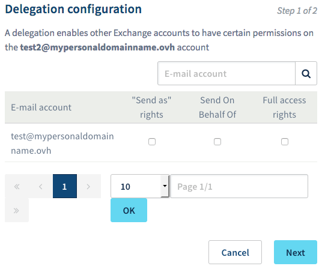

**Last updated 31st August 2018**

## Objective

With the Exchange service, you can set up professional email addresses, and use them with a range of features for collaborative work. One of these features is the ability to delegate specific permissions (e.g. sending or access permissions) between different Exchange accounts.

**Find out how to delegate permissions on your Exchange account to another user.**

## Requirements

- an [Exchange](https://www.ovh.co.uk/emails/){.external} solution
- at least two active Exchange accounts, configured on the same OVH Exchange platform
- access to the [OVH Control Panel](https://www.ovh.com/auth/?action=gotomanager)
- credentials for the Exchange account that will be delegated new permissions

## Instructions

Before you get started, define the permissions you want to delegate. As a reminder, when you set up a delegation, you are granting one or more Exchange accounts additional permissions for the Exchange mailbox concerned.

|Permissions|Description|
|---|---|
|‘Send As’ permission|Allows the user to send emails as another account. The user sending the email will not appear as the sender. Instead, the account for which the user holds the ‘Send As’ permission will appear as the sender. There is no way for the recipient to tell whether an email has been sent by the original account, or by another user with the ‘Send As’ permission.|
|‘Send on Behalf’ permission|Allows the user to send on behalf of another account. The user sending the email will not appear as the sender. Instead, the account for which the user holds the ‘Send on Behalf’ permission will appear as the sender. However, in this case there will be a comment showing that the message was sent by another user on behalf of the original account.|
|'Access' permission|Gives the user read-only access to the account they have been delegated this permission for. This access type does not allow the user to send any emails. It only allows them to view content.|

> [!warning]
>
> The ‘Send As’ and ‘Send on Behalf’ permissions cannot be used together at the same time. However, you can combine other permissions.
> 

When you have identified the account that you want to delegate permissions for, determined the kinds of permissions you want to delegate, and listed the users that will be delegated these permissions, go to the next step.

### Step 1: Set up the delegation.

To do this, log in to the [OVH Control Panel](https://www.ovh.com/auth/?action=gotomanager){.external}. Click `Microsoft`{.action} in the services bar on the left-hand side, then `Exchange`{.action}. Then click on the name of the Exchange service containing the account that you want to delegate permissions for. Next, go to the `Email accounts`{.action} tab.

The table that appears will list all of the accounts linked to your Exchange service. Click on the three dots to the right of the account you want to delegate permissions for, then `Manage delegations`{.action}.

{.thumbnail}

In the page that pops up, select the permissions you want to delegate. You will need to link them to one or more accounts that you wish to grant the permissions to. Then press `Next`{.action}.

{.thumbnail}

Take a few moments to check the change summary. If the information in the summary is correct, click `Confirm`{.action}. Within a few minutes, the delegation will be created on our servers.

Once the delegation has been configured, *test@mypersonaldomain.ovh* can carry out the selected actions on the *test2@mypersonaldomain.ovh* account.

### Step 2: Use the delegated permissions.

Now that the delegation has been set up, it is ready to use. Before you go any further, please ensure that you have the credentials for the Exchange account that has been granted the newly delegated permissions.

This will work differently depending on the permissions you have delegated, and also the software or web interface you are using to access your Exchange account. From this point onwards in the guide, you should follow the instructions that are relevant to the permissions you have delegated.

> [!warning]
>
> This solution requires knowledge of the software or interface you would like to use. We have provided general information below on how to proceed, but we recommend contacting a specialist provider and/or getting in touch with the publisher of the interface or software if you encounter any difficulties. We will not be able to assist you ourselves.
>

#### 2.1 Use your access permissions.

- **From the Outlook Web Application (OWA)**

Go to <https://www.ovh.co.uk/mail/> and enter the login details for the Exchange account that has been delegated permissions. Once you have logged in, right-click on the name of the account in the menu on the left-hand side, then select `Add shared folder`{.action}.

In the window that pops up, enter the name for the account that holds the delegated permissions, then click `Add`{.action}. The account will then appear in the left-hand menu, and you can view its content.

{.thumbnail}

- **From the Outlook application for Windows**

In the Outlook 2016 application, click `File`{.action} in the menu bar at the top of your screen, then `Account Settings`{.action}. In the dropdown menu, click again on `Account Settings`{.action}. In the window that pops up, select the account with the delegated permission, then click `Change`{.action}. 

{.thumbnail}

Next, click on `More Settings`{.action}. In the new window, go to the `Advanced`{.action} tab, then click `Add`{.action}. Enter the name of the account that will use the delegated permission, then confirm the addition. The account will then appear in the left-hand menu on your application, and you can view its content.

{.thumbnail}

#### 2.2 Use the ‘Send As’ permission.

- **From the Outlook Web Application (OWA)**

Go to <https://www.ovh.co.uk/mail/> and enter the login details for the Exchange account that has been delegated permissions. Once you have logged in, start editing a new email by clicking `+ New`{.action}.

In the zone that appears, click on the three dots, then `Show From`{.action}. Then click on the `From`{.action} button, and select the email address you want to appear as the sender (i.e. the address you have delegated that permission for). If it doesn’t appear, delete the address that is already displayed, and enter the address you want to appear. 

At this stage, you are now ready to write and send your email. 

{.thumbnail}

- **From the Outlook application for Windows**

In your Outlook 2016 application, start editing a new email. Ensure that the `From`{.action} button is visible in the editing window. If it is not visible, go to the `Options`{.action} tab, then click `From`{.action}.

Then click on the `From`{.action} button, and select the email address you want to appear as the sender (i.e. the address you have delegated permissions for). If it doesn’t appear, click `Other Email Address`{.action}, enter the email address you would like to appear as the sender, then confirm. 

At this stage, you are now ready to write and send your email. 

{.thumbnail}

#### 2.3 Use the ‘Send on Behalf’ permission.

- **From the Outlook Web Application (OWA)**

Go to <https://www.ovh.co.uk/mail/> and enter the login details for the Exchange account that has been delegated permissions. Once you have logged in, start editing a new email by clicking `+ New`{.action}.

In the zone that appears, click on the three dots, then `Show From`{.action}. Then click on the `From`{.action} button, and select the email address you want to appear as the sender (i.e. the address you have delegated permissions for). If it doesn’t appear, delete the address that is already displayed, and enter the address you want to appear. 

At this stage, you are now ready to write and send your email. 

{.thumbnail}

- **From the Outlook application for Windows**

In your Outlook 2016 application, start editing a new email. Ensure that the `From`{.action} button is visible in the editing window. If it is not visible, go to the `Options`{.action} tab, then click `From`{.action}.

Then click on the `From`{.action} button, and select the email address you want to appear as the sender (i.e. the address you have delegated permissions for). If it doesn’t appear, click `Other Email Address`{.action}, enter the email address you would like to appear as the sender, then confirm. 

At this stage, you are now ready to write and send your email. 

{.thumbnail}

## Go further

Join our community of users on <https://community.ovh.com/en/>.