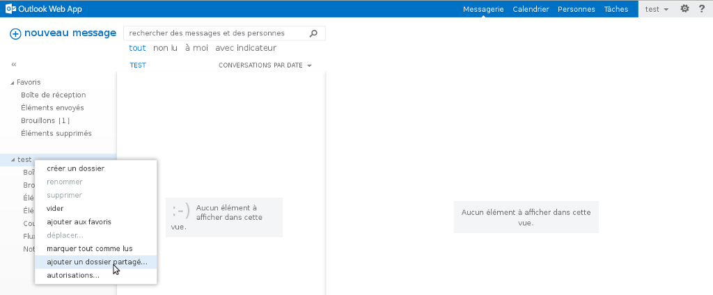
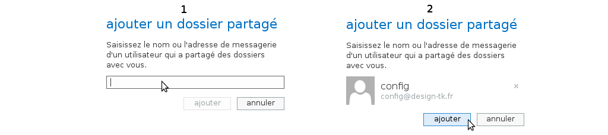

## Step 1: Set up Full Access
This steps must be carried out via the [Web Control Panel](https://www.ovh.com/manager/web/login.html).

Once you have logged in, select your Exchange service by clicking on it in the left-hand column under "Platforms".

Click on the "Email accounts" tab, then click the "More actions" icon on the far right (three blue dots) and select "Manage delegations".

{.thumbnail}

## Step 2: Set up Full Access
The delegation configuration window will open. Here, you can give sending permissions or access permissions to the chosen account.

Simply tick the boxes and then click on "Next".

{.thumbnail}

## Step 3: Set up Full Access
A summary of the delegations will appear in the window. Here you need to confirm your selection.

It may take a few moments for the delegations to be applied.

Click on "Confirm".

{.thumbnail}

## Step 1: Set up with OWA
You can now check that the other user's account is visible in the first account.

If you want to see everything in one interface, right-click on on your email account name and then select "add shared folder".

{.thumbnail}

## Step 2: Set up with OWA
Enter the username of the other account in the search field and then "add".

{.thumbnail}

## Step 3: Set up with OWA
The other user's account now correctly appears in the list on the left-hand side in [OWA](https://ex.mail.ovh.net/owa).

{.thumbnail}

