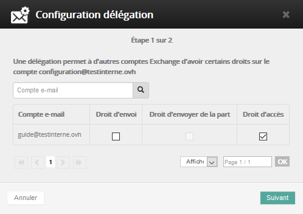
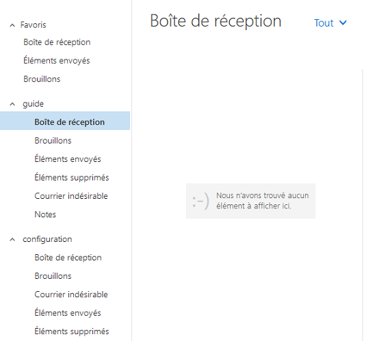

Le "Full Access" permet de donner la visibilité totale sur un compte Exchange d'un collaborateur.

Il ne permet pas d'envoyer un e-mail à la place de la personne. (Cette notion sera vue dans la partie "Send As : envoyer en tant que").

Cliquez [ici](https://www.ovh.com/fr/emails/hosted-exchange/guides/){.external} pour retrouver nos différents guides.

## Activation des droits Full Access.

### Mise en place du Full Access Partie 1
Vous devez réaliser la manipulation depuis votre [espace client](https://www.ovh.com/manager/web/login.html){.external}.

Une fois connecté, sélectionnez votre service Exchange.

Dans la rubrique Compte e-mail, cliquez sur la roue crantée à droite du compte que vous souhaitez déléguer.

Puis sélectionnez "Gérer les délégations".

{.thumbnail}

### Mise en place du Full Access Partie 2
Une nouvelle fenêtre s'ouvre afin de configurer la délégation.

Vous pouvez ici choisir les actions possibles sur le compte précedement sélectionné :

- "Droit d'envoi" : Permet de réaliser un envoi en tant que.
- "Droit d'envoyer de la part" : Permet de réaliser un envoi de la part de.
- "Droit d'accès" : Permet d'accéder à la boite e-mail.

Cochez : "Droit d'accès" puis cliquez ensuite sur `Suivant`{.action}

{.thumbnail}

### Mise en place du Full Access Partie 3
Voici l'interface qui apparaît, vous devez ici valider vos actions.

Comptez quelques minutes le temps que la mise en place soit effective.

Validez par un clic sur `Valider`{.action}

{.thumbnail}

## Visualisation du Full Access&#58; Verification sous OWA.

### Mise en place sous OWA Partie 1
Vous pouvez maintenant vérifier que le compte e-mail "guide" a la possibilité de voir le compte e-mail "configuration".

Si vous désirez visualiser les 2 comptes sur la même interface, dans ce cas :

Clic droit sur votre compte e-mail, puis sélectionnez `"ajouter un dossier`{.action} partagé"

{.thumbnail}

### Mise en place sous OWA Partie 2
Ajoutez la boîte e-mail "configuration", cliquez ensuite sur `ajouter`{.action}.

{.thumbnail}

### Mise en place sous OWA Partie 3
Le compte e-mail "configuration" apparaît maintenant correctement sur le [Webmail
Exchange](https://ex.mail.ovh.net/owa){.external}.

{.thumbnail}