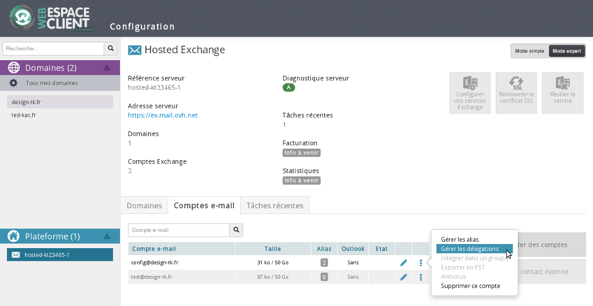
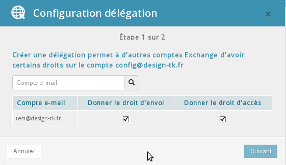
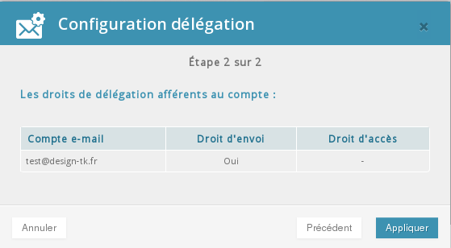
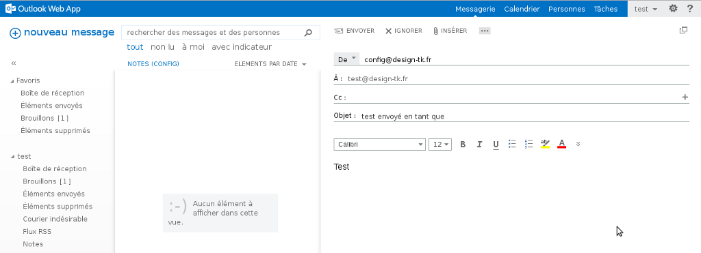
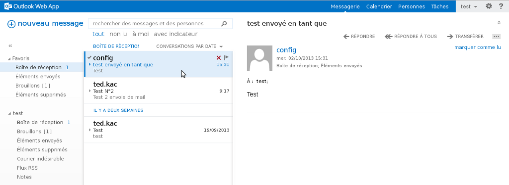
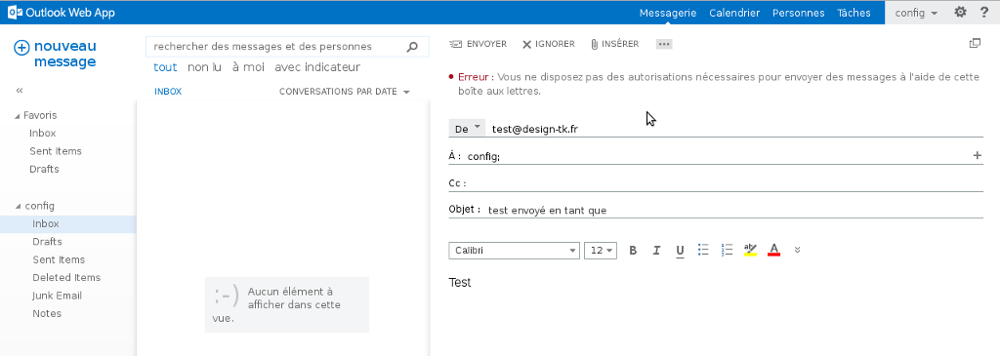

## Setting up Send As rights: Part 1
This action must be carried out via the [Web Control Panel](https://www.ovh.com/manager/web/login.html).

Once you have logged in, select your Exchange service by clicking on it in the left-hand column under "Platforms".

Click on the "Email accounts" tab, then click the "More actions" icon on the far right (three blue dots).

Then select "Manage delegations".

{.thumbnail}

## Setting up Send As rights: Part 2
The delegation congiguration window will open, enabling you to select an email account and delegate sending and access rights to it.

Simply tick the boxes and then click on "Next".

{.thumbnail}

## Setting up Send As rights: Part 3
A summary of the delegations will appear in the window for you to confirm.

It may take a few moments for the delegations to be applied.

Click on "Confirm".

{.thumbnail}

## Outlook Web App set up: Part 1
You can check via [OWA](https://ex.mail.ovh.net/owa) that you can now send an email as another account. (E.g. "test@design-tk.fr" as "config@design-tk.fr").

Click on "+ new mail" and then click the "..." icon to the right "Insert" in order to make the "From" field appear. 

Click on "From" and right-click the existing address to remove it. You can then enter the second address manually.
It will thus be saved automatically.

{.thumbnail}

## Outlook Web App set up: Part 2
The email has successfully been received as "config".

{.thumbnail}

## Possible error:
This error message may appear if the Send As rights have not been configured:

{.thumbnail}

