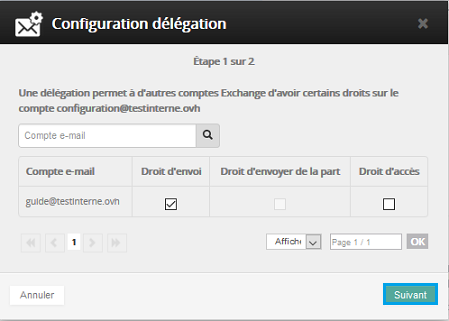
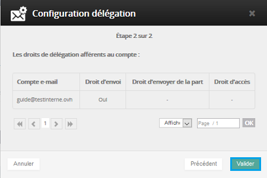
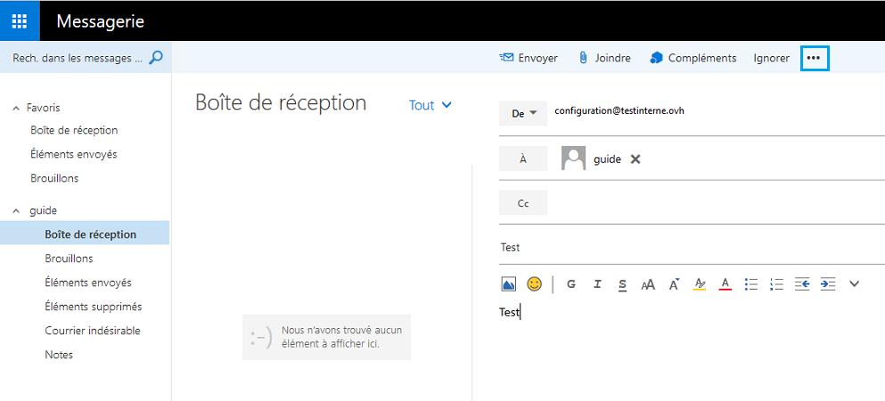
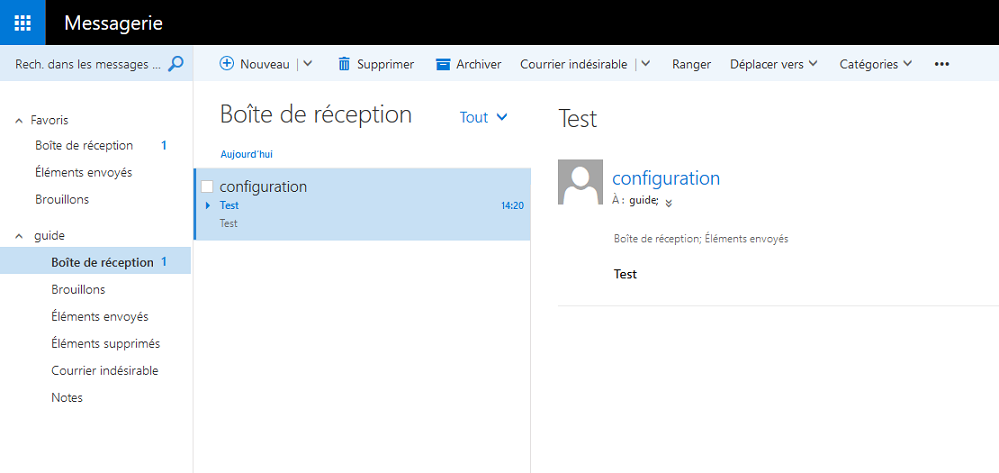
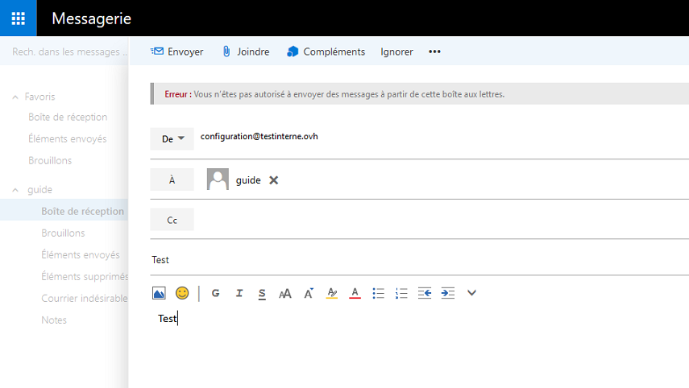

La fonction "Send As" permet d'envoyer un e-mail en tant qu'un autre compte. Exemple : mon compte e-mail "test" doit permettre d'envoyer des courriers électroniques en tant que l'adresse e-mail "config" sans que les utilisateurs recevant l'e-mail ne le voient.

Cliquez [ici](https://www.ovh.com/fr/emails/hosted-exchange/guides/){.external} pour retrouver nos différents guides.

## Activation des droits Send As.

### Mise en place des droits Send As Partie 1
Vous devez réaliser la manipulation depuis votre [espace client](https://www.ovh.com/manager/web/login.html){.external}.

Une fois connecté, sélectionnez votre service Exchange.

Dans la rubrique "Compte e-mail", cliquez sur la roue crantée à droite du compte que vous souhaitez déléguer.

Puis sélectionnez "Gérer les délégations".

{.thumbnail}

### Mise en place des droits Send As Partie 2
Une nouvelle fenêtre s'ouvre afin de configurer la délégation.

Vous pouvez ici choisir les actions possibles sur le compte précedement sélectionné :

- "Droit d'envoi" : Permet de réaliser un envoi en tant que.
- "Droit d'envoyer de la part" : Permet de réaliser un envoi de la part de.
- "Droit d'accès" : Permet d'accéder à la boite e-mail.

Cochez : "Droit d'envoi" puis cliquez ensuite sur `Suivant`{.action}

{.thumbnail}

### Mise en place des droits Send As Partie 3
Voici l'interface qui apparaît et sur laquelle vous devez valider vos actions.

Comptez quelques minutes le temps que la mise en place soit effective.

Validez en cliquant sur `Valider`{.action}

{.thumbnail}

## Visualisation des droits &quot;Send As&quot;&#58; Verification sous OWA.

### Mise en place sous OWA Partie 1
Vous pouvez vérifier depuis [OWA](https://ex.mail.ovh.net/owa){.external} que vous avez désormais la possibilité d'envoyer un e-mail à partir de "[guide@testinterne.ovh](mailto:guide@testinterne.ovh){.external}" en tant que "[configuration@testinterne.ovh](mailto:configuration@testinterne.ovh){.external}"

Pour faire apparaître le champ "De :" vous devez cliquer sur "..." à droite de "insérer"

Vous devrez renseigner manuellement la seconde adresse dans le champ "De : "

Elle sera automatiquement mémorisée de cette manière.

{.thumbnail}

### Mise en place sous OWA Partie 2
L'e-mail a correctement été reçu en tant que "config".

{.thumbnail}

### Erreur possible
Voici le message d'erreur qui apparaîtra si les accès Send As n'ont pas été configurés :

{.thumbnail}