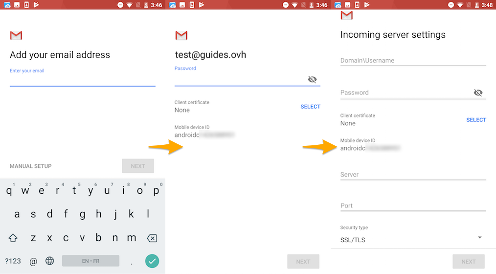

**Last updated 12th March 2018**

## Objective

You can configure Exchange accounts on email clients, if they are compatible. By doing so, you can use your email address through your preferred email application.

**Find out how to configure an Exchange account on Android, via the Gmail app.**

## Requirements

- You must have an [Exchange](https://www.ovh.co.uk/emails/){.external} solution.
- You need to have the Gmail app installed on your device. You can install the app from the Google Play Store.
- You need to have the required credentials for the email address you would like to configure.

> [!primary]
>
> This guide has been written using a Nexus 6 device, with Android version 7.1.1. For consistency purposes, we are using the Gmail app available to download from the Play Store. If you would like to use another app, the steps you need to take will be different.
>

## Instructions

### Step 1: Add the account

On your device’s homepage, open the `Gmail`{.action} app. You can add an account in two different ways:

- **If no account has been set:** Tap through the welcome screen, and tap `Add email address`{.action}. Next, choose `Exchange and Office 365`{.action}. 

- **If an account has already been set:** Tap the three-line icon on the top left-hand corner, then the arrow icon to the right of the account name that has already been set. Next, tap `Add account`{.action}, and choose `Exchange and Office 365`{.action}. 

{.thumbnail}

Enter your email address, then tap `Next`{.action}.

Enter your email password, do not select any client certificates, then tap `Next`{.action} to continue configuring your account. You can make connections to the OVH server to configure your account. If you would like to do so, a notification will appear on your device. Tap `OK`{.action} to make these connections.

Enter the incoming server settings. Some fields may be auto-filled.

|Information|Description| 
|---|---| 
|Domain/Username|Enter your full email address.|  
|Password|Enter the password for your email address.|
|Client certificate|Do not select anything.|
|Server|Enter the details for the server your Exchange service is hosted on. You will find these details in your [OVH Control Panel](https://www.ovh.com/auth/?action=gotomanager){.external} by going to the `General information`{.action} tab for the Exchange service concerned, then the `Connection`{.action} section.|
|Port|Enter port 443.|  
|Security type|Choose ‘SSL/TLS’.|

Then tap `Next`{.action}. If all the information you have entered is correct, you will be able to log in to your account straight away.

{.thumbnail}

To finalise your configuration, you will need to authorise the OVH server to control certain security features on your device. Tap `OK`{.action}, read the information on the page, and tap `Activate device administrator`{.action}.

Set a name for your account, so that you can distinguish it from any other accounts associated with your app. Then press `Next`{.action}.

To check that the account has been correctly configured, you can send a test email.

### Step 2: Use the email address

Once you have configured your email address, you can start using it! You can now send and receive emails.

OVH also offers a web application that has [collaborative features](https://www.ovh.co.uk/emails/){.external}, accessible via [https://www.ovh.co.uk/mail/](https://www.ovh.co.uk/mail/){.external}. You can log in using your email credentials.

## Go further

[Configuring an email address included in an MX Plan or web hosting plan on Android, via the Gmail app](https://docs.ovh.com/gb/en/emails/configuration-android/){.external}.

[Configuring an Email Pro account on Android via the Gmail app](https://docs.ovh.com/gb/en/emails-pro/configuration-android/){.external}.

Join our community of users on [https://community.ovh.com/en/](https://community.ovh.com/en/){.external}.