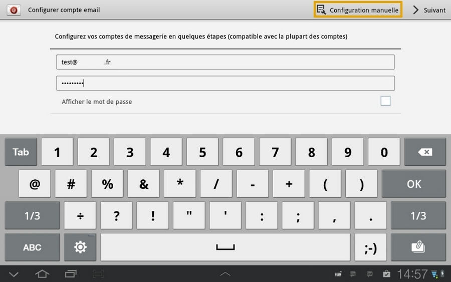
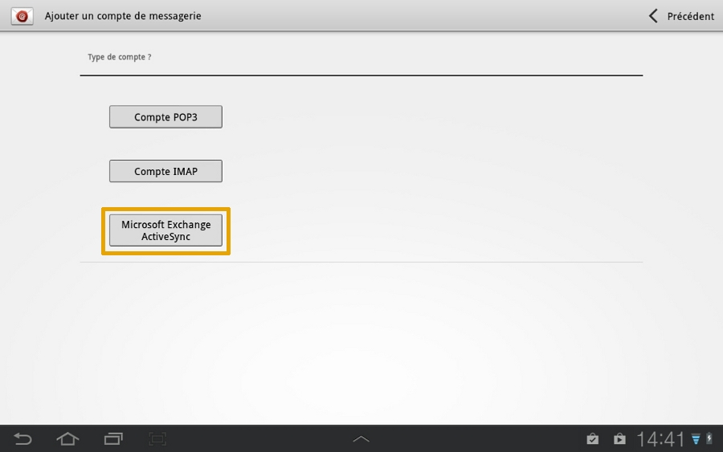
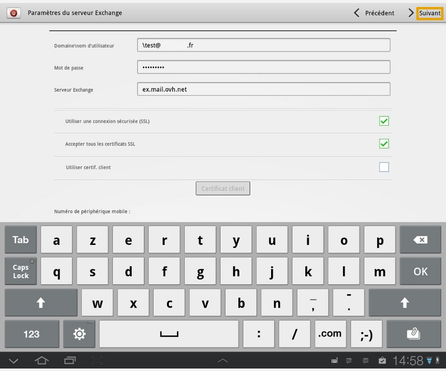
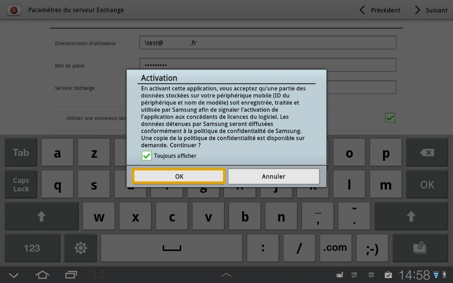
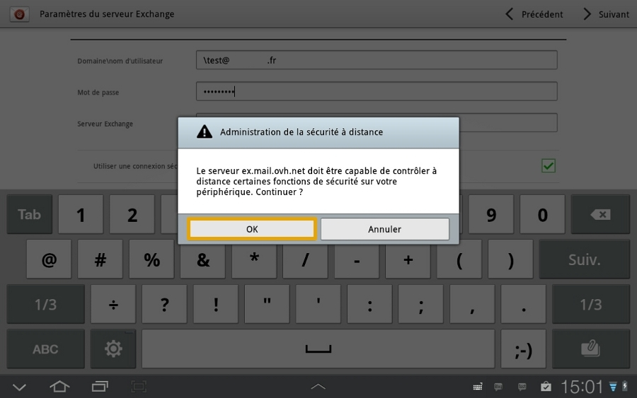
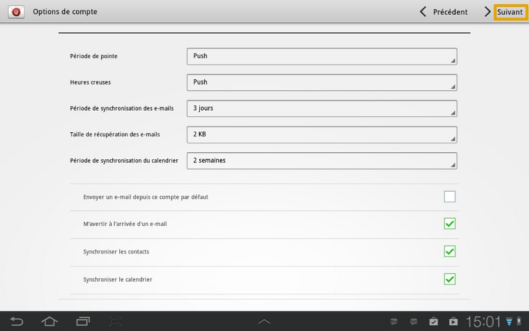
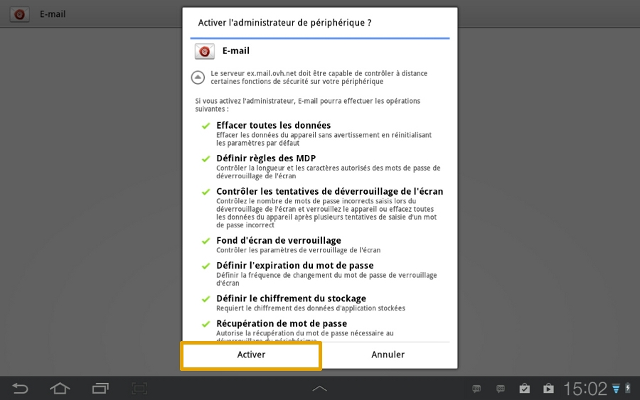
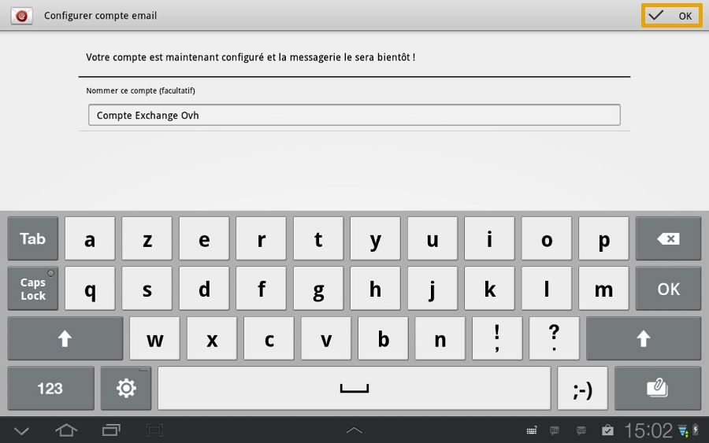
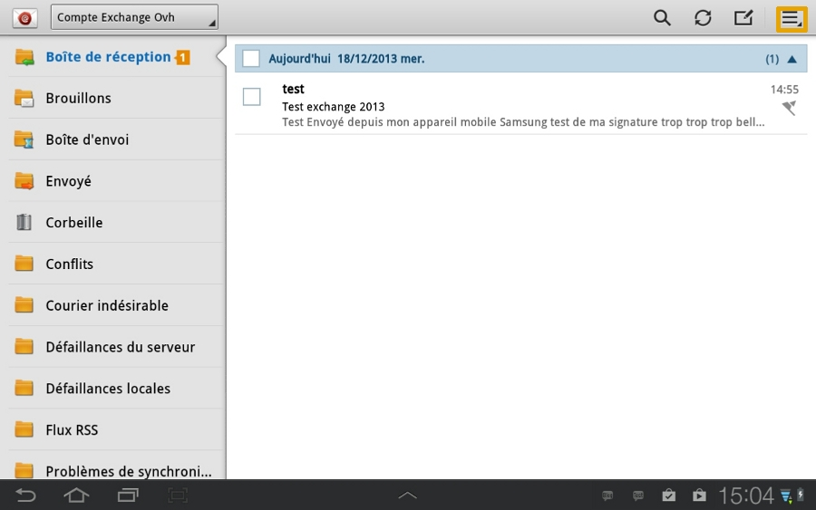
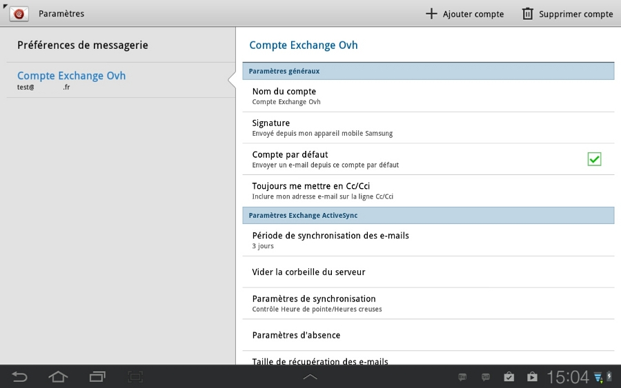

## Część 1: E-mail
Najpierw kliknij na ikonę "E-mail".

W naszym przykładzie mamy konto Hosted Exchange. Jest ono konfigurowane na Samsung Tab z systemem Android 4.1.2

Podczas dodawania konta sprawdź, czy połączenie 3G lub Wi-Fi jest aktywne.

{.thumbnail}

## Część 2: Konfiguracja konta e-mail
Wpisz swój cały adres e-mail Exchange 2013 i hasło zdefiniowane dla konta Exchange w [panelu klienta](https://www.ovh.com/manager/web/login.html).

Następnie kliknij na "Konfiguracja ręczna".

{.thumbnail}

## Część 3: Rodzaj konta e-mail
Wybierz "Microsoft Exchange ActiveSync", aby kontynuować konfigurację konta Exchange.

{.thumbnail}

## Część 4: Parametry serwera Exchange
W przypadku zamówień realizowanych od 26/04/2016 serwer Exchange dla oferty Hosted to ex2.mail.ovh.net.
Teraz możesz podać informacje dotyczące konta Exchange.

"Domena\nazwa użytkownika": nie wpisuj domeny, dodaj anty-slash (altGr+8 na klawiaturze) i cały adres e-mail.

"Hasło: hasło zdefiniowane w [panelu klienta](https://www.ovh.com/manager/web/login.html).

"Serwer Exchange": serwer konta Exchange.
W przypadku oferty Hosted jest to ex.mail.ovh.net; w przypadku oferty Private należy podać nazwę serwera wybranego podczas instalacji.

"Korzystaj z szyfrowanego połączenia (SSL)": ta opcja musi być zaznaczona.

"Akceptuj wszystkie certyfikaty SSL": ta opcja musi być zaznaczona.

Kliknij na "Dalej", aby kontynuować.

{.thumbnail}

## Część 5: Aktywacja
Pojawi się wiadomość dotycząca polityki poufności. Należy ją zaakceptować klikając na "OK".

{.thumbnail}

## Część 6: Zarządzanie bezpieczeństwem
Druga wiadomość dotyczy zdalnej kontroli nad urządzeniem.

Potwierdź ją klikając na "OK".

{.thumbnail}

## Część 7: Opcje konta
W tym interfejsie możesz zdefiniować niektóre opcje dotyczące konfiguracji adresu e-mail Exchange. 

Po zdefiniowaniu ustawień kliknij na "Dalej".

{.thumbnail}

## Część 8: Administrator urządzenia zewnętrznego
W tym interfejsie określone są uprawnienia do aplikacji "E-mail" Android.

Kontynuuj klikając na "Włącz".

{.thumbnail}

## Część 9: Zakończenie
Na tym etapie możesz nazwać swoje konto e-mail. 

Aby zakończyć instalację konta Exchange kliknij na "OK".

{.thumbnail}

## Interfejs e-mail
Oto interfejs e-mail, z którego możesz korzystać. 

Kliknięcie na ikonę z prawej strony u góry pozwoli na dostęp do ustawień konta Exchange.

{.thumbnail}

## Interfejs konfiguracyjny konta e-mail
Interfejs ze skonfigurowanym kontem e-mail

{.thumbnail}

