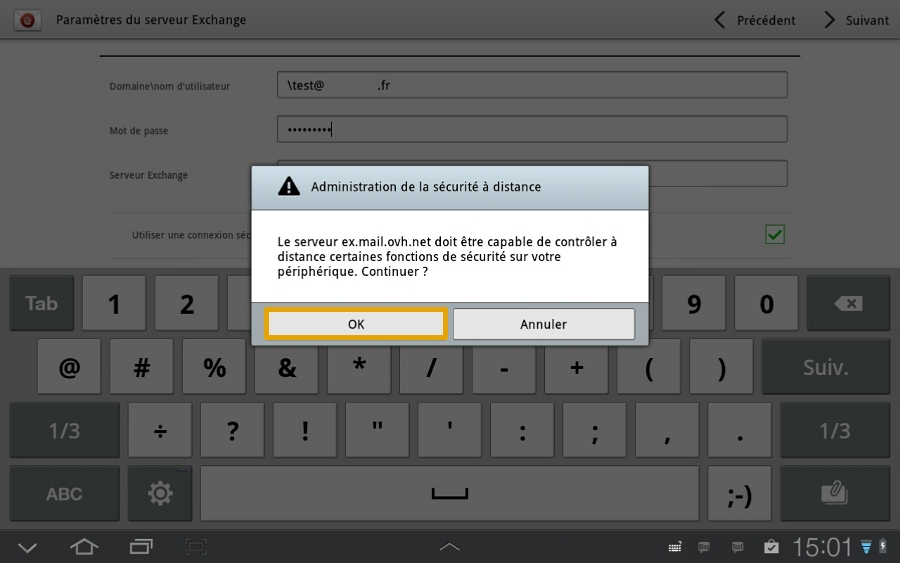
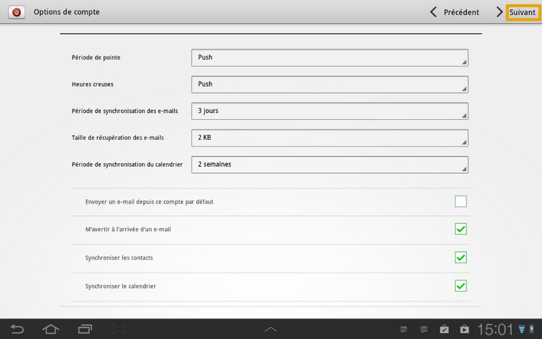
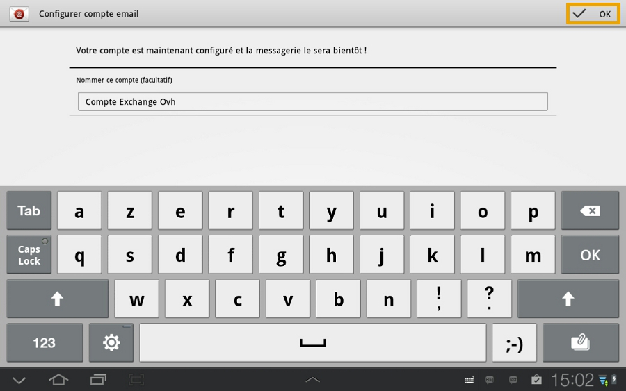

## Parte 1 : Email
Num primeiro tempo, clique no ícone "E-mail".

No nosso exemplo a conta exchange é do tipo Hosted e está configurada num Samsung Tab com Android 4.1.2

Durante a adição da conta, verifique que a sua ligação 3G ou Wi-Fi está ativa.

{.thumbnail}

## Parte 2 : Configuração da conta de email
Introduza o seu endereço de email Exchange completo e a palavra-passe definida no seu [Espacço Cliente](https://www.ovh.com/auth/?action=gotomanager&from=https://www.ovh.pt/&ovhSubsidiary=pt)) para a conta Exchange.

Clique de seguida em "Configuração manual" para continuar.

{.thumbnail}

## parte 3 : tipo de email
Selecione de seguida "Microsoft Exchange ActiveSync" para prosseguir com a configuração da conta Exchange.

{.thumbnail}

## Parte 4 : Parâmetros do servidor Exchange
Para todas as encomendas efetuadas a partir de 26/04/2016, o servidor Exchange para uma oferta Hosted é: ex2.mail.ovh.net.
Terá de introduzir as seguintes informações para usar a sua conta Exchange.

"Domínio\Nome de utilizador": não introduza o domínio; adicione uma anti-slash ("\") e o seu endereço de email completo.

"Palavra-passe": a palavra-passe definida no seu [Espaço Cliente](https://www.ovh.com/auth/?action=gotomanager&from=https://www.ovh.pt/&ovhSubsidiary=pt)).

"Servidor Exchange": o servidor da sua conta Exchange.
No caso de uma conta do tipo Hosted, trata-se do servidor ex.mail.ovh.net ; Para as ofertas Private deverá introduzir  nome que escolheu durante a instalação Exchange.

"Utilizar uma ligação segura (SSL)": opção deve estar selecionada.

"Aceitar todos os certificados SSL": deve estar selecionada.

Clique em "Seguinte" para continuar.

{.thumbnail}

## Parte 5 : Ativação
Uma mensagem de administração da política de confidencialidade aparecerá; é necessário validar a mesma através de um clique em "OK".

{.thumbnail}

## Parte 6 : Administração de segurança
Uma segunda mensagem de administração irá pedir-lhe a validação de controlo remoto do periférico.

Valide o pedido ao clicar em "OK".

{.thumbnail}

## Parte 7 : Opções de conta
Nesta interface, poderá definir certas opções de configuração para o endereço de email Exchange.

Uma vez efetuada a configuração, prossiga ao clicar em "Seguinte".

{.thumbnail}

## Parte 8 : Administrador do periférico
Ser-lhe-ão indicadas nesta interface as permissões da aplicação "Email" de Android.

Clique em "Ativar" para continuar.

{.thumbnail}

## Parte 9 : Finalização
Já poderá dar um nome à sua conta de email.

Para concluir a instalação da sua conta Exchange, clique em "OK".

{.thumbnail}

## Interface Email
Eis a interface que poderá utilizar.

Um clique no ícone no canto superior direito permite acesso às configurações da conta Exchange.

{.thumbnail}

## Interface de configuração de email
Eis a interface de configuração que será possível utilizar.

{.thumbnail}

