Avant de réaliser ces manipulations, assurez-vous que le champ SRV de votre nom de domaine est correctement configuré. Cliquez [ici](https://www.ovhcloud.com/fr/emails/hosted-exchange/){.external} pour retrouver nos différents guides

> [!warning]
>
> OVH met à votre disposition des services dont la configuration, la gestion et la responsabilité vous incombent. Il vous revient de ce fait d'en assurer le bon fonctionnement.
> 
> Nous mettons à votre disposition ce guide afin de vous accompagner au mieux sur des tâches courantes. Néanmoins, nous vous recommandons de faire appel à un prestataire spécialisé et/ou de contacter l'éditeur du service si vous éprouvez des difficultés. En effet, nous ne serons pas en mesure de vous fournir une assistance. Plus d'informations dans la section « Aller plus loin » de ce guide.
> 

## Configuration du compte Exchange sous Android 5

### Partie 1 &#58; Parametre du telephone
Dans notre exemple le compte Exchange est un compte de type Hosted.

Dans un premier temps, cliquez sur l'icône "Paramètres".

Lors de l'ajout du compte, vérifiez que votre connexion 3G ou Wi-Fi soit activée.

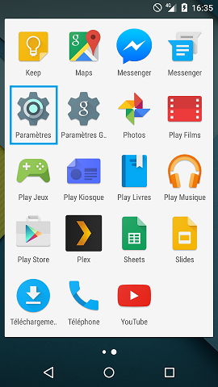{.thumbnail}

### Partie 2 &#58; Comptes
Sélectionnez "comptes" dans les paramètres, section "personnel"

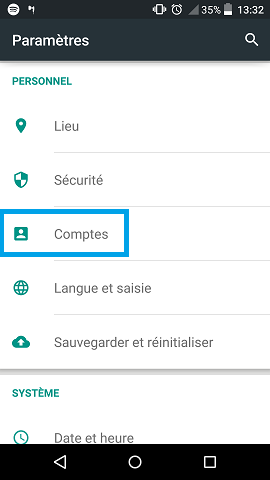{.thumbnail}

### Partie 3 &#58; Ajouter un compte
Sélectionnez le menu : "Ajouter un compte"

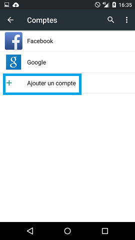{.thumbnail}

### Partie 4 &#58; Type de compte
Sélectionnez le type de compte : Exchange

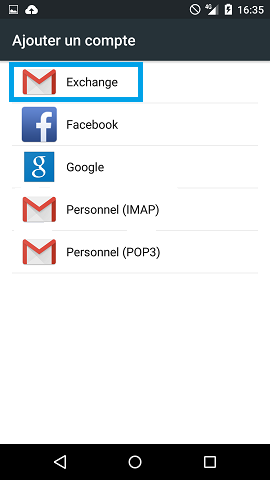{.thumbnail}

### Partie 5&#58; Configuration du compte Exchange
Saisissez votre compte E-mail "Exchange".

Puis "Configuration manuelle".

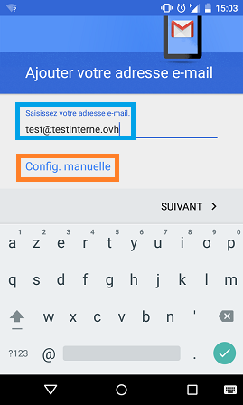{.thumbnail}

Validez de nouveau le type de compte : "Exchange"

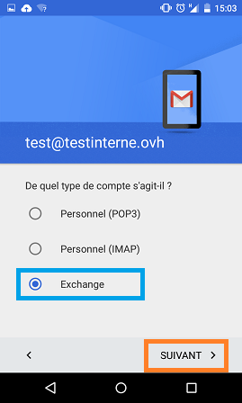{.thumbnail}

Saisissez votre mot de passe. Vous pouvez si vous le souhaitez afficher les caractères saisis.

"Suivant" pour valider et passer à l'étape suivante.

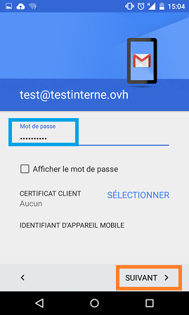{.thumbnail}

Il sera demandé de renseigner le nom du serveur Exchange à cette étape :

> [!success]
>
> Dans notre exemple nous utilisons comme serveur : ex.mail.ovh.net. Il se peut que votre serveur soit différent.
> Vous pouvez retrouver l'information dans la section `Informations Générales`{.action}
> de votre service Exchange puis rubrique Connexion et Webmail.
> Il est nécessaire d'enlever le https://.
> 

- Pour une offre Hosted Exchange OVH 2013/2016 : ex.mail.ovh.net
- Pour une offre Private Exchange OVH 2013/2016 : Cela correspond au nom choisi pour le certificat SSL de votre serveur.

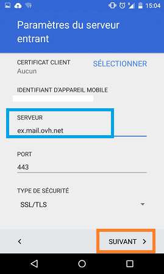{.thumbnail}

Une vérification des paramètres est effectuée. Cela ne dure que quelques secondes.

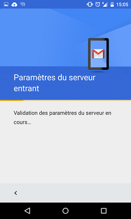{.thumbnail}

Vous devez ensuite valider un avertissement afin d'autoriser le serveur exchange à dialoguer avec votre téléphone.

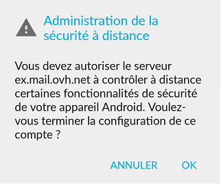{.thumbnail}

Paramétrez ensuite les options du compte Exchange puis "suivant" pour valider.

La configuration de votre compte est alors terminée et fonctionnelle. Celui-ci va se synchroniser. Cela peut prendre plusieurs minutes.

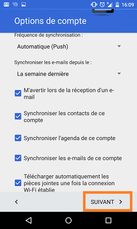{.thumbnail}

## Aller plus loin

Échangez avec notre communauté d'utilisateurs sur <https://community.ovh.com>.