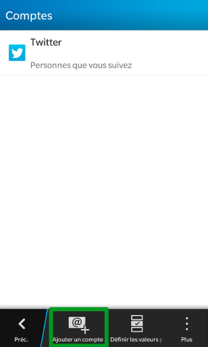

## Step 1: Settings
Click "Settings".

In our example, we configure an Exchange 2013 account on a Z10 Blackberry OS 10.

Make sure that you are connected to the internet via 3G or Wi-Fi.

{.thumbnail}

## Step 2: System settings
In system settings, select "Accounts" (Configure email, contacts, calendar).

{.thumbnail}

## Step 3: Add an account
Notice that here we can see the other types of account on your device.

Select "Add Account".

{.thumbnail}

## Step 4: Advanced add
Then select Advanced.

{.thumbnail}

## Step 5: Advanced configuration
Then select the Microsoft Exchange ActiveSync account type.

{.thumbnail}

## Step 6: Account settings
Fill in the following under account settings:

Description: enter the description of your choice.

Domain: leave this field empty.

Username: your full Exchange email address. In our example: team@support-exchange.eu.

Email: your full Exchange email address. In our example: team@support-exchange.eu.

Password: The password chosen when creating your Exchange address.

Server Address: "ex.mail.ovh.net"

Please note: for a private server, you need to enter your host name.

Port: "443"

Use SSL: this must be enabled.

Use a VPN: this should be disabled by default.

Download messages while roaming: this allows you to download messages abroad using a mobile internet connection. This may incur extra costs with some operators.

Push: this must be enabled.

Now click "Next".

{.thumbnail}

## Step 7: Synchronisation options
Select the items you want to synchronise on your BlackBerry. By default, everything is synchronised.

{.thumbnail}

## Step 8: Account configured
Your account is now configured - you can access it via your BlackBerry Hub.

{.thumbnail}

