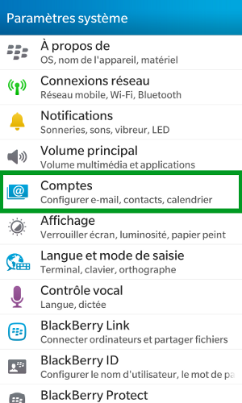
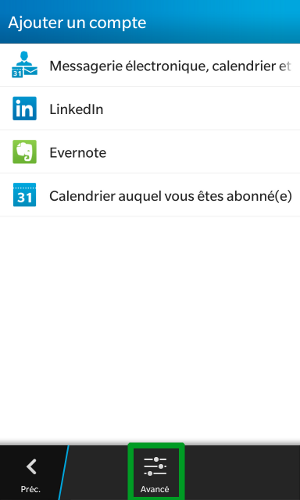
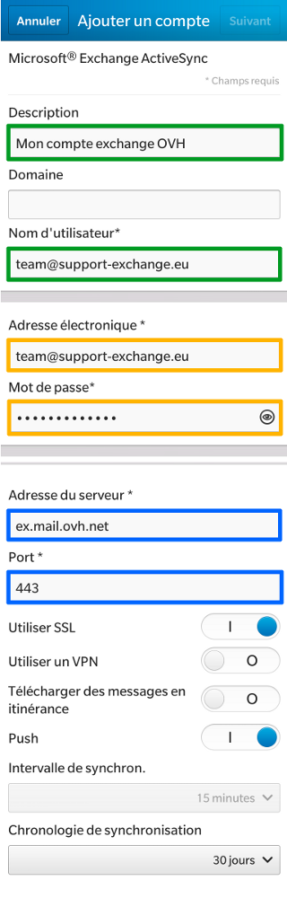
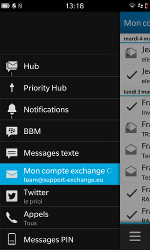

Avant de réaliser ces manipulations, assurez-vous que le champ SRV de votre nom de domaine est correctement configuré. [Un guide est disponible ici](https://www.ovh.com/fr/exchange/guides/g1311.exchange_20132016_premiere_configuration_du_service){.external} pour la mise en place du champ SRV sur votre nom de domaine.

Cliquez [ici](https://www.ovh.com/fr/emails/hosted-exchange/guides/){.external} pour retrouver nos différents guides.

> [!warning]
>
> OVH met à votre disposition des services dont la configuration, la gestion et la responsabilité vous incombent. Il vous revient de ce fait d'en assurer le bon fonctionnement.
> 
> Nous mettons à votre disposition ce guide afin de vous accompagner au mieux sur des tâches courantes. Néanmoins, nous vous recommandons de faire appel à un prestataire spécialisé et/ou de contacter l'éditeur du service si vous éprouvez des difficultés. En effet, nous ne serons pas en mesure de vous fournir une assistance. Plus d'informations dans la section « Aller plus loin » de ce guide.
> 

## Configuration du compte Exchange sous OS 10

### partie 1 &#58; parametres
Cliquez sur "Paramètres" .

Dans notre exemple le compte Exchange est un compte de type Hosted, configuré sur un Blackberry Z10 sous OS 10.

Lors de l'ajout du compte, vérifiez que votre connexion 3G ou Wi-Fi est active.

{.thumbnail}

### partie 2 &#58; parametres systeme
Dans les paramètres système, sélectionnez  "Comptes" (Configurer e-mail, contacts, calendrier).

{.thumbnail}

### partie 3 &#58; ajouter un compte
Remarquez que l'on trouve à ce niveau d'autres types de compte.

Sélectionnez  "Ajouter un compte".

{.thumbnail}

### Partie 4 &#58; ajout avance
Sélectionnez ensuite Avancé.

{.thumbnail}

### Partie 5 &#58; configuration avancee
Sélectionnez ensuite le type de compte Microsoft Exchange ActiveSync.

{.thumbnail}

### Partie 6 &#58; parametres du compte

> [!success]
>
> Dans notre exemple nous utilisons comme serveur : ex.mail.ovh.net. Il se peut que votre serveur soit différent.
> Vous pouvez retrouver l'information dans la section `Informations Générales`{.action}
> de votre service Exchange puis rubrique Connexion et Webmail.
> Il est nécessaire d'enlever le https://.
> 

Renseignez les paramètres suivants :

Description : Entrez ici une description de votre choix.

Domaine: Laissez ce champ vide.

Nom d'utilisateur : Votre adresse Exchange complète, *dans notre exemple team @support-exchange.eu*.

Adresse électronique : Votre adresse Exchange complète, *dans notre exemple team@support-exchange.eu*.

Mot de passe : "Le mot de passe choisi lors de la création de votre adresse Exchange".

Adresse du serveur : "ex.mail.ovh.net"

**Attention, pour un serveur private, vous devez renseigner votre nom d'hôte.**

Port: "443"

Utiliser SSL: doit être activé.

Utiliser un VPN: doit être désactivé par défaut.

Télécharger des messages en itinérance : permet de télécharger des messages grâce à une connexion mobile à l'étranger. Cela peut générer des surcoûts selon votre opérateur.

Push : doit être activé.

Cliquez à présent sur "suivant".

{.thumbnail}

### Partie 7 &#58; Options de synchronisations
Choisissez ensuite les éléments que vous souhaitez synchroniser sur votre BlackBerry. Par défaut tout est synchronisé.

{.thumbnail}

### Partie 8 &#58; Compte configure
Votre compte est à présent configuré, vous pouvez utiliser votre BlackBerry Hub pour y accéder.

{.thumbnail}

## Aller plus loin

Échangez avec notre communauté d'utilisateurs sur <https://community.ovh.com>.