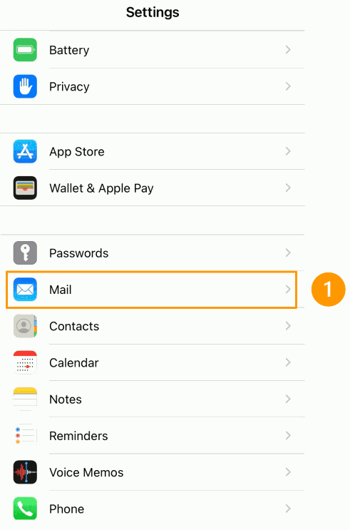

**Last updated 21st May 2021**

## Objective

You can configure Exchange accounts on email clients, if they are compatible. By doing so, you can use your email address through your preferred email application.

**This guide explains how to configure your Exchange account on iPhone and iPad, via the Mail app.**

> [!warning]
>
> OVHcloud provides services which you are responsible for with regard to their configuration and management. You are therefore responsible for ensuring they function correctly.
>
> This guide is designed to assist you in common tasks as much as possible. If you encounter any difficulties performing these actions, please contact a [specialist service provider](https://partner.ovhcloud.com/en-ca/directory/) and/or discuss the issue with our community on https://community.ovh.com/en/. OVHcloud cannot provide you with technical support in this regard.
>

## Requirements

- an [OVHcloud Exchange account](https://www.ovhcloud.com/en-ca/emails/hosted-exchange/){.external}
- the Mail app installed on your iOS device
- login credentials for the email account to be configured

## Instructions

### Adding an account 

> [!primary]
>
> In our example, we use as the hostname: ex**?**.mail.ovh.ca. You will need to replace the "?" with the actual number indicating the appropriate server for your Email Pro service.
> 
> You can find this information in the [OVHcloud Control Panel](https://ca.ovh.com/auth/?action=gotomanager&from=https://www.ovh.com/ca/en/&ovhSubsidiary=ca), in the `Web Cloud`{.action} section, if you select `Microsoft`{.action}. Click on `Exchange`{.action} and then on your service. The server name is displayed in the **Connection** box in the `General Information`{.action} tab.
>

On your device’s home screen, go to `Settings`{.action} (cogwheel icon). There are several ways you can add an account, depending on your iOS version:

- **For iOS 7, 8, 9 and 10**: Go to `Mail, Contacts, Calendar`{.action}, then `Add account`{.action}. Choose `Other`{.action}, then `Add Mail Account`{.action}. Then proceed to step 5 of the table below.

- **For iOS 11**: Go to `Accounts and passwords`{.action}, then `Add account`{.action}. Choose `Other`{.action}, then `Add Mail Account`{.action}. Then proceed to step 5 of the table below.

- **For current** versions: follow the instructions in the table below.

| | |
|---|---|
|{.thumbnail}|1. In `Settings`, go to `Mail`.    2. Tap `Accounts`.   3. Tap `Add Account`.   4. Choose `Microsoft Exchange`.|
|5. Enter your email **address** and email account **description**, tap `Next`.  6. Select `Configure Manually`.  |{.thumbnail}|
|{.thumbnail}|7. Enter:  - the server **ex?.mail.ovh.ca** (replace the **?** by [your Exchange server number](#addaccount)) -your **full email address** as username  - your account password|
|8. Please ensure that you leave `Mail`{.action} activated, so that the application can use this account. Other applications (e.g. *Calendars* and *Notes*) can use some of Exchange’s collaborative features.  9. Tap `Save` to finish adding your Exchange account.|{.thumbnail}|

To check that the account has been correctly configured, you can send a test email.

### Using your email address

Once you have configured your email address, you can start using it! You can now send and receive emails.

OVHcloud also offers a web application that includes [Exchange collaborative features](https://www.ovh.com/ca/en/emails/){.external}, accessible via <https://www.ovh.com/ca/en/mail/>. You can log in using your email credentials.

> [!primary]
>
> If you experience any difficulties receiving or sending emails, please read our [FAQ about OVHcloud email services](../../emails/emails-faq/).
>

## Go further

[Configuring a Web Hosting email address on iPhone and iPad](../../emails/email_hosting_iphone_ios_91_configuration/)

[Email FAQ](../../emails/emails-faq/)

Join our community of users on <https://community.ovh.com/en/>.
