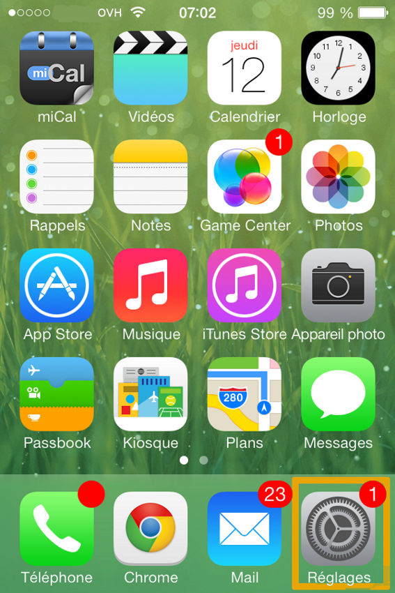
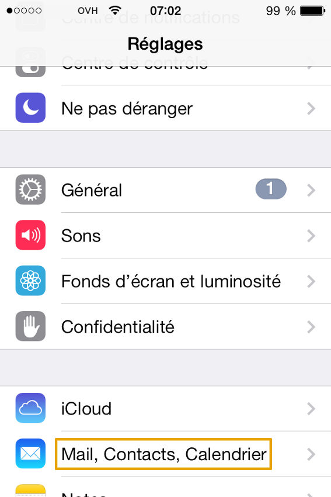
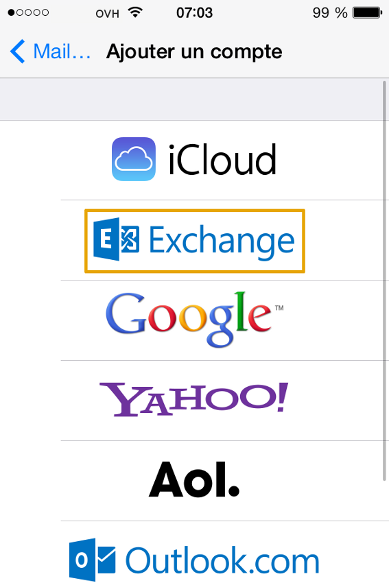
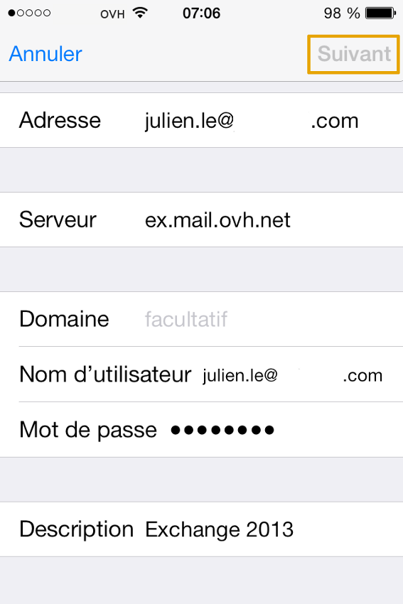
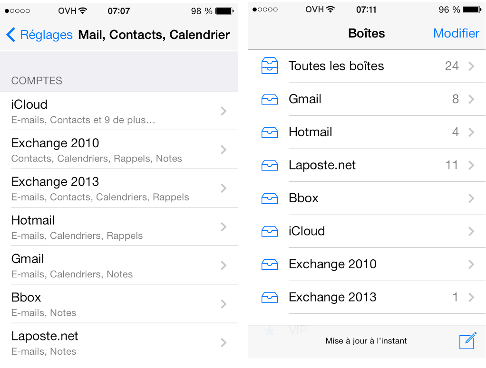

## Parte 1: impostazioni
Clicca sull'icona Impostazioni.

Nel nostro esempio, l'account Exchange è un account di tipo Hosted ed è configurato su un iPhone 4 con iOS 7.0.3.

Per un'offerta Private, devi inserire il nome del server che hai scelto al momento dell'installazione (Cf. parte 6).

Quando aggiungi un account, verifica che la connessione 3G o Wi-Fi sia attiva.

{.thumbnail}

## Parte 2: mail, contatti, calendario
In Impostazioni, accedi a Mail, Contatti, Calendario.

Puoi aggiungere il tuo account Exchange.

{.thumbnail}

## Parte 3: aggiunta di un account email
Nella finestra che si apre trovi gli indirizzi email già installati.

Per proseguire, seleziona "Aggiungi un account".

{.thumbnail}

## Parte 4: tipo di account email
Seleziona l'account che vuoi aggiungere.

Seleziona "Exchange" per continuare l'installazione del tuo account email.

{.thumbnail}

## Parte 5: impostazioni dell'account email
Inserisci le informazioni del tuo account email Exchange.

Indirizzo: il tuo indirizzo email completo.

Password: password definita nel tuo [Spazio Cliente OVH](https://www.ovh.com/manager/web/login.html) per l'account Exchange.

Descrizione: nome da visualizzare nel tuo client di posta.

È possibile testare le impostazioni del tuo account Hosted Exchange dalla tua [Webmail Exchange](https://ex.mail.ovh.net/owa/).

Clicca su Avanti per continuare.

{.thumbnail}

## Parte 6: impostazioni avanzate dell'account email
Per gli ordini effettuati dal 26/04/2016, per il server Exchange per un'offerta Hosted è: ex2.mail.ovh.net.
Inserisci le informazioni del tuo account email Exchange.

Indirizzo: il tuo indirizzo email completo.

Server: il server del tuo Exchange.
Nel nostro caso, per un'offerta Hosted, si tratta di  ex.mail.ovh.net.
Per un'offerta Private inserisci il nome del server che hai scelto al momento dell'installazione.

Dominio: facoltativo. Ti consigliamo di non inserire nulla.

Nome utente: inserisci il tuo indirizzo mail completo.

Password: password definita nel tuo [Spazio Cliente OVH](https://www.ovh.com/manager/web/login.html).

Descrizione: nome da visualizzare nel tuo client di posta.

Clicca su Avanti per continuare.

{.thumbnail}

## Parte 7: sincronizzazione dei servizi Exchange
Da questa interfaccia puoi scegliere i servizi che vuoi sincronizzare con il tuo account Exchange.

Clicca su Registra per continuare.

{.thumbnail}

## Parte 8: finalizzazione
Il tuo account è impostato correttamente.

Visualizza le informazioni sui tuoi account, nell'applicazione "Mail" di Apple.

{.thumbnail}

