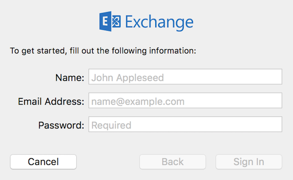
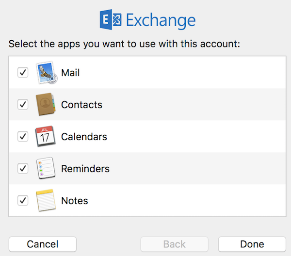

**Last updated 20th February 2018**

## Objective

You can configure Exchange accounts on a range of email clients, provided they are compatible. By doing so, you can use your email address with your preferred application, and benefit from Exchange's collaborative features.

**Find out how to configure your Exchange email account on the Mail app, for the following macOS operating systems: El Capitan, Sierra and High Sierra.**

## Requirements

- You must have an [Exchange](https://www.ovh.co.uk/emails/){.external} solution.
- You need to have the Mail app installed on your device.
- You need to have the appropriate credentials for the email address you would like to configure.

> [!primary]
>
> This guide can be used for the following macOS versions: El Capitan, Sierra, High Sierra.
>

## Instructions

There are two ways of adding your email address to the Mail app:

- **Via our Apple Devices tool:** Click on the following link and follow the configuration steps:  <https://autodiscover.mail.ovh.net/AppleDevices/>

- **Via the Mail app configuration assistant:** Launch the Mail app on your device.

From this point onwards, this guide will only cover configuration using the Mail app.

### Step 1: Add the account

Once you have launched the Mail app on your device, you can add an account in two different ways:

- **When you open the app for the first time:** A window will appear, asking you to select a service provider for your Mail account. Select `Exchange`{.action}, then continue.

- **If you have already added an account:** Click `Mail`{.action} at the top of your screen, then `Add account`{.action}. Select `Exchange`{.action}, then continue.

{.thumbnail}

Enter your account information:

|Information|Description| 
|---|---| 
|Name|Enter the sender name that you wish to be displayed when sending emails from this address.|
|Email address|Enter your full email address.|
|Password|Enter your email address' password.|  

Click on the `Log in`{.action} button. If the information you have entered is correct, and if the domain name is correctly configured on your Exchange service, your account will be connected.

{.thumbnail}

When you are asked to select the apps you want to use with your account, ensure that `Mail`{.action} is ticked, so that the application will work correctly with your email address. Other applications can also use some of some of Exchange’s collaborative features, so tick the ones you would like to make use of in this way. Once you have done so, click `Done`{.action}.

To check that the account has been correctly configured, you can send a test email.

{.thumbnail}

If you experience any issues connecting your account, we recommend:

- Checking the domain name configuration of your Exchange service in your [OVH Control Panel](https://www.ovh.com/auth/?action=gotomanager){.external}. Click on the `Associated domains`{.action} tab, then look in the `Diagnostic`{.action} column of the table.

- Trying to enter the connection URL for your Exchange service. Enter this URL, ignoring the security certificate alert, then fill in the `Internal URL`{.action} and `External URL`{.action} fields with the details of your Exchange server.

To find the server details you need, log in to your [OVH Control Panel](https://www.ovh.com/auth/?action=gotomanager){.external}, and go to the Exchange service concerned. Click on the `General Information`{.action} tab. The relevant server and its details can be found in the `Connection`{.action} section.

### Step 2: Use the email address

Once you have configured your email address, you can start using it to send and receive emails straight away!

OVH also offers a web application that includes various [collaborative features](https://www.ovh.co.uk/emails/){.external}. You can access it here, using your email credentials: <https://www.ovh.co.uk/mail/>.

## Go further

[Configuring an email address on the macOS Mail app](https://docs.ovh.com/gb/en/emails/guide-configuring-mail-on-macos/){.external}.

[Configuring your Email Pro account on the macOS Mail app](https://docs.ovh.com/gb/en/emails-pro/configuring-email-pro-macos-mail/){.external}.

Join our community of users on [https://community.ovh.com/en/](https://community.ovh.com/en/){.external}.