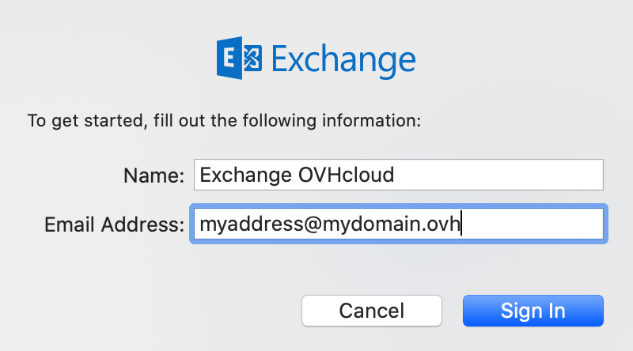

**Última atualização: 28/12/2021**

> [!primary]
> Esta tradução foi automaticamente gerada pelo nosso parceiro SYSTRAN. Em certos casos, poderão ocorrer formulações imprecisas, como por exemplo nomes de botões ou detalhes técnicos. Recomendamos que consulte a versão inglesa ou francesa do manual, caso tenha alguma dúvida. Se nos quiser ajudar a melhorar esta tradução, clique em "Contribuir" nesta página.
>

## Objetivo

As contas Exchange podem ser configuradas em vários softwares de e-mail compatíveis. Isto permite-lhe usar o seu endereço de e-mail no dispositivo que preferir. A aplicação Mail no macOS está disponível gratuitamente em todos os Mac.

**Saiba como configurar o seu endereço de e-mail Exchange no Mail do macOS.**

> [!warning]
>
> A responsabilidade sobre a configuração e a gestão dos serviços que a OVHcloud disponibiliza recai sobre o utilizador. Assim, deverá certificar-se de que estes funcionam corretamente.
> 
> Este manual fornece as instruções necessárias para realizar as operações mais habituais. No entanto, se encontrar dificuldades, recomendamos que recorra a um [prestador de serviços especializado](https://partner.ovhcloud.com/pt/directory/) e/ou que contacte o editor do serviço. Não poderemos proporcionar-lhe assistência técnica. Para mais informações, aceda à secção "Quer saber mais?" deste guia.
> 

## Requisitos

- Dispor de um endereço de e-mail [Exchange](https://www.ovhcloud.com/pt/emails/hosted-exchange/).
- Ter o software Mail instalado no seu Mac.
- Dispor das credenciais do endereço de e-mail que pretende configurar.
 
## Instruções

### Adicionar a conta

- **No início da aplicação**: um assistente de configuração aparece diretamente e convida-o a escolher o seu tipo de conta.

- **Se uma conta já estiver configurada**: clique em `Mail`{.action} na barra de menu no topo do ecrã e, a seguir, em `Contas`{.action}.

| | |
|---|---|
|{.thumbnail}|Selecione `Exchange`{.action}|
|Introduza o **Nome** da sua conta de e-mail e o seu **endereço de e-mail**, e clique em `Aceder`{.action}|{.thumbnail}|
|{.thumbnail}|Na janela seguinte, clique em `Cofiguração manual`{.action}:  - Defina o **Nome** que aparecerá na interface de navegação  - Deixe o seu **endereço de e-mail** - Deixe a sua **password** já introduzida   Para terminar a configuração, clique em `Ligar-se`{.action}|
|Além dos seus e-mails, pode selecionar outras funcionalidades Exchange que deseja gerir a partir do seu Mac.|{.thumbnail}|

### Utilizar o endereço de e-mail

Após a configuração, a conta de e-mail está pronta a usar e pode começar a enviar e receber mensagens no seu dispositivo.

A OVHcloud também disponibiliza uma aplicação web que permite aceder ao seu endereço de e-mail a partir de um browser. disponível no endereço <https://www.ovh.com/pt/mail/>. Para aceder, só precisa dos dados de acesso do seu endereço de e-mail. Para qualquer questão relativa à sua utilização, consulte o nosso manual [Utilizar o Outlook Web App com uma conta Exchange](https://docs.ovh.com/pt/microsoft-collaborative-solutions/exchange_2016_guia_de_utilizacao_do_outlook_web_app/).

### Recuperar um backup do seu endereço de e-mail

Se tiver de efetuar uma operação suscetível de causar a perda dos dados da sua conta de e-mail, sugerimos que efetue uma cópia de segurança da conta de e-mail em questão. Para isso, consulte o parágrafo "**Exportar**" na secção "**Mail para Mac OS**" do nosso manual [Migrar manualmente o seu endereço de e-mail](https://docs.ovh.com/pt/emails/migrar-os-enderecos-email-manualmente/#exportar).

### Modificar os parâmetros existentes

Se a sua conta de e-mail já está configurada e tem de aceder aos parâmetros da conta para os alterar:

- Clique em `Mail`{.action} na barra de menu no topo do ecrã e, a seguir, em `Preferências`{.action}.
- Selecione a conta em causa na coluna da esquerda e, em seguida, clique em `Regulações do servidor`{.action}.

{.thumbnail}

## Quer saber mais?
 
Fale com a nossa comunidade de utilizadores: <https://community.ovh.com/en/>.
