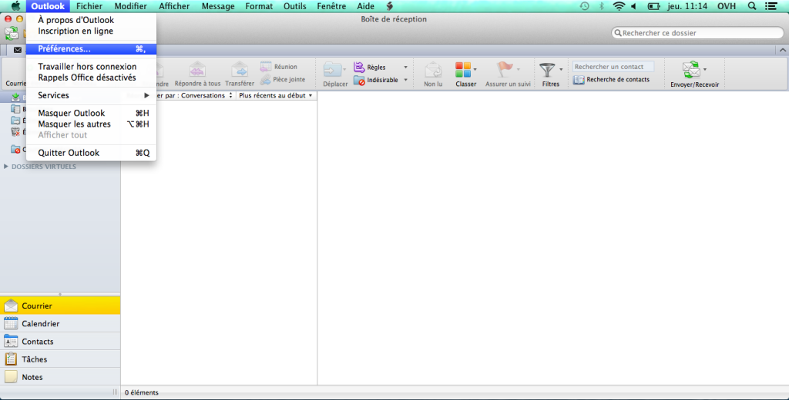
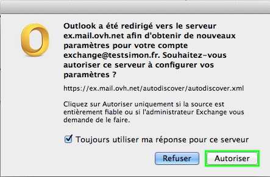

Avant de réaliser ces manipulations, assurez-vous que le champ SRV de votre nom de domaine est correctement configuré.

Cliquez [ici](https://www.ovh.com/fr/emails/hosted-exchange/guides/){.external} pour retrouver nos différents guides.

> [!warning]
>
> OVH met à votre disposition des services dont la configuration, la gestion et la responsabilité vous incombent. Il vous revient de ce fait d'en assurer le bon fonctionnement.
> 
> Nous mettons à votre disposition ce guide afin de vous accompagner au mieux sur des tâches courantes. Néanmoins, nous vous recommandons de faire appel à un prestataire spécialisé et/ou de contacter l'éditeur du service si vous éprouvez des difficultés. En effet, nous ne serons pas en mesure de vous fournir une assistance. Plus d'informations dans la section « Aller plus loin » de ce guide.
> 

## Mise en place

### Étape 1 &#58; Configuration automatique
Pour commencer, vous devez vous rendre dans l'application Outlook 2011 de votre Mac.

Un interface similaire à celle présentée sur la capture ci-contre apparaît. Nous allons maintenant ajouter le compte Exchange.

{.thumbnail}

### Étape 2 &#58; Preferences
Dans la barre de menu, sélectionnez "Outlook" puis "Préférences". Une nouvelle fenêtre apparaît.

{.thumbnail}

### Étape 3 &#58; Comptes
Sélectionnez l'icône "Comptes".

Pour ajouter un compte Exchange, cliquez ensuite sur le  **"+"**  ou directement sur  **Compte Exchange**  .

{.thumbnail}

### Étape 4 &#58; Ajouter un compte
Une nouvelle interface apparaît. Vous pouvez y renseigner les informations nécessaires pour configurer votre compte Exchange :

Adresse de messagerie : votre adresse e-mail complète.

Méthode : nom d'utilisateur et mot de passe

Nom d'utilisateur: votre adresse e-mail complète.

Mot de passe : le mot de passe choisi lors de la création de votre compte Exchange via votre [espace client](https://www.ovh.com/manager/web/login.html){.external}.

La case "Configurer automatiquement" doit être cochée.

Cliquez sur "Ajouter un compte".

{.thumbnail}

### Étape 5 &#58; Configuration manuelle
Si la configuration automatique a fonctionné, passez directement à l'étape 6. Sinon, décochez la case Configurer Automatiquement.

Puis renseignez le serveur "ex.mail.ovh.net".

> [!success]
>
> Pour toutes commandes réalisées depuis le 26/04/2016, le serveur Exchange pour
> une offre Hosted est : ex2.mail.ovh.net.
> 

Cliquez ensuite sur "Ajouter un compte".

{.thumbnail}

### Étape 6 &#58; Verification du certificat
Une boîte de dialogue vous invite à autoriser le serveur ex.mail.ovh.net à configurer vos paramètres. Cochez la case "Toujours utiliser ma réponse pour ce serveur" cela vous évite de devoir autoriser l'accès à chaque ouverture d'Outlook. Puis cliquez sur "Autoriser".

Votre compte est à présent correctement configuré.

{.thumbnail}

## Aller plus loin

Échangez avec notre communauté d'utilisateurs sur <https://community.ovh.com>.