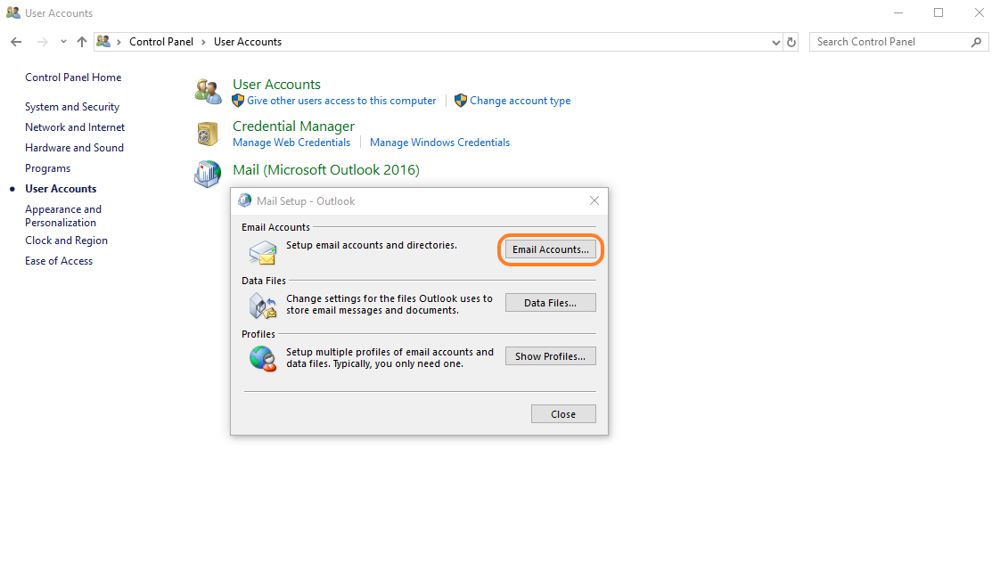
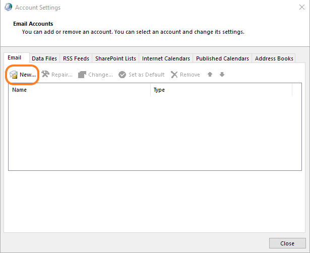
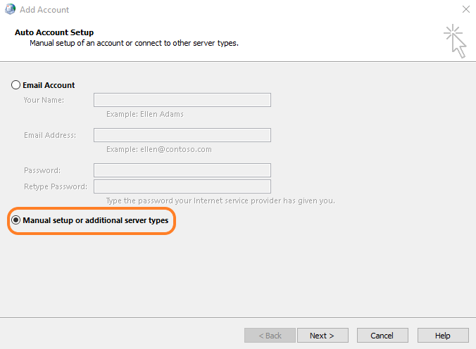
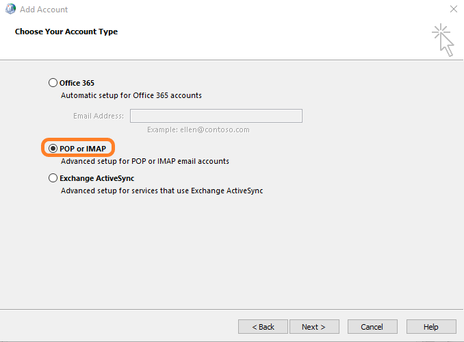
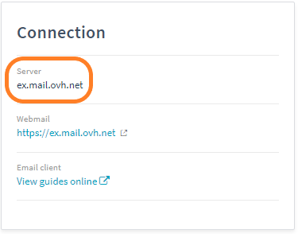
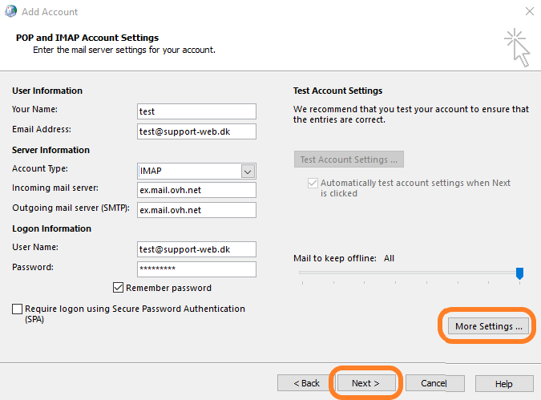
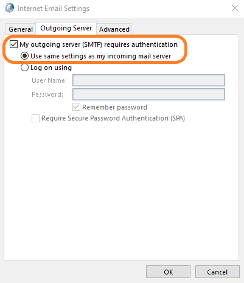
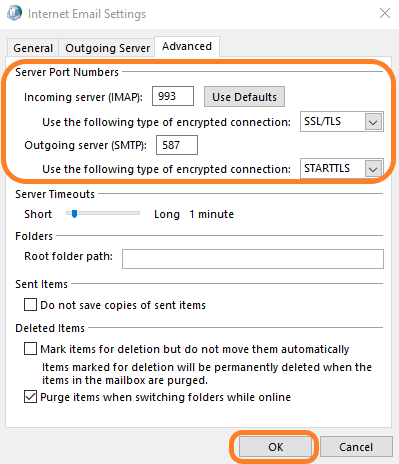
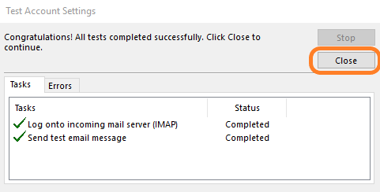
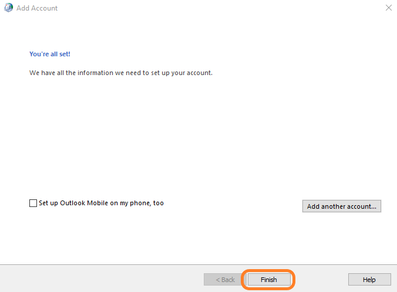

**Last updated 19th June 2019**

## Objective

This guide explain manual configuration of outlook in case if you can't set up the SRV field which is neccesary for automatic configuration.

## Requirements

- You need to have a subscription to a [Hosted Exchange](https://www.ovh.co.uk/emails/hosted-exchange/){.external} solution.
- You need to have created E-mail account on exchange solution.
- You must have outlook license.

## Instructions

### Windows Control Panel

The following steps are carried out on a workstation running on a Windows OS.

To start up, open your computer's Control Panel.

Select "User accounts" then "Mail (Microsoft Outlook 2016)" Please note that it is also possible to directly access Mail in Outlook.

Then click "Email Accounts"

## Add a new email account

Click "New..." to add an Exchange email account.

## Manual account setup

Check the box : "Manual Setup or additional server types".

Then click "Next".

## Choose a service

Select "POP or IMAP"

Then click "Next".

## Server settings

Please fill your e-mail account settings : 

- Your Name : Name of e-mail account.
- Email Address : E-mail address that you want to configure.
- Account Type : Choose IMAP.
- Incomming mail server : It has form "ex*.mail.ovh.net" depends on which server your service is hosted. Please check server name in OVH Control Panel, microsoft tab -> service name -> general information -> window "Connection" -> "Server:", please check screen below.

- Outgoing mail serwer (SMTP) : It is the same as Incomming mail server.
- User Name : E-mail address that you want to configure.
- Password : Password to e-mail account

When everyhing is correctly filled, please click on "More Settings..."

Go to "Outgoing Server and check box "My outgoing server(SMTP) requires authentication.

Also check box "Use same settings as my incoming mail server".

Now go to "Advanced tab" 

For Incomming server IMAP in "Use the following type of encrypted connection" choose : "SSL/TLS" and put port 993.

For Outgoing server SMTP in "Use the following type of encrypted connection" choose : "STARTTLS" and put port 587.

Click "Ok" and then "Next"

## Test Account Settings

System will automatically test connection with mail server (IMAP) and will send test e-mail via SMTP.

If tasks will be done correctly you can close window.

If not, please check again Step 6 about configuration Server settings.

## Confirm configuration

E-mail account is now created properly, click on "Finish" button to close window.

Your account is now correctly configured and you can start using Outlook.

