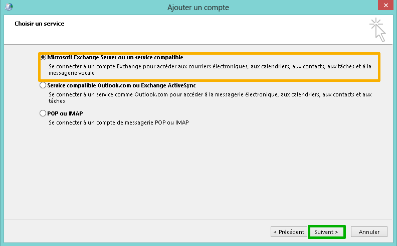
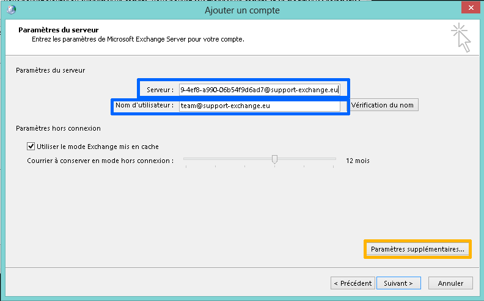

## Exchange GUID recovery
To manually configure Outlook, you must first retrieve the GUID available in your Web Control Panel. To do this, click on "Configuration" to the right of the address you want to configure.

Next to GUID, add: "@your-domain.com".

In our example this would be: 45c94143-1a29-4ef8-a990-06b54f9d6ad7@support-exchange.eu

{.thumbnail}

## Windows Control Panel
The following steps are carried out on a workstation running on a Windows OS.

To start up, open your computer's Control Panel.

Select "show small icons" to bring up "Mail" or "Mail (32-bit)" icons.

Click on the "Mail" or "Mail (32-bit)" icons. They can be found here or under user accounts. Please note that it is also possible to directly access Mail in Outlook.

Then click "Mail Accounts"

{.thumbnail}

## Step 2: Add a new email account
Click "New" to add an Exchange 2013 email account.

{.thumbnail}

## Step 3: Email account
Select "Email Account", then click "Next".

{.thumbnail}

## Step 4: Manual account setup
Tick the box next to "Manual Setup or additional server types".

Then click "Next".

{.thumbnail}

## Step 5: Choose a service
Select "Microsoft Exchange Server or a compatible service"

Then click "Next".

{.thumbnail}

## Step 6: Server settings
Server: in this field, enter the previously retrieved Exchange GUID, followed by "@your_domain".

Username: fill in this field with your full Exchange email address.

Then click "More Settings ..."

{.thumbnail}

## Step 7: Exchange proxy settings
In the "Connection" tab, check "Connect to Microsoft Exchange using HTTP".

Then click "Exchange Proxy Settings".

{.thumbnail}

## Step 8: Connection settings
Under "Use this URL to connect to my proxy server for Exchange", please enter "ex.mail.ovh.net"

Then select "Connect using SSL only". Under "Only connect to proxy servers that include the certificate principal name" enter: "msstd:ex.mail.ovh.net"

Additionally, tick the boxes next to "On fast networks, connect using HTTP first, then connect using TCP/IP" and "On slow networks, connect using HTTP first, then connect using TCP/IP."

Finally, click OK.

{.thumbnail}
For Private Exchange, replace the ex.mail.ovh.net server with the name of your server's SSL certificate.

## Step 9: Authentication
A window opens to authenticate the Exchange server. Enter your full email address and password.

Do not forget to tick "Remember this information".

Your account is now correctly configured and you can start using Outlook.

{.thumbnail}

