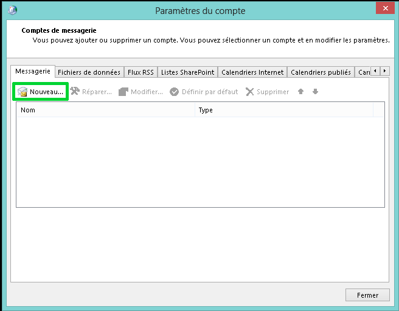

Il est parfois nécessaire de configurer Outlook manuellement soit lorsque le champ SRV n'est pas résolu par votre fournisseur d'accès à Internet, soit si le bureau d'enregistrement de votre domaine ne permet pas l'ajout d'un champ SRV.

Cliquez [ici](https://www.ovh.com/fr/emails/hosted-exchange-2013/documents/){.external} pour retrouver nos différents guides.

## Pre-requis

### Recuperation du GUID Exchange
Pour configurer manuellement votre Outlook, il faut récupérer au préalable le GUID disponible dans votre espace client en cliquant sur "Configuration" à droite de l'adresse à configurer.

Ajoutez à la suite du GUID "@votre-domaine.com".

Dans notre exemple, cela donnera : [45c94143-1a29-4ef8-a990-06b54f9d6ad7@support-exchange.eu](mailto:45c94143-1a29-4ef8-a990-06b54f9d6ad7@support-exchange.eu){.external}

{.thumbnail}

> [!alert]
>
> La version Outlook 2016 n'autorise que la configuration automatique via un champ de type SRV. Cliquez ici <legacy:1245> pour consulter le guide de configuration automatique.
> 

## Mise en place

### Panneau de configuration
Les manipulations réalisées sont effectuées sur un poste équipé du système d'exploitation Windows.

Pour commencer, vous devez vous rendre dans le panneau de configuration de votre ordinateur.

Pensez à sélectionner "afficher les petites icônes" afin de faire apparaître les icônes "Courrier" ou "Courrier (32-bit)"

Cliquez sur l'onglet "Courrier" ou  "Courrier (32-bit)" qui se trouve généralement à cet endroit ou dans les comptes utilisateurs. Notez qu'il est aussi possible d'y accéder depuis Outlook directement.

Cliquez ensuite sur "Comptes de messagerie"

{.thumbnail}

### Étape 2 &#58; ajout du nouveau compte e-mail
Cliquez sur "Nouveau" afin d'ajouter un compte e-mail Exchange.

{.thumbnail}

### Étape 3 &#58; compte de messagerie
Sélectionnez "Compte de messagerie" puis cliquez sur "Suivant".

{.thumbnail}

### Étape 4 &#58; configuration manuelle de compte
Cochez "Configuration manuelle ou types de serveurs supplémentaires"

Cliquez ensuite sur "Suivant".

{.thumbnail}

### Étape 5 &#58; choisir un service
Selectionnez "Microsoft Exchange Server ou un service compatible"

Cliquez ensuite sur "Suivant".

{.thumbnail}

### Étape 6 &#58; parametres du serveur
Serveur : renseignez dans ce champ le GUID Exchange précédemment récupéré suivi de "@votre_domaine".

Nom d'utilisateur : renseignez dans ce champ votre adresse e-mail Exchange complète.

Cliquez ensuite sur "Paramètres supplémentaires..."

{.thumbnail}

### Étape 7 &#58; parametres proxy Exchange
Dans l'onglet "Connexion", cochez l'option "Se connecter à Microsoft Exchange avec HTTP".

Cliquez ensuite sur "Paramètres proxy Exchange".

{.thumbnail}

### Étape 8 &#58; parametres de connexion
Dans le champ "Utiliser cette URL pour la connexion à mon serveur proxy pour Exchange", veuillez taper: "ex.mail.ovh.net"

Cochez ensuite "Se connecter en utilisant SSL uniquement" et "Se connecter uniquement aux serveurs proxy dont le certificat comporte ce nom principale" tapez : "msstd:ex.mail.ovh.net"

Cochez également les cases "Sur des réseaux rapides, se connecter d'abord avec HTTP, puis se connecter avec TCP/IP" et "Sur des réseaux lents, se connecter d'abord avec HTTP, puis se connecter avec TCP/IP".

Enfin, cliquez sur OK.

{.thumbnail}

> [!success]
>
> Pour les offres "Private", remplacez le serveur ex.mail.ovh.net par le nom du certificat SSL de votre serveur.
> 

> [!success]
>
> Dans notre exemple nous utilisons comme serveur : ex.mail.ovh.net. Il se peut que votre serveur soit différent.
> Vous pouvez retrouver l'information dans la section `Informations Générales`{.action}
> de votre service Exchange puis rubrique Connexion et Webmail.
> Il est nécessaire d'enlever le https://.
> 

### Étape 9 &#58; Authentification
Une fenêtre s'ouvre pour vous authentifier sur le serveur Exchange, vous devez renseigner votre adresse e-mail complète et votre mot de passe .

N'oubliez pas de cocher "Mémoriser ces informations".

Votre compte est à présent correctement configuré : vous pouvez démarrer votre logiciel de messagerie Outlook.

{.thumbnail}