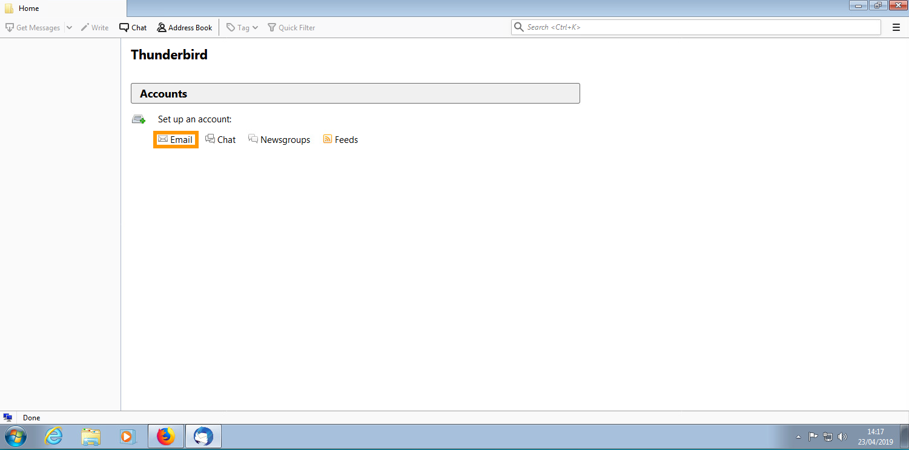
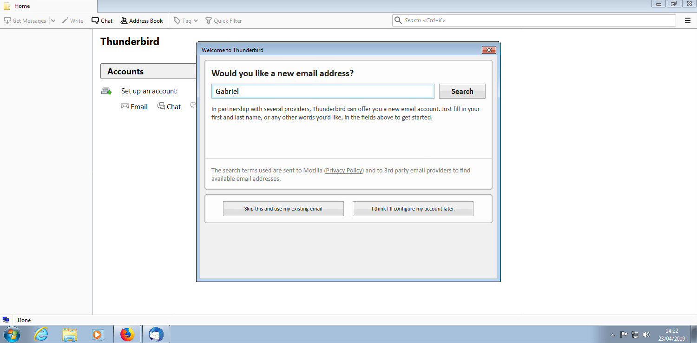
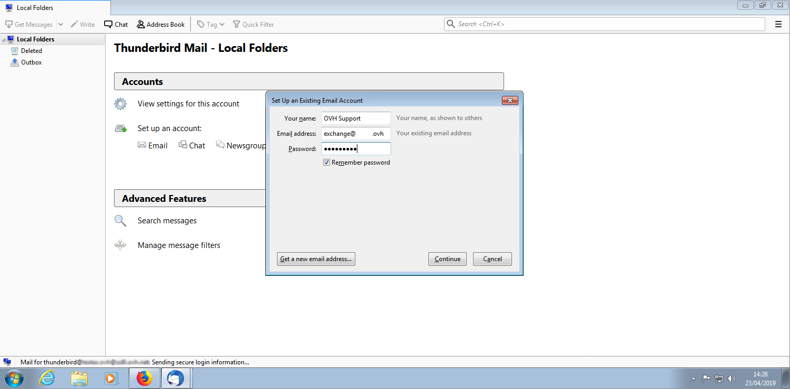
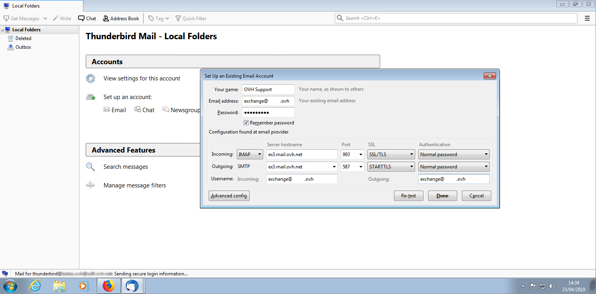
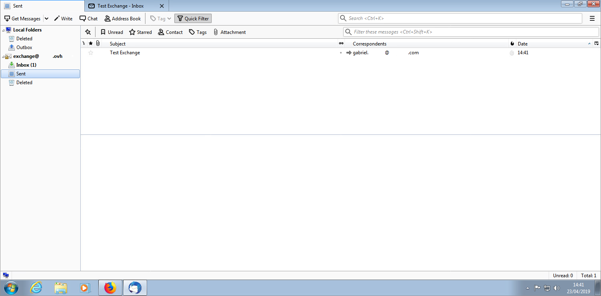
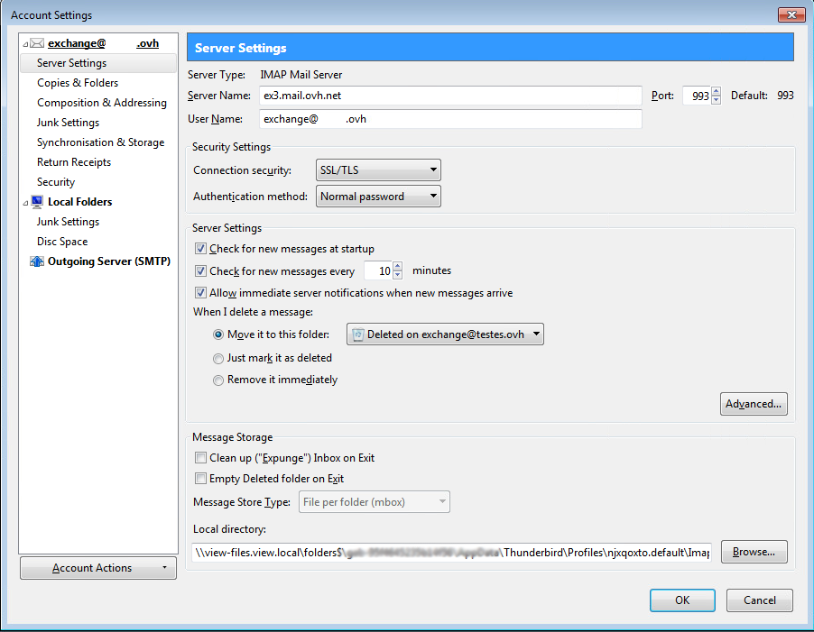
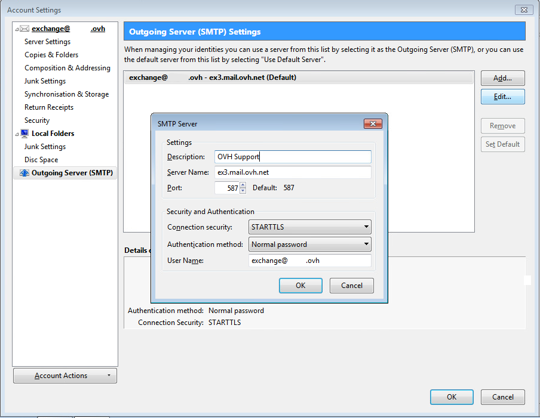

## Part 1: Startup
Open the Thunderbird application installed on your computer.

This screen will appear if you haven't configured any email accounts. If not, go to the menu bar and select Tools > Account Settings, and then click "Add Account".

To create a new email account, click on the "Email" icon to continue.

{.thumbnail}

## Part 2: Startup
A new window will open asking if you would like to create a new email address. To add your existing email address, click on "Skip this and use my existing email".

{.thumbnail}

## Part 3: Creating an account
In the New Account Setup wizard, enter the following information:

Your name: enter your chosen display name.

Email address: your full email address.

Password: the Exchange 2013 account password you set up in the [Web Control Panel](https://www.ovh.com/manager/web/login.html).

Tick Remember password: if you don't want to enter your password every time you launch Thunderbird.

Click on "Continue" to continue with the installation.

{.thumbnail}

## Part 4: Advanced configuration
If you click on "Manual configuration", you will see the adjacent screen:

Please check that the following elements are entered correctly:

"Incoming server: IMAP"

For Hosted Exchange accounts:

Server hostname: ex#.mail.ovh.net (# depends on your assigned Exchange server, you can check it in your OVH Control Panel)

Port: 993

SSL: SSL

Authentication: Normal password.

"Outgoing server: SMTP"

For Hosted Exchange accounts:

Server hostname: ex#.mail.ovh.net (# depends on your assigned Exchange server, you can check it in your OVH Control Panel)

Port: 587

SSL: STARTTLS

Authentication: Normal password.

"Username": your full email address.

For Private Exchange accounts, enter the server you selected when you ordered the Exchange server.

If the "Normal password" authentication doesn't work, you can also enter "NTLM".

Then click on "Done" to proceed with the final stages of installation.

{.thumbnail}

## Part 5: Finish up
Your Exchange 2013 account is now correctly configured in IMAP.

You should see the adjacent screenshot.

{.thumbnail}

## Incoming server settings
See this image for a reminder of how to view the account settings "for the incoming server".

{.thumbnail}

## Outgoing server settings
See this image for a reminder of how to view the account settings "for the outgoing server".

{.thumbnail}

