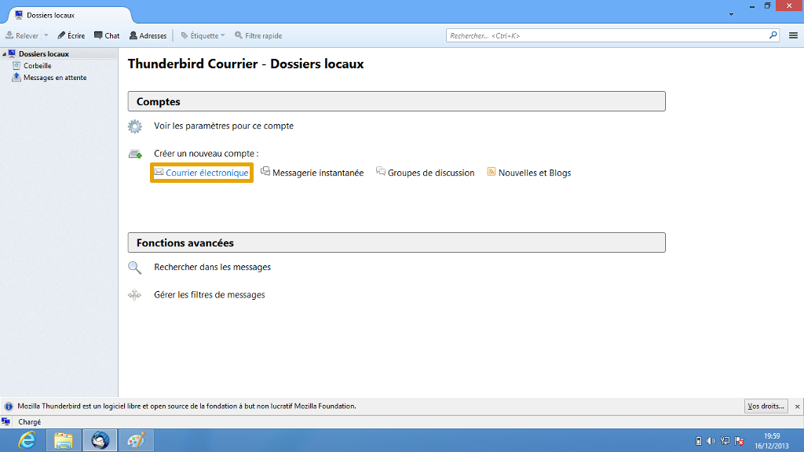
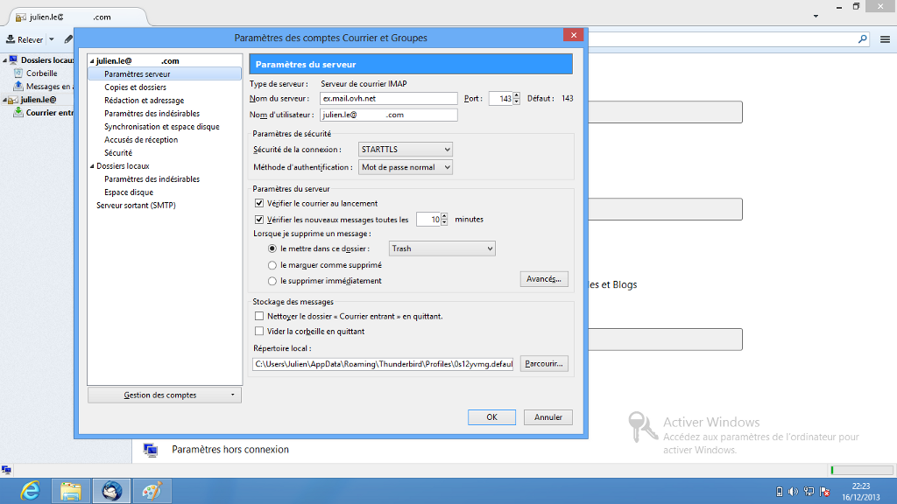

## Osa 1: Aloitus
Aluksi mene koneellesi asennettuun ”Thunderbird”-sovellukseen.

Tässä näkymä käyttöliittymästä jos mitään sähköpostilaatikkoa ei ole määritelty käyttöön. Muussa tapauksessa lisää uusi tili menemällä valikkoon.

Valitse "Sähköposti" jatkaaksesi.

{.thumbnail}

## Osa 2: Aloitus (jatkoa)
Jatkaaksesi sähköpostiosoitteen asennusta, valitse ”Ohita tämä kohta ja käytä olemassa olevaa sähköpostiosoitetta” jatkaaksesi.

{.thumbnail}

## Osa 3: tilin luonti
Täytä pyydetyt kentät:

”Etunimi Sukunimi”: Syötä nimi, jonka haluat näkyvän vastaanottajalle.

”Sähköpostiosoite”: Syötä sähköpostiosoitteesi kokonaisuudessaan.

”Salasana”: Syötä salasana, joka on määritelty Exchange 2013 -laatikolle [Web-hallintapaneelissa](https://www.ovh.com/manager/web/login.html).

”Tallenna salasana”: Rastita tämä vaihtoehto.

Klikkaa ”Jatka” jatkaaksesi asennusta.

{.thumbnail}

## Osa 4: Edistynyt määrittely
Näet tämän ikkunan mikäli klikkaat ”Muokkaa asetuksia”.

Tarkista että seuraavat kohdat on syötetty oikein:

”Saapuva palvelin: IMAP”
Hosted Exchange -tileille;
Palvelimen osoite: ex.mail.ovh.net
Portti: 143
SSL/u]: STARTTLS
Todennus: Normaali salasana.

”Lähtevä palvelin: SMTP”
Hosted Exchange -tileille;
Palvelimen osoite: ex.mail.ovh.net
Portti: 587
SSL: STARTTLS
Todennus: Normaali salasana.

”Käyttäjätunnus”: Koko sähköpostiosoitteesi.

Private Exchange -tiliä varten, syötä Exchange-palvelimen tilaushetkellä saamasi palvelimen tunnus.

Tämän jälkeen klikkaa ”Valmis” jatkaaksesi asennusta.

{.thumbnail}

## Osa 5: viimeistely
Exchange 2013 -tilisi on nyt määritelty käyttöön IMAP-protokollalla.

Katso kuvakaappaus esikatsellaksesi Thunderbird-näkymää.

{.thumbnail}

## Sisääntulevan palvelimen asetukset
Katso kuva tarkastellaksesi esimerkkitilin asetuksia ”sisääntulevan palvelimen” asetuksien osalta.

{.thumbnail}

## Ulos lähtevän palvelimen asetukset
Katso kuva tarkastellaksesi esimerkkitilin asetuksia ”ulos lähtevän palvelimen” asetuksien osalta.

{.thumbnail}

