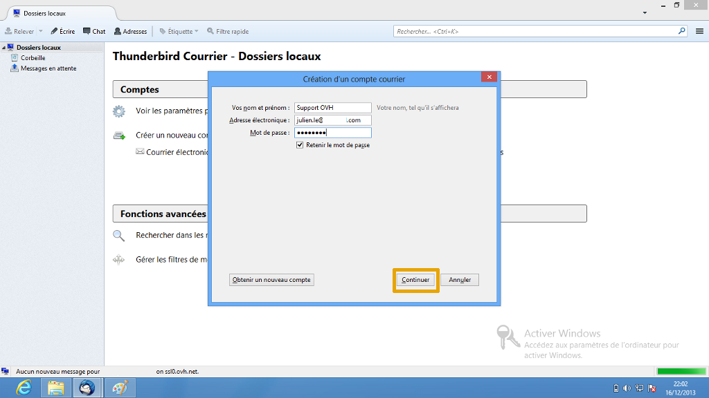
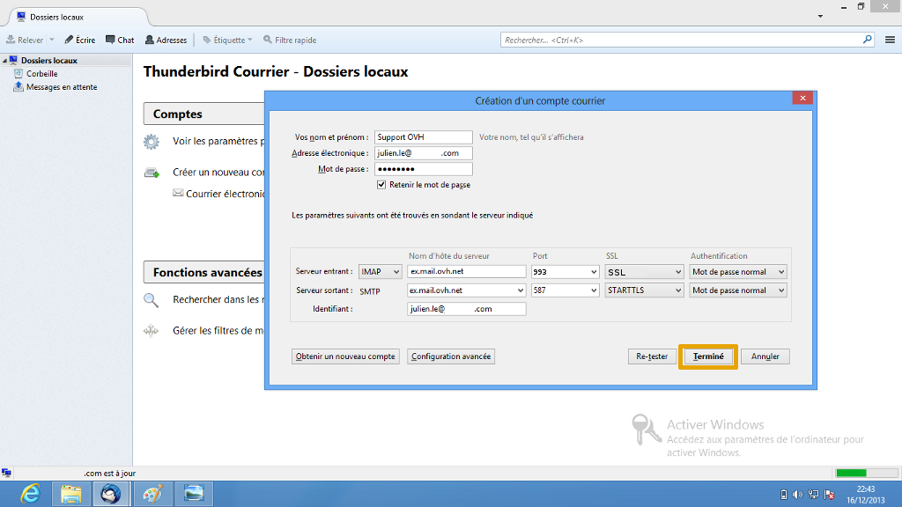
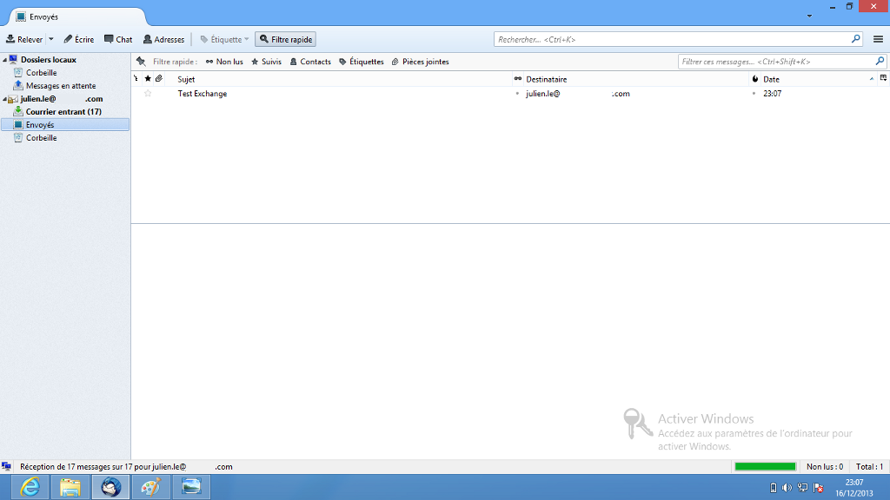
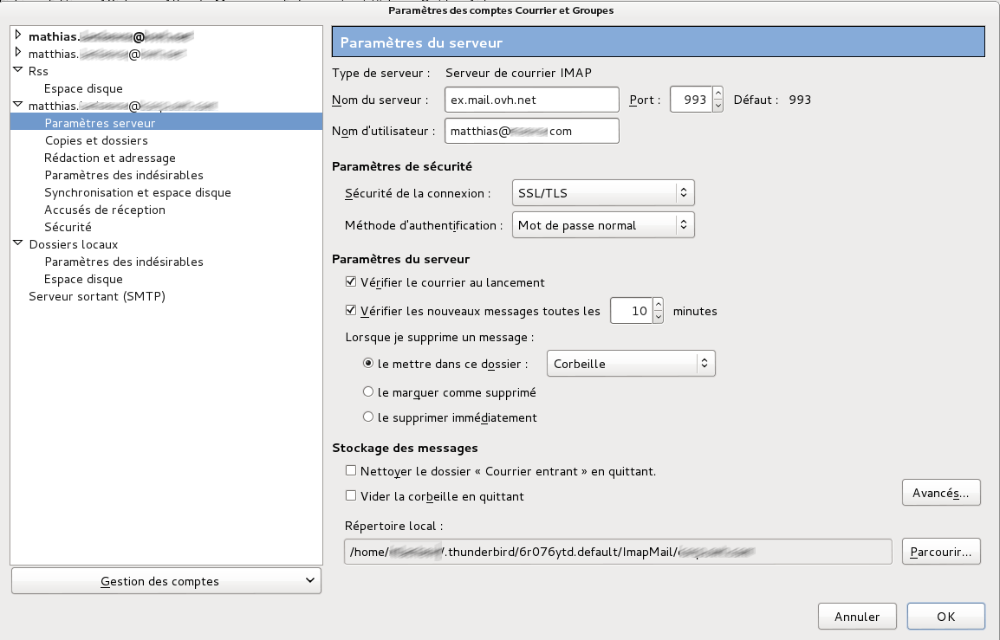
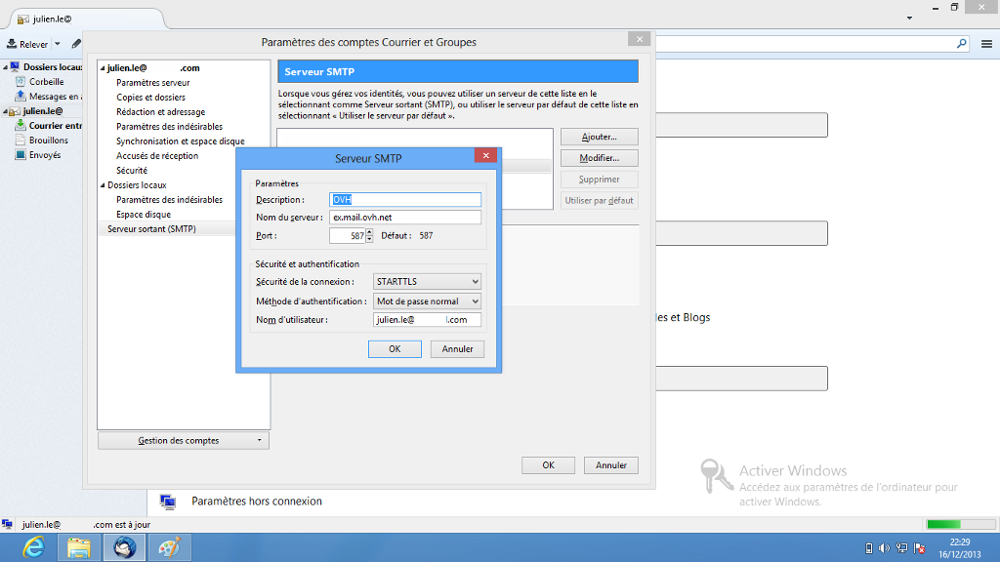

Thunderbird n'est pas compatible avec le protocle Exchange, la configuration peut se faire en POP ou en IMAP. Dans notre exemple, un compte Hosted Exchange est configuré en IMAP.

Cliquez [ici](https://www.ovh.com/fr/emails/hosted-exchange/guides/){.external} pour retrouver nos différents guides.

> [!warning]
>
> OVH met à votre disposition des services dont la configuration, la gestion et la responsabilité vous incombent. Il vous revient de ce fait d'en assurer le bon fonctionnement.
> 
> Nous mettons à votre disposition ce guide afin de vous accompagner au mieux sur des tâches courantes. Néanmoins, nous vous recommandons de faire appel à un prestataire spécialisé et/ou de contacter l'éditeur du service si vous éprouvez des difficultés. En effet, nous ne serons pas en mesure de vous fournir une assistance. Plus d'informations dans la section « Aller plus loin » de ce guide.
> 

## Thunderbird configuration

### Partie 1 &#58; Demarrage
Rendez-vous dans l'application "Thunderbird" installée sur votre poste.

Voici l'interface que vous allez voir apparaître par défaut si vous n'avez pas d'adresse e-mail configurée. Sinon aller dans le menu pour lancer l'ajout d'un nouveau compte.

Sélectionnez "Courrier électronique" pour continuer.

{.thumbnail}

### Partie 2 &#58; Demarrage (suite)
Afin de poursuivre l'installation de l'adresse e-mail, sélectionnez "Passer cette étape et utiliser mon adresse existante" pour continuer.

{.thumbnail}

### Partie 3 &#58; Création compte
Renseignez les champs affichés :

"Vos nom et prénom" : Renseignez ici le nom d'affichage désiré.

"Adresse électronique" : Votre adresse e-mail entière.

"Mot de passe" : Le mot de passe défini dans votre [Espace Client](https://www.ovh.com/manager/web/login.html){.external} pour le compte Exchange.

"Retenir le mot de passe" : Vous devez cocher cette option.

Cliquez sur "Continuer" pour poursuivre les étapes d'installation.

{.thumbnail}

### Partie 4 &#58; Configuration avancee

> [!success]
>
> Dans notre exemple nous utilisons comme serveur : ex.mail.ovh.net. Il se peut que votre serveur soit différent.
> Vous pouvez retrouver l'information dans la section `Informations Générales`{.action}
> de votre service Exchange puis rubrique Connexion et Webmail.
> Il est nécessaire d'enlever le https://.
> 

Après avoir cliqué sur "Configuration manuelle" voici l'interface qui apparaît.

Vérifiez que ces éléments sont correctement renseignés :

"Serveur entrant : IMAP" : *Pour un compte de type Hosted*

Le nom d'hôte du serveur:  **ex.mail.ovh.net**

Le port:  **993**

La méthode de chiffrement:   **SSL**

L'authentification:  **Mot de passe normal**

"Serveur sortant : SMTP" : *Pour un compte de type Hosted*

Le nom d'hôte du serveur :  **ex.mail.ovh.net**

Le port:  **587** .

La méthode de chiffrement :  **STARTTLS** .

L'authentification :  **Mot de passe normal** .

"Identifiant" : Votre adresse e-mail entière.

*Pour les comptes de type Private, le serveur à renseigner sera celui choisi lors de la commande du serveur Exchange.*

*Si l'authentification "Mot de passe normal" n'est pas fonctionnelle, il vous est aussi possible de renseigner "NTLM".*

Cliquez sur "Terminé" pour continuer les étapes d'installation.

{.thumbnail}

### Partie 5 &#58; Finalisation
Votre compte Exchange est à présent correctement configuré en IMAP.

Voici l'interface que vous trouverez à présent.

{.thumbnail}

### Parametres des comptes serveur entrant
Voici, en image, un rappel des paramètres des comptes.

"Pour le serveur entrant"

{.thumbnail}

### Parametres des comptes serveur sortant
"Pour le serveur sortant"

{.thumbnail}

## Aller plus loin

Échangez avec notre communauté d'utilisateurs sur <https://community.ovh.com>.