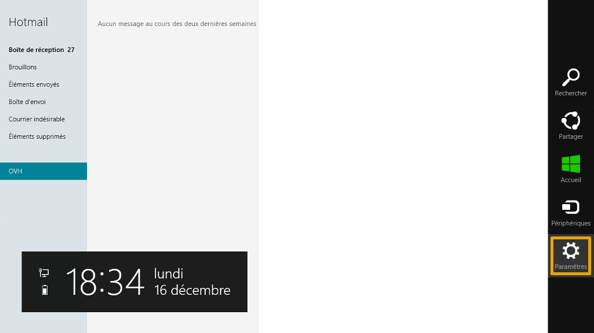
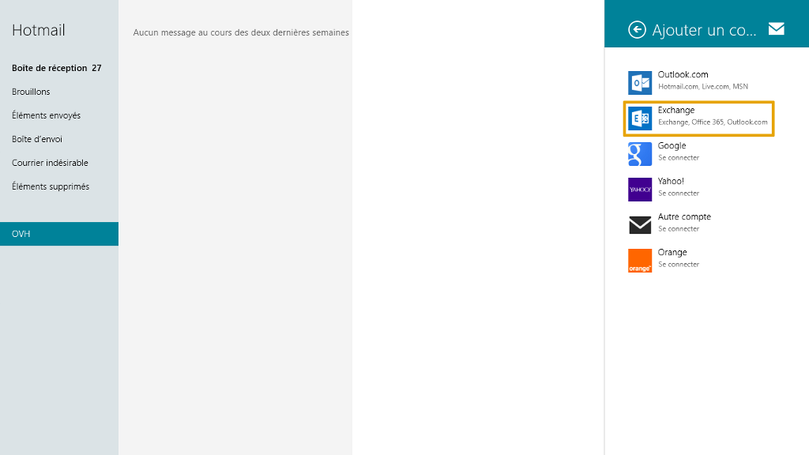
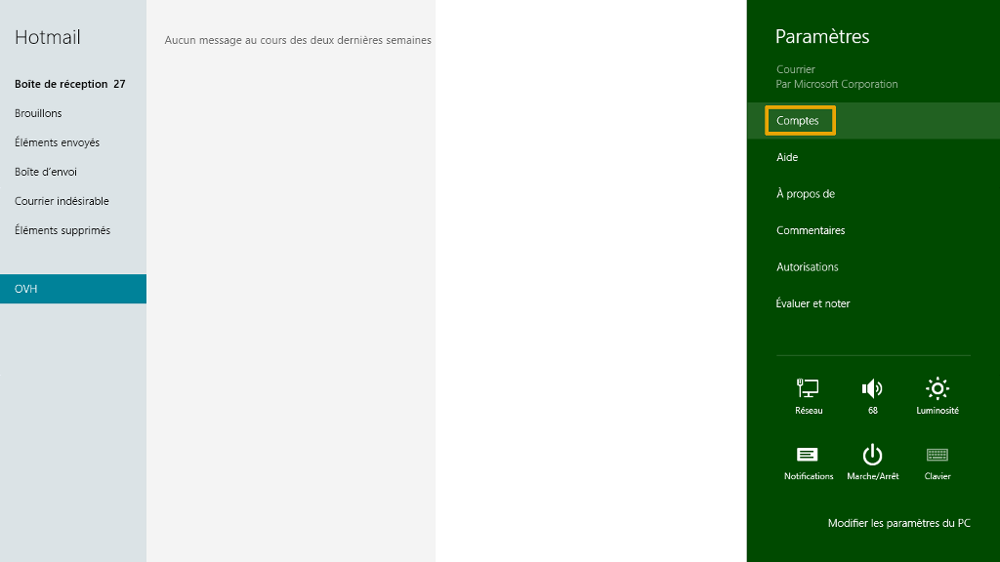
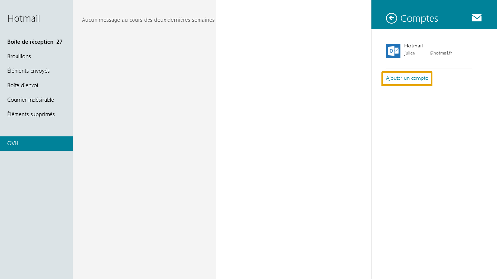
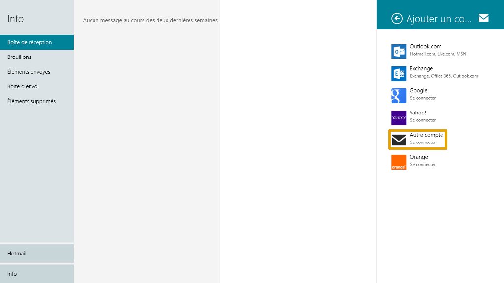
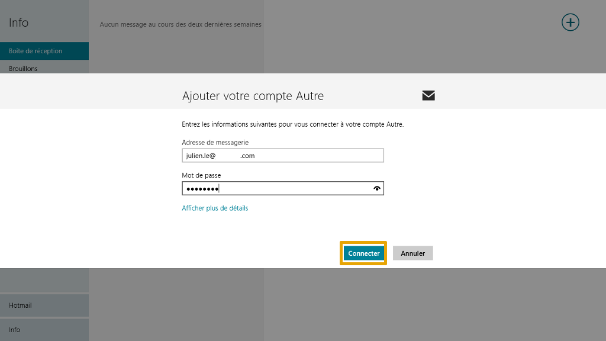

## Part 1: Startup
Go to the Windows 8 "Mail" application under your computer's Control Panel.

If it's the first time you're accessing it, you will be asked to enter your email address and password.

If you already have an account set up, you will see this Window:

Click "Settings" on the right-hand side of your Web Control Panel.

{.thumbnail}

## Part 2: Accounts
Click on "Accounts" to add your Exchange account.

{.thumbnail}

## Part 3: Add an account
In the image, we can see that an email address has already been added.

Once the Exchange 2013 account has been added, it will appear alongside the existing account. You will be able to access the settings by clicking on it.

Click on "Add an account" to continue.

{.thumbnail}

## Part 4: Type of account
To select the account type, click on "Exchange".

{.thumbnail}

## Part 5: Settings
Fill in the following fields in the new window:

"Email address": your full Exchange 2013 email address.

"Password": your Exchange 2013 account password as defined in the [Web Control Panel](https://www.ovh.com/manager/web/login.html).

Click on "Connect" to continue.

{.thumbnail}

## Part 6: Advanced settings
Fill in the following fields in the new window:

"Email address": your full Exchange 2013 email address.

"Server": enter the address of your Exchange 2013 server. In our example, the address is ex.mail.ovh.net. For Private Exchange, enter the server name chosen at the time of installation.

"Domain": this is optional, but we advise you to enter it.

"Email username": your full email address.

"Password": the Exchange 2013 account password you set up in the [Web Control Panel](https://www.ovh.com/manager/web/login.html).

Click on "Connect" to continue.

{.thumbnail}

## Part 7: Security warning
If a warning message appears, click on "Apply these strategies" to continue.

{.thumbnail}

## Part 8: Finish up
Your Exchange 2013 account should now be correctly configured.

Here is a preview of the mailbox:

{.thumbnail}

## Part 1: Startup
Go to the Windows 8 "Mail" application under your computer's Control Panel.

If it's the first time you're accessing it, you will be asked to enter your email address and password.

If you already have an account set up, you will see this Window:

Click "Settings" on the right-hand side of your Web Control Panel.

{.thumbnail}

## Part 2: Accounts
Click on "Accounts" to add your Exchange account.

{.thumbnail}

## Part 3: Add an account
In the image, we can see that an email address has already been added.

Once the Exchange 2013 account has been added, it will appear alongside the existing account. You will be able to access the settings by clicking on it.

Click on "Add an account" to continue.

{.thumbnail}

## Part 4: Type of account
To select the account type, click on "Other account".

{.thumbnail}

## Part 5: Settings
Fill in the following fields in the new window:

"Email address": your full Exchange 2013 email address.

"Password": your Exchange 2013 account password as defined in the [Web Control Panel](https://www.ovh.com/manager/web/login.html).

Click on "Connect" to continue.

{.thumbnail}

## Part 6: Advanced settings
In the new window, fill in the following fields:

blue]"Email address": your full Exchange 2013 email address.

"Username": your full email address.

"Password": your Exchange 2013 account password as defined in the [Web Control Panel](https://www.ovh.com/manager/web/login.html).

"Incoming server (IMAP)": enter the address of your Exchange 2013 server. In our example, the address is ex.mail.ovh.net. For Private Exchange, enter the server name chosen at the time of installation.
The "Port" number must be 993.

The "Incoming server requires SSL" box must be ticked.

"Outgoing server (SMTP)": in our example, the address is ex.mail.ovh.net. For Private Exchange, enter the server name you chose at the time of installation.
The "Port" number is 465.

The "Outgoing server requires SSL" and the "Outgoing server requires authentication" boxes must be ticked.

The "Use the same username and password to send and receive email" option must also be ticked.

Click "Connect" to continue.

{.thumbnail}

## Part 7: Finish up
Your Exchange 2013 account should now be correctly configured in IMAP.

Here is a preview of the mailbox:

{.thumbnail}

