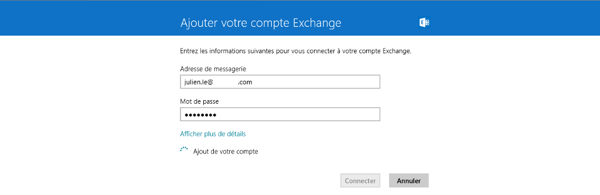
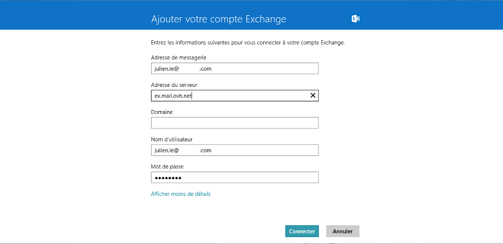
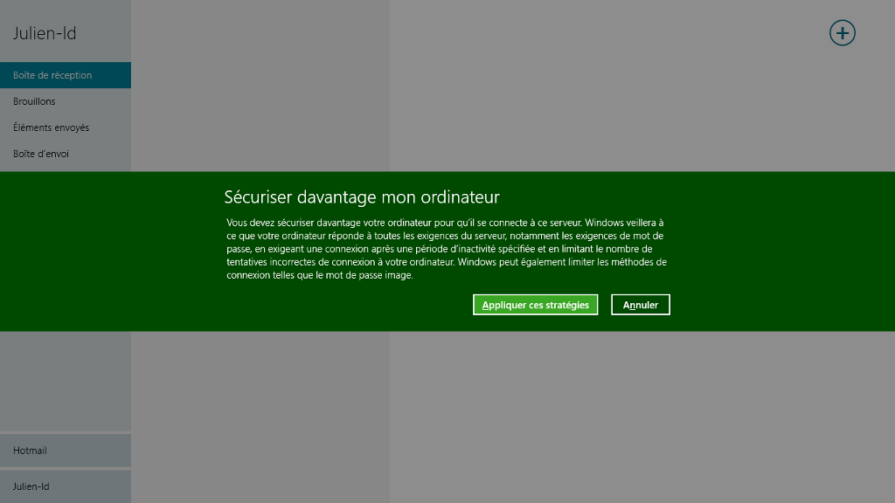
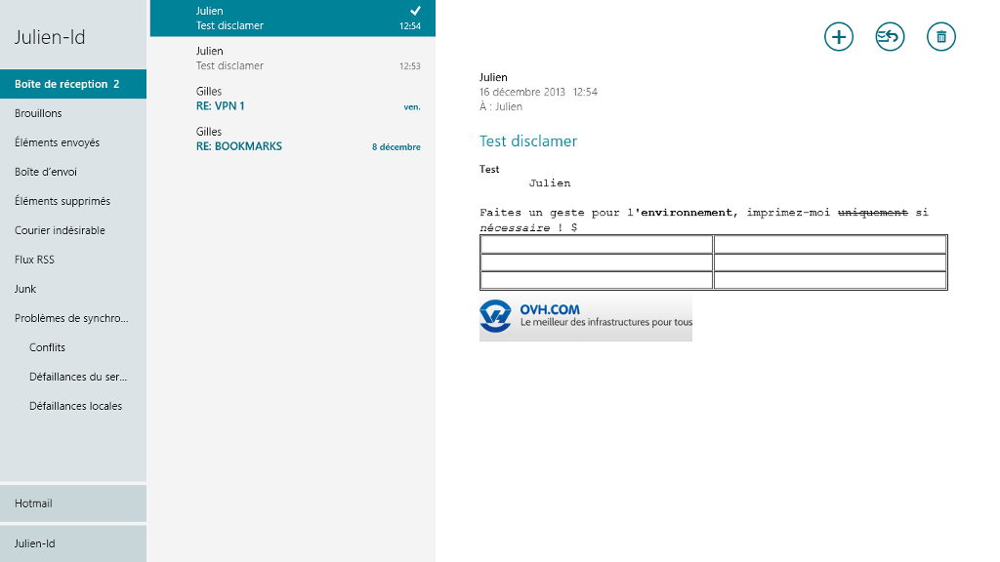
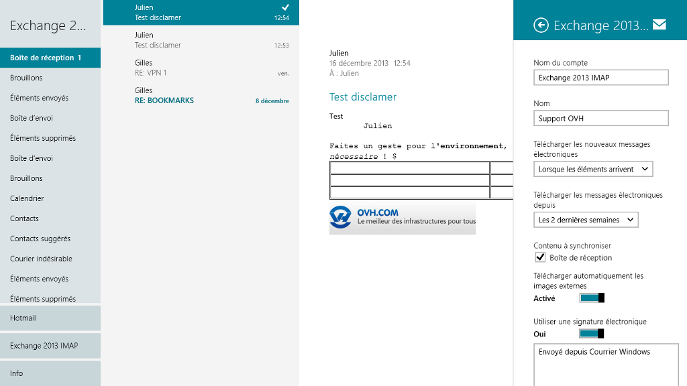

Avant de réaliser ces manipulations, assurez-vous que le champ SRV de votre nom de domaine est correctement configuré. Cliquez [ici](https://www.ovh.com/fr/emails/hosted-exchange/guides/){.external} pour retrouver nos différents guides

> [!warning]
>
> OVH met à votre disposition des services dont la configuration, la gestion et la responsabilité vous incombent. Il vous revient de ce fait d'en assurer le bon fonctionnement.
> 
> Nous mettons à votre disposition ce guide afin de vous accompagner au mieux sur des tâches courantes. Néanmoins, nous vous recommandons de faire appel à un prestataire spécialisé et/ou de contacter l'éditeur du service si vous éprouvez des difficultés. En effet, nous ne serons pas en mesure de vous fournir une assistance. Plus d'informations dans la section « Aller plus loin » de ce guide.
> 

## Configuration Protocole Exchange

### Partie 1 &#58; Demarrage
Dans un premier temps, rendez-vous dans l'application "Courrier" de Windows 8 sur l'écran d'accueil de votre ordinateur.

Le premier démarrage vous demande d'indiquer une adresse de messagerie et le mot de passe associé dans une autre interface que celle présentée ici.

Si vous avez déjà un compte existant, voici l'interface que vous allez voir apparaître.

Placez votre curseur sur la partie de droite, et sélectionnez "Paramètres".

{.thumbnail}

### Partie 2 &#58; Comptes
Cliquez ensuite sur "Comptes" afin d'ajouter votre nouveau compte e-mail Exchange.

{.thumbnail}

### Partie 3 &#58; Ajouter un compte
On voit qu'une adresse e-mail est déjà présente.

Il vous sera possible, une fois que le compte Exchange sera ajouté, d'accéder au paramètre du compte via un clic sur le compte e-mail.

Cliquez sur "Ajouter un compte" pour continuer.

{.thumbnail}

### Partie 4 &#58; Type de compte
Vous devez sélectionner le type de compte e-mail à ajouter. Cliquez sur "Exchange" pour continuer.

{.thumbnail}

### Partie 5 &#58; Parametres
Dans cette nouvelle interface, renseignez les différents champs.

"Adresse de messagerie" : L'adresse e-mail Exchange entière.

"Mot de passe" : Le mot de passe défini dans [l'Espace Client](https://www.ovh.com/manager/web/login.html){.external} pour ce compte Exchange.

Cliquez sur "Connecter" pour continuer.

{.thumbnail}

### Partie 6 &#58; Parametres avances

> [!success]
>
> Dans notre exemple nous utilisons comme serveur : ex.mail.ovh.net. Il se peut que votre serveur soit différent.
> Vous pouvez retrouver l'information dans la section `Informations Générales`{.action}
> de votre service Exchange puis rubrique Connexion et Webmail.
> Il est nécessaire d'enlever le https://.
> 

Dans cette nouvelle interface, renseignez les différents champs.

"Adresse de messagerie" : L'adresse e-mail Exchange entière.

"Adresse du serveur" : Dans notre exemple le compte Exchange est un compte de type Hosted, l'adresse du serveur est donc  **ex.mail.ovh.net** Pour une offre Private, vous devrez renseigner le nom du serveur que vous avez choisi à l'installation de l'offre Exchange.

"Domaine" : Il est facultatif, il est conseillé de ne rien renseigner.

"Nom d'utilisateur" : Vous devez renseigner votre adresse e-mail entière.

"Mot de passe" : Le mot de passe défini dans [l'Espace Client](https://www.ovh.com/manager/web/login.html){.external} pour ce compte Exchange.

Cliquez sur "Connecter" pour continuer.

{.thumbnail}

### Partie 7 &#58; Avertissement de securite
Si un message d'avertissement apparaît, cliquez sur "Appliquer ces stratégies" pour continuer.

{.thumbnail}

### Partie 8 &#58; Finalisation
Votre compte Exchange est à présent correctement configuré.

Voici l'interface d'utilisation des e-mails.

{.thumbnail}

## Configuration en protocole IMAP

### Partie 1 &#58; Demarrage
Dans un premier temps, rendez-vous dans l'application "Courrier" de Windows 8 sur l'écran d'accueil de votre ordinateur.

Le premier démarrage vous demande d'indiquer une adresse de messagerie et le mot de passe associé dans une autre interface que celle présentée ici.

Si vous avez déjà un compte existant, voici l'interface que vous allez voir apparaître.

Placez votre curseur sur la partie de droite, et sélectionnez "Paramètres".

{.thumbnail}

### Partie 2 &#58; Comptes
Cliquez ensuite sur "Comptes" afin d'ajouter votre nouveau compte e-mail Exchange.

{.thumbnail}

### Partie 3 &#58; Ajouter un compte
On voit qu'une adresse e-mail est déjà présente.

Il vous sera possible, une fois que le compte Exchange sera ajouté, d'accéder au paramètre du compte via un clic sur le compte e-mail.

Cliquez sur "Ajouter un compte" pour continuer.

{.thumbnail}

### Partie 4 &#58; Type de compte
Vous devez sélectionner le type de compte e-mail à ajouter. Cliquez sur "Autre compte" pour continuer.

{.thumbnail}

### Partie 5 &#58; Parametres
Dans cette nouvelle interface, renseignez les différents champs.

"Adresse de messagerie" : L'adresse e-mail Exchange entière.

"Mot de passe" : Le mot de passe défini dans [l'Espace Client](https://www.ovh.com/manager/web/login.html){.external} pour ce compte Exchange.

Cliquez sur "Connecter" pour continuer.

{.thumbnail}

### Partie 6 &#58; Parametres avances

> [!success]
>
> Dans notre exemple nous utilisons comme serveur : ex.mail.ovh.net. Il se peut que votre serveur soit différent.
> Vous pouvez retrouver l'information dans la section `Informations Générales`{.action}
> de votre service Exchange puis rubrique Connexion et Webmail.
> Il est nécessaire d'enlever le https://.
> 

Dans cette nouvelle interface, renseignez les différents champs.

"Adresse de messagerie" : L'adresse e-mail Exchange entière.

"Nom d'utilisateur" : Vous devez renseigner votre adresse e-mail entière.

"Mot de passe" : Le mot de passe défini dans [l'Espace Client](https://www.ovh.com/manager/web/login.html){.external} pour ce compte Exchange.

"Serveur de messagerie entrant (IMAP)" : Dans notre exemple le compte Exchange est un compte de type Hosted, l'adresse du serveur est donc  **ex.mail.ovh.net** Pour une offre Private vous devrez renseigner le nom du serveur que vous avez choisi à l'installation de l'offre Exchange. Le  **"Port"**  à indiquer sera  **993** .

"Le serveur entrant requiert SSL" : doit être coché.

"Serveur de messagerie sortant (SMTP)" : Dans notre exemple le compte Exchange est un compte de type Hosted, l'adresse du serveur est donc  **ex.mail.ovh.net** Pour une offre Private, vous devrez renseigner le nom du serveur que vous avez choisi à l'installation de l'offre Exchange. Le  **Port**  à indiquer sera  **587** (méthode de chiffrement: `STARTTLS`)

"Le serveur sortant requiert SSL" : doit être coché.

"Le serveur sortant requiert l'authentification" : doit être coché.

"Utiliser les mêmes nom d'utilisateur et mot de passe pour envoyer et recevoir les messages électroniques" : doit être coché.

Cliquez sur "Connecter" pour continuer.

{.thumbnail}

### Partie 7 &#58; Finalisation
Votre compte Exchange est à présent correctement configuré en IMAP.

Voici l'interface d'utilisation des e-mails.

{.thumbnail}

## Aller plus loin

Échangez avec notre communauté d'utilisateurs sur <https://community.ovh.com>.