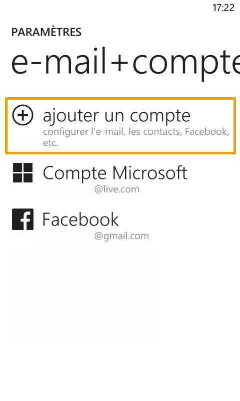
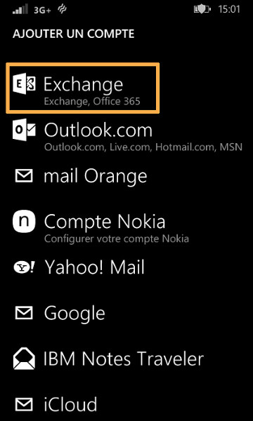
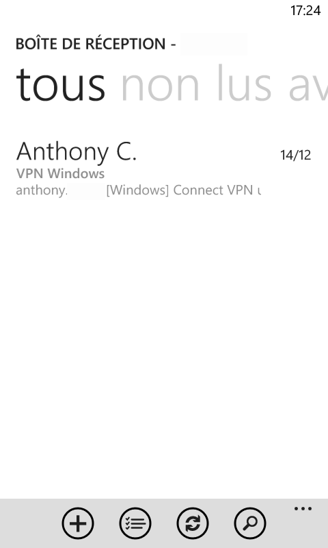

Avant de réaliser ces manipulations, assurez-vous que le champ SRV de votre nom de domaine est correctement configuré.

Retrouvez nos différents [guides Exchange](https://www.ovhcloud.com/fr/emails/hosted-exchange/){.external}.

> [!warning]
>
> OVH met à votre disposition des services dont la configuration, la gestion et la responsabilité vous incombent. Il vous revient de ce fait d'en assurer le bon fonctionnement.
> 
> Nous mettons à votre disposition ce guide afin de vous accompagner au mieux sur des tâches courantes. Néanmoins, nous vous recommandons de faire appel à un [prestataire spécialisé](https://partner.ovhcloud.com/fr/) et/ou de contacter l'éditeur du service si vous éprouvez des difficultés. En effet, nous ne serons pas en mesure de vous fournir une assistance. Plus d'informations dans la section « Aller plus loin » de ce guide.
> 

## Configuration du compte Exchange sous Windows Phone 8

### Partie 1 &#58; Parametres
Dans un premier temps, cliquez sur l'icône "Paramètres".

Dans notre exemple le compte Exchange est un compte de type Hosted, il est configuré sur un Nokia Lumia 625 avec Windows Phone 8.0

Lors de l'ajout du compte, vérifiez que votre connexion 3G ou Wi-Fi soit active.

{.thumbnail}

### Partie 2 &#58; Systeme
Afin de continuer l'ajout du compte Exchange, sélectionnez "e-mail+comptes".

{.thumbnail}

### Partie 3 &#58; Ajout d'un compte
Sélectionnez maintenant "ajouter un compte" afin de configurer votre compte Exchange.

Vous remarquerez qu'à ce niveau il est aussi possible de trouver d'autres comptes configurés.

{.thumbnail}

### Partie 4 &#58; Type de compte
En fonction de la version de Windows Phone utilisé le choix du type de compte peut être différent.

Avec Windows Phone 8.0 :

Il vous est proposé de choisir le type de compte désiré.

Dans votre cas, sélectionnez "Outlook" afin de continuer.

{.thumbnail}

Avec Windows Phone 8.1 :

Sélectionnez "Exchange, Office 365" afin de continuer.

{.thumbnail}

### Partie 5 &#58; Configuration du compte
Dans le premier champ, renseignez votre adresse e-mail entière.

Renseignez ensuite le mot de passe défini via votre [Espace Client](https://www.ovh.com/auth/?action=gotomanager&from=https://www.ovh.com/fr/&ovhSubsidiary=fr)){.external} pour le compte Exchange.

Pour continuer, sélectionnez "se connecter".

{.thumbnail}

### Acces aux e-mails
Pointez l'icône Exchange sur la page d'accueil du téléphone pour accéder à vos e-mails Exchange.

{.thumbnail}

### Apercu de la gestion des e-mails
Voici un aperçu de l'interface disponible pour la gestion des e-mails.

{.thumbnail}

## Aller plus loin

Échangez avec notre communauté d'utilisateurs sur <https://community.ovh.com>.