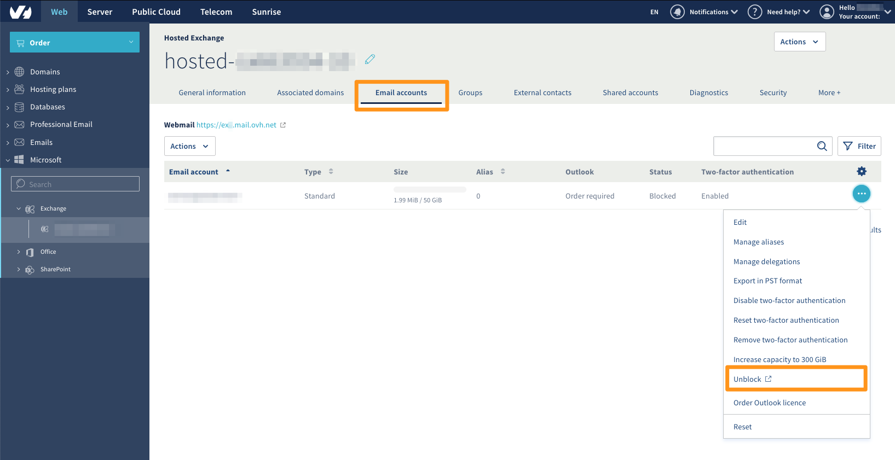
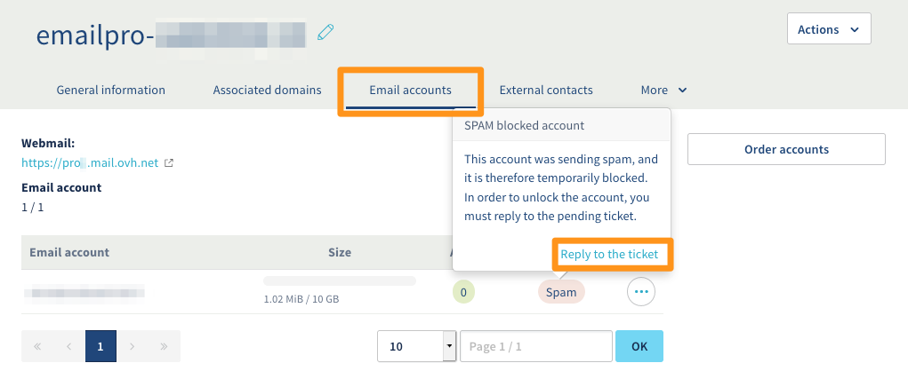
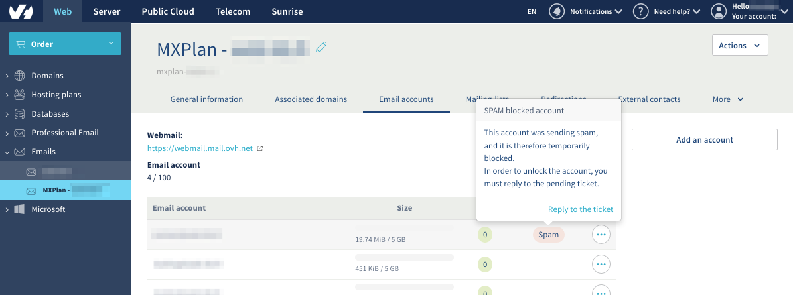
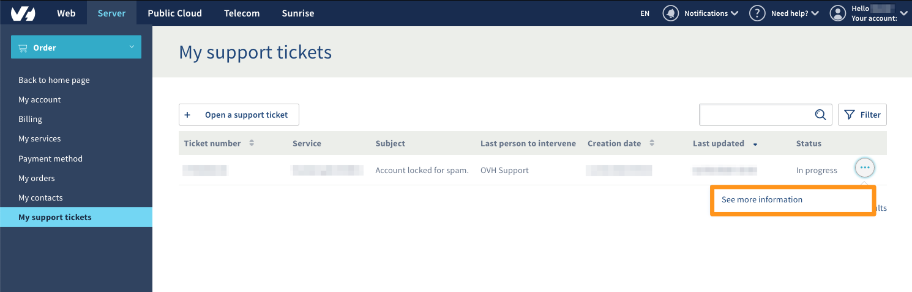

**Last updated 20th April 2020**

## Objective

If you receive an email notifying you that one of your email addresses has been blocked for spam, there are several steps to follow to be able to use it again.

**This guide explains the procedure to follow if an email account has been blocked for spam.**

## Requirements

- an [OVHcloud email solution](https://www.ovh.ie/emails/)
- access to the `Web`{.action} section of the [OVHcloud Control Panel](https://www.ovh.com/auth/?action=gotomanager)

## Instructions

### Step 1: Checking the status of the email address, and access the associated support ticket

#### For an Exchange email address:

Log in to your [OVHcloud Control Panel](https://www.ovh.com/auth/?action=gotomanager) and select `Web`{.action} in the top navigation bar. Click `Microsoft`{.action} in the services bar on the left-hand side, then `Exchange`{.action}. Next, select the Exchange service concerned.

Go to the `Email accounts`{.action} section of your platform. If the "Status" column for your email address displays "Blocked", click `...`{.action} to the right of the account concerned, then `Unblock`{.action}. Next, move on to [step 2](./#step-2-access-the-support-ticket_1) of this guide.

{.thumbnail}

#### For an Email Pro address:

Log in to your [OVHcloud Control Panel](https://www.ovh.com/auth/?action=gotomanager) and select `Web`{.action} in the top navigation bar. Click `Email Pro`{.action} in the services bar on the left-hand side, then select the Email Pro platform concerned.

Go to the `Email accounts`{.action} section of your platform. If the "Status" column to the right of the email address concerned displays "Spam", click on it, then `Reply to the ticket`{.action}. Next, move on to [step 2](./#step-2-access-the-support-ticket_1) of this guide.

{.thumbnail}

#### For an MX Plan email address:

Log in to your [OVHcloud Control Panel](https://www.ovh.com/auth/?action=gotomanager) and select `Web`{.action} in the top navigation bar. Click `Emails`{.action} in the services bar on the left-hand side, then choose the domain name concerned.

Go to the `Email accounts`{.action} section of your platform. If the "Status" column to the right of the email address concerned displays "Spam", click on it, then `Reply to the ticket`{.action}. Next, move on to [step 2](./#step-2-access-the-support-ticket_1) of this guide.

{.thumbnail}

### Step 2: Accessing the support ticket

Following step 1, you will then be redirected to the Control Panel section “My support tickets”. Click `...`{.action} to the right of the ticket with the subject “Account locked for spam”, then click `See more information`{.action}. 

{.thumbnail}

Here you will see the email that was sent to you, which has subsequently generated the support ticket.

The support ticket will look like this:

> 
> Dear Customer,
>
> Our system has detected that the address **youraddress@domain.com** hosted on our systems under the **servicename** service is a source of spam.
> The sending of emails has been temporarily disabled.
>
> We have currently detected **X** suspicious message(s).
>
> To help us re-enable sending for the address: **address@domain.com**,
> please reply to this email by answering the following questions:
>
> - Are you the sender of the email in question (see the header below)?
>
> - Do you have a redirection rule to another email address?
>
> - Have you responded to spam?
> 
> These answers will help us re-enable your account quickly.
>  
>  
> 

After this message, you will be sent a sample of email headers.

These headers will help determine the movement and origin of the emails sent.

### Step 3: Answering the three questions regarding the email account

> [!warning]
>
> Email addresses are not unblocked automatically. You will need to contact the support team by replying to the ticket with all three questions answered.
>

- **Are you the sender of the email in question?** Using the headers provided, check the sender, the recipient, and the email subject to check if it is one of your emails.

- **Do you have a redirection rule to another email address?** Check the inbox rules for your email address, and ensure that incoming spam emails were not redirected to another address.

- **Have you responded to spam?** Even just replying to spam emails plays a part in degrading the reputation of email sending servers, as well as your domain name.    

### Step 4: Putting measures in place if your email address has been fraudulently accessed

If the sent emails mentioned in the headers were not sent by the real email address holders, please take the following measures:

- Perform an anti-virus check for each of the emails sent using the email address blocked for spam, and apply a patch if these emails contain malware.

- Check all of the software using the credentials for the email address that has been blocked for spam (e.g. fax machines, business software, email software).

- Change the password for the email address, once you have performed an anti-virus check — and ensure that the password is strong enough. We recommend to consult the [guidelines defined by the NCSC for creating a strong password](https://www.ncsc.gov.uk/collection/top-tips-for-staying-secure-online/use-a-strong-and-separate-password-for-email) or another reputable resource on this topic.

## Go further

Join our community of users on <https://community.ovh.com/en/>.