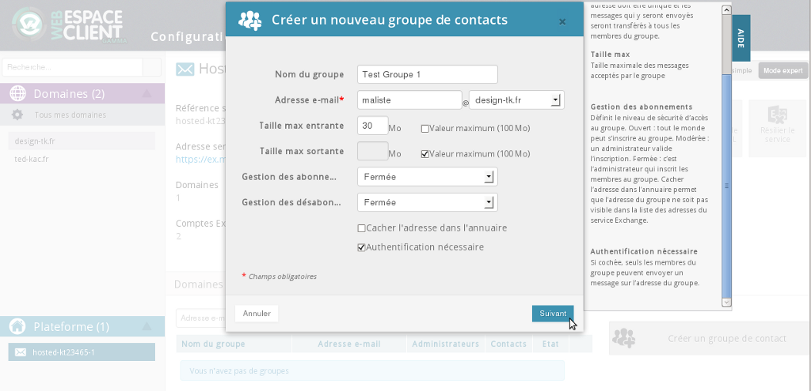
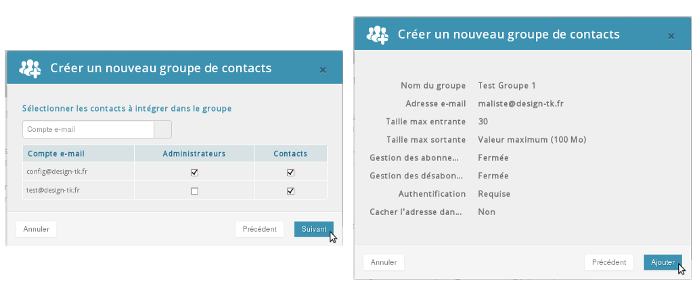
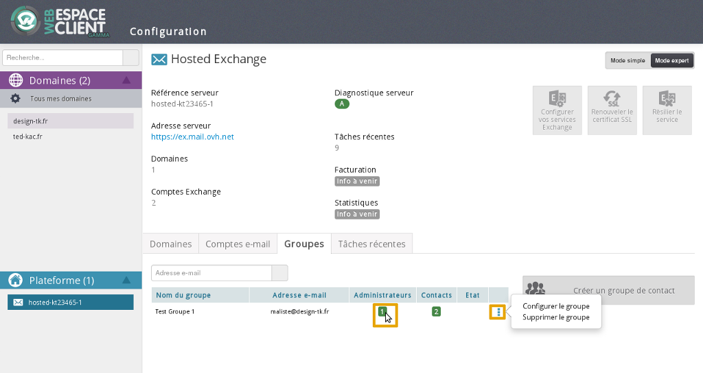

## Aktywacja w panelu Manager - część 1
Najpierw należy zalogować się do [panelu klienta](https://www.ovh.com/manager/web/login.html).

Następnie wybierz usługę Exchange w części "WWW".

W części "Grupy" wybierz opcję "Załóż grupę kontaktów"

{.thumbnail}

## Aktywacja w panelu Manager - część 2
Pojawi się nowy interfejs. Poniżej opisujemy poszczególne elementy:

"Nazwa grupy": nazwa pojawiająca się w [panelu klienta](https://www.ovh.com/manager/web/login.html) oraz w interfejsie [Webmail](https://ex.mail.ovh.net/owa/).

"Adres e-mail": adres e-mail grupy dyskusyjnej. Uwaga: nie można podać adresu, który już istnieje.

"Maksymalny rozmiar wiadomości przychodzących-wychodzących": możesz określić rozmiar załączników dla e-maili przychodzących-wychodzących.

"Zarządzanie abonentami": określa poziom bezpieczeństwa dostępu do grupy. 
Otwarta: każdy może się zapisać do grupy.
Moderowana: administrator zatwierdza zapisy.
Zamknięta: administrator zapisuje członków grupy.

"Ukryj adres w książce adresowej": ukrywanie adresu sprawia, że adres grupy nie jest widoczny na liście adresów usługi Exchange.

"Niezbędna autoryzacja": jeśli opcja ta jest zaznaczona, tylko członkowie grupy mogą wysłać wiadomość na adres grupy.

Kliknij na "Dalej", aby kontynuować.

{.thumbnail}

## Aktywacja w panelu Manager - część 3
Następnie wystarczy zatwierdzić te dwa etapy:

W pierwszej kolejności należy:
Określić "Administratorów" i "Kontakty".
Uwaga: tylko e-maile określone w "Kontaktach" otrzymują wiadomości wysłane na grupę dyskusyjną.
Kontynuuj klikając na "Dalej".

Następnie:

Zakończ operację klikając na "Dodaj".

{.thumbnail}

## Aktywacja w panelu Manager - część 4
Grupa pojawi się po kilku minutach w [panelu klienta](https://www.ovh.com/manager/web/login.html).

Zostaną udostępnione ikony do zarządzania grupami.

{.thumbnail}

## Przykład korzystania z poziomu OWA - część 1
W interfejsie [webmail](https://ex.mail.ovh.net/owa/) możesz wykonać test grupy dyskusyjnej.
Wyślij jeden e-mail na adres grupy.

{.thumbnail}

## Przykład korzystania z poziomu OWA - część 2
Twoja wiadomość powinna zostać poprawnie dostarczona.

{.thumbnail}

