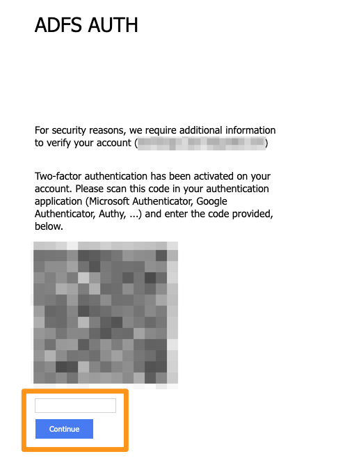

**Ostatnia aktualizacja z dnia 11-03-2020**

## Wprowadzenie

Możesz wzmocnić bezpieczeństwo swojego konta Exchange za pomocą weryfikacji dwuetapowej (2FA). Pozwala ona wygenerować kod, który należy wprowadzić przy każdym logowaniu, jako uzupełnienie zabezpieczenia hasłem. Kod jest generowany przez aplikację *one-time password* (OTP), którą należy zainstalować na smartfonie lub tablecie.

**Odkryj, jak aktywować weryfikację dwuetapową na Twoim koncie Exchange.**

## Wymagania początkowe

- Wykupienie usługi [Exchange OVHcloud](https://www.ovh.com/fr/emails/){.external}.
- Dostęp do [Panelu klienta OVHcloud](https://www.ovh.com/auth/?action=gotomanager).
- Zainstalowanie aplikacji OTP na smartfonie lub tablecie z systemem Android lub iOS.

> [!primary]
>**Aplikacje mobilne OTP**
>
> Istnieje wiele aplikacji OTP. Oto przykładowe dwie z nich, dostępne za darmo:
> 
> - dla systemu Android: Free OTP;
> - dla systemu iOS: OTP Auth.
> 

## W praktyce

### Pierwsza konfiguracja

#### Etap 1: włączenie weryfikacji dwuetapowej w platformie 

Przy pierwszej konfiguracji należy aktywować weryfikację dwuetapową w platformie, aby móc ją włączyć w koncie.

Zaloguj się do swojego [Panelu klienta OVHcloud](https://www.ovh.com/auth/?action=gotomanager) i przejdź do sekcji „Web”. Kliknij `Microsoft`{.action} na pasku usług po lewej stronie, a następnie `Exchange`{.action}. Na koniec wybierz swoją usługę Exchange.

Wybierz kartę `Bezpieczeństwo`{.action} w platformie. Naciśnij przycisk `Aktywuj`{.action}, który znajduje się pod opcją „Weryfikacja dwuetapowa”. Na koniec przejdź na dół strony i kliknij `Zapisz zmiany`{.action}.

{.thumbnail}

#### Etap 2: włączenie weryfikacji dwuetapowej na koncie

Po aktywowaniu weryfikacji dwuetapowej w platformie, możesz ją włączyć dla jednego z Twoich kont.

Pozostając w platformie Exchange, przejdź do karty `Konta e-mail`{.action}. Kliknij `...`{.action} po prawej stronie konta, dla którego chcesz aktywować weryfikację dwuetapową, a następnie  `Aktywuj weryfikację dwuetapową`{.action}.

{.thumbnail}

Aby powiązać konto z Twoją aplikacją OTP, zaloguj się do [poczty webmail](https://mail.ovh.net).

Przy pierwszym logowaniu wyświetlony zostanie kod QR. Zeskanuj go za pomocą aplikacji OTP, a następnie wprowadź wygenerowany w aplikacji kod, aby się zalogować.

{.thumbnail}

Podczas następnych logowań wymagany będzie jedynie kod wygenerowany przez aplikację.

### Wyłączenie weryfikacji dwuetapowej

Weryfikację dwuetapową Twojego konta można wyłączyć na trzy sposoby.

Zaloguj się do swojego [Panelu klienta OVHcloud](https://www.ovh.com/auth/?action=gotomanager) i przejdź do sekcji „Web”. Kliknij `Microsoft`{.action} na pasku usług po lewej stronie, a następnie `Exchange`{.action}. Na koniec wybierz swoją usługę Exchange.

Z poziomu karty `Konta e-mail`{.action} Twojej platformy Exchange kliknij `...`{.action} po prawej stronie konta z aktywną weryfikacją dwuetapową.

{.thumbnail}

Wybierz pożądaną opcję na podstawie poniższej tabeli:

| Nr                 	| Stanowisko    | Opis                                                                                                        	
|----------------------------------	|------------------|------------------|
| 1. | „Wyłącz weryfikację dwuetapową” | Umożliwia dezaktywację weryfikacji dwuetapowej na określoną liczbę godzin. Po upływie określonego terminu weryfikacja dwuetapowa zostanie ponownie włączona.   *Przykład: użytkownik zapomniał smartfona i nie może zalogować się z wykorzystaniem aplikacji OTP.*   |
| 2. | „Zresetuj weryfikację dwuetapową” | Umożliwia ponowne wygenerowanie kodu QR wymaganego przy pierwszym logowaniu do poczty webmail.  *Przykład: użytkownik zmienił smartfona i musi ponownie skonfigurować aplikację OTP.* |
| 3. | „Usuń weryfikację dwuetapową” | Ta opcja powoduje całkowite wyłączenie weryfikacji dwuetapowej w koncie. | 

## Sprawdź również

Dołącz do społeczności naszych użytkowników na stronie<https://community.ovh.com/en>.
