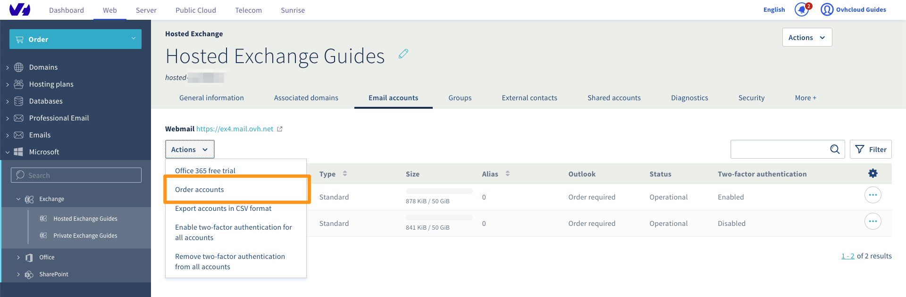
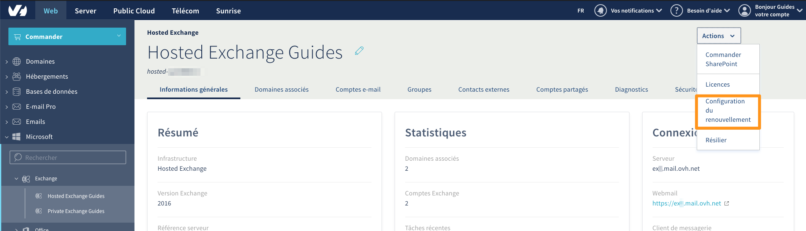
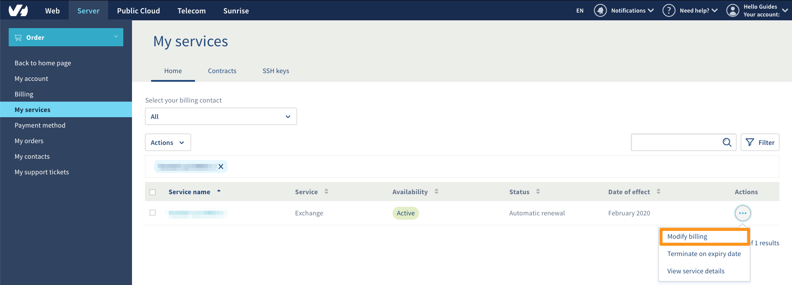
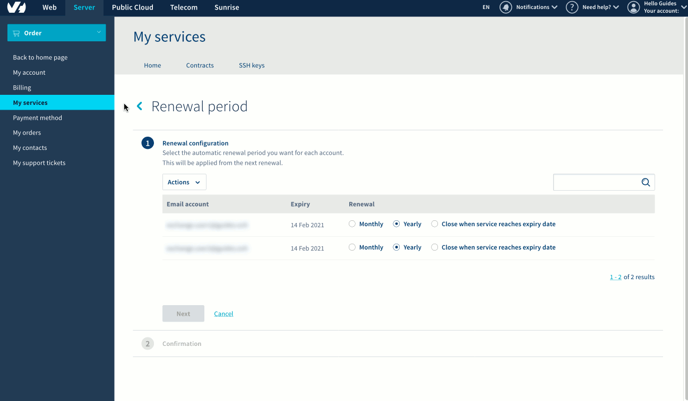
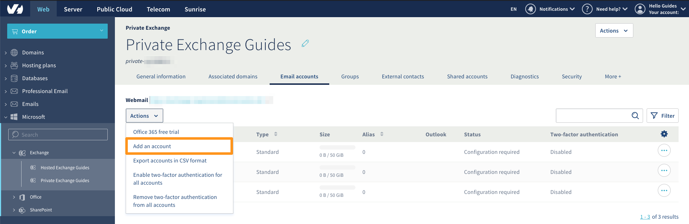
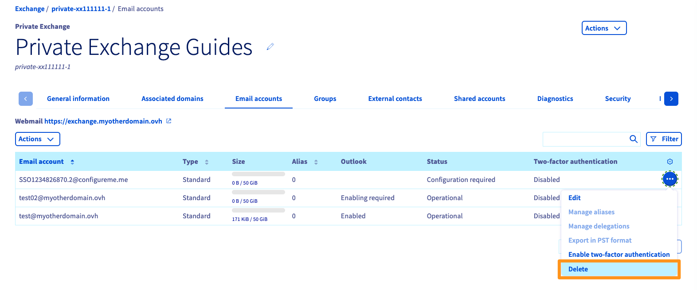

**Last updated 20th April 2020**

## Objective

The Hosted Exchange and Private Exchange services offer flexible management for account billing. This guide details how to configure it.

**This guide explains how to manage subscriptions for your Exchange accounts.**

## Requirements

- access to the [OVHcloud Control Panel](https://www.ovh.com/auth/?action=gotomanager){.external}
- a subscription to an [Exchange](https://www.ovh.co.uk/emails/hosted-exchange/){.external} solution

## Instructions

### Hosted Exchange 

#### Ordering additional accounts

Log in to your [OVHcloud Control Panel](https://www.ovh.com/auth/?action=gotomanager) and select `Web`{.action} in the top navigation bar. Click `Microsoft`{.action} in the services bar on the left-hand side, then `Exchange`{.action}. Next, select the Exchange service concerned.

Go to the `Email accounts`{.action} tab, then click on the `Actions`{.action} button in the top left-hand corner. Next, click `Order accounts`{.action}.

{.thumbnail}

#### Changing the renewal frequency for your accounts

Log in to your [OVHcloud Control Panel](https://www.ovh.com/auth/?action=gotomanager) and select `Web`{.action} in the top navigation bar. Click `Microsoft`{.action} in the services bar on the left-hand side, then `Exchange`{.action}. Next, select the Exchange service concerned.

In the window for managing your Exchange platform, click on the `Actions`{.action} button in the top right-hand corner, then click `Renewal configuration`{.action}. 

{.thumbnail}

You will be redirected to the “My services” section of the OVHcloud Control Panel. You will notice that a filter has been applied, to only display the Exchange platform you are modifying.

Click `...`{.action} to the right of the Exchange platform, then `Modify billing`{.action}.

{.thumbnail}

In this new window, you can view and modify the billing for each of your accounts. You can make changes via the **Renewal** column for one or more accounts at once. Each modification on an account will be applied on the date listed in the **Expiry** column. 

In the example below, you will see the actions you need to take in order to set an account to monthly renewal:

> In the first step, click **Monthly** to the right of the account, then click `Next`{.action}.

> In the second step, you will see a summary listing the change that has been applied. Click `Send`{.action} on the bottom left.

> {.thumbnail}

#### Deleting accounts

To delete an account on your Hosted Exchange platform, you will need to cancel it by setting its renewal configuration to **Cancel on expiry**. To do this, refer to the step on [changing the renewal frequency for your accounts](./#change-the-renewal-frequency-for-your-accounts){.external}.

Once you have cancelled it, the account will be suspended on its expiry date. If you would like to delete the email address hosted by the account before its expiry date, you can reset it.

To do this, log in to your [OVHcloud Control Panel](https://www.ovh.com/auth/?action=gotomanager) and select `Web`{.action} in the top navigation bar. Click `Microsoft`{.action} in the services bar on the left-hand side, then `Exchange`{.action}. Next, select the Exchange service concerned.

Go to the `Email accounts`{.action} tab for your platform, then click `...`{.action} next to the account concerned. Finally, click `Reset`{.action}. Once you have reset the account, it will remain empty until its expiry date.

### Private Exchange

> [!primary]
>
> On a Private Exchange platform, only monthly renewal is available for accounts. You cannot configure any other renewal frequencies.

#### Ordering additional accounts

Log in to your [OVHcloud Control Panel](https://www.ovh.com/auth/?action=gotomanager) and select `Web`{.action} in the top navigation bar. Click `Microsoft`{.action} in the services bar on the left-hand side, then `Exchange`{.action}. Next, select the Exchange service concerned.

Go to the `Email accounts`{.action} tab, then click on the `Actions`{.action} button in the top left-hand corner. Next, click `Add an account`{.action}. The account will be billed for the current month.

{.thumbnail}

#### Deleting accounts

Log in to your [OVHcloud Control Panel](https://www.ovh.com/auth/?action=gotomanager) and select `Web`{.action} in the top navigation bar. Click `Microsoft`{.action} in the services bar on the left-hand side, then `Exchange`{.action}. Next, select the Exchange service concerned.

In the `Email accounts`{.action} tab, click `...`{.action} to the right of the account concerned, then click `Delete`{.action}. The account will be immediately removed from the platform, and you will not need to cancel it.

{.thumbnail}

## Go further

Join our community of users on <https://community.ovh.com/en/>.