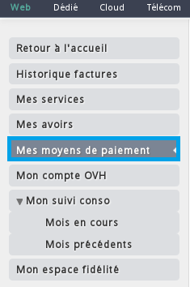
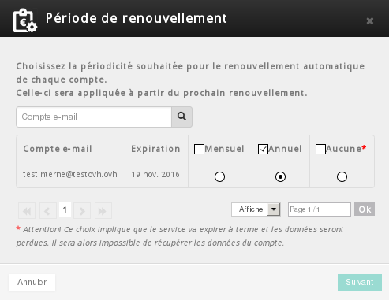
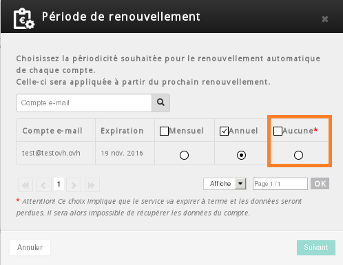
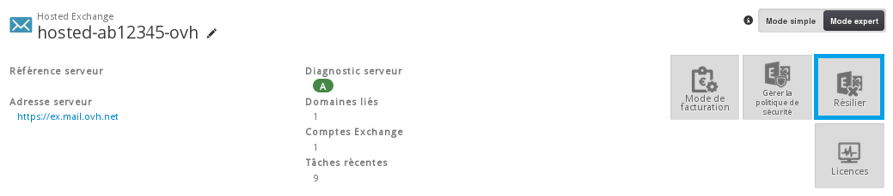

## Le renouvellement automatique

### Généralité
Nos différentes offres Microsoft (Exchange, Office 365) sont par défaut en renouvellement automatique. Deux méthodes sont proposées pour le règlement de vos factures   :

- L'enregistrement d'un moyen de paiement depuis le manager
- L'utilisation du compte OVH

### Methode 1 &#58; L'enregistrement d'un moyen de paiement depuis le manager
Connectez-vous à votre [espace client](https://www.ovh.com/manager/web){.external} à l'aide de votre couple identifiant (nic-handle) - mot de passe.

{.thumbnail}

Sélectionnez ensuite l'onglet "Facturation"

{.thumbnail}

Dans le menu de gauche, sélectionnez "Mes moyens de paiement"

{.thumbnail}

Cliquez ensuite sur "Ajouter un moyen de paiement"

{.thumbnail}

Différents moyens de paiement sont proposés :

- Compte bancaire
- Carte bancaire
- Paypal

### Methode 2 &#58; Le compte OVH
Si vous ne souhaitez pas enregistrer de moyen de paiement, il est possible d'utiliser le compte OVH.

Le compte OVH fonctionne comme un compte bancaire. Son solde est par défaut à 0. Il est possible de le créditer du montant de votre choix (le minimum étant de 10 euros).

Lors de l'émission d'une facture Microsoft, le montant de celle-ci est alors prélevé sur le compte OVH. Si celui-ci a été créditer d'un montant supérieur ou égal au montant de la facture, celle-ci est automatiquement réglée.

Si votre compte OVH n'a pas été crédité ou est d'un montant insuffisant, celui-ci devient débiteur. Vous avez alors un délai de 7 jours pour le créditer.

### Crediter le compte OVH
Si votre compte OVH est débiteur, un e-mail vous est envoyé à ce sujet. Il y a alors plusieurs moyens de le créditer :

- Enregistrer un moyen de paiement afin de réaliser le prélèvement
- Suivre le lien de l'e-mail vers un bon de commande spécifique
- créditer le compte depuis votre espace client

Pour créditer le compte depuis votre espace client, sélectionnez "Facturation" puis "Mon compte OVH" et cliquez sur "Créditer".

Vous pourrez alors choisir le montant à créditer puis en validant générer le bon de commande à cet effet.

## Gerer le renouvellement de son offre Hosted Exchange

### Voir/Modifier votre mode de facturation
Vous souhaitez changer le mode de facturation de annuel en mensuel ou inversement, ou simplement vérifier votre type de renouvellement. Cela est possible depuis votre [espace client](https://www.ovh.com/manager/web){.external}.

Sélectionnez ensuite votre plateforme "Exchange"

{.thumbnail}

Puis onglet "Mode de facturation"

{.thumbnail}

Vous pouvez à ce niveau, vérifier le mode de facturation mis en place. Par défaut le mode de renouvellement est appliqué en fonction de la première commande.

Vous pourrez aussi à tout moment le modifier. Dans ce cas sélectionnez le type de renouvellement souhaité et validez :

- Mensuel
- Annuel
- Aucun

Il est nécessaire que cela soit fait avant la date anniversaire de l'offre.

Modifier le type de renouvellement, n'entraine pas la création d'un bon de commande, cela est automatiquement pris en compte lors de la reconduction de l'offre.

{.thumbnail}

### Arreter le renouvellement
Deux possibilités à ce niveau :

- Stopper le renouvellement d'un compte
- Stopper le renouvellement du service Exchange

> [!alert]
>
> Il est vivement conseillé de réaliser une sauvegarde du compte concerné avant
> sa suspension (export PST).
> 

Pour stopper le renouvellement uniquement d'un ou plusieurs comptes exchange, il est nécessaire de vous connecter à votre [espace client](https://www.ovh.com/manager/web){.external}.

Sélectionnez ensuite votre plateforme "Exchange"

{.thumbnail}

Puis onglet "Mode de facturation"

{.thumbnail}

Si vous ne souhaitez pas renouveler un ou plusieurs comptes, il est nécessaire de cocher "Aucune" et de valider.

{.thumbnail}

> [!alert]
>
> Cette option résilie l'ensemble de la plateforme Exchange. Il est vivement
> conseillé de réaliser une sauvegarde de chaque compte (export PST).
> 

Pour stopper le renouvellement de l'intégralité d'une plateforme exchange, sélectionnez "Résilier" puis valider. Le service sera résilié à la date anniversaire.

{.thumbnail}