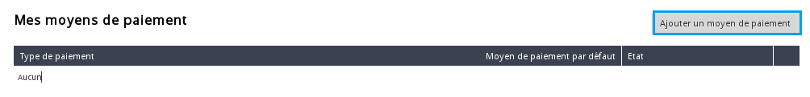
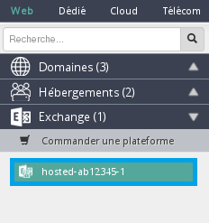
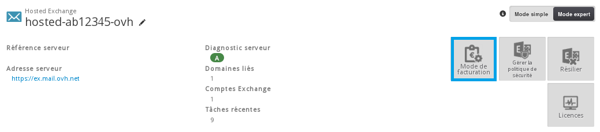

## Informazioni generali
Di default, le nostre soluzioni Microsoft (Exchange 2013/2016, Office 365) si rinnovano automaticamente.

Per saldare le tue fatture, puoi utilizzare il conto OVH registrando una modalità di pagamento dal tuo Spazio Cliente OVH.

## Registra una modalità di pagamento dal tuo Spazio Cliente OVH
Accedi al tuo [Spazio Cliente OVH](https://www.ovh.com/manager/web) utilizzando le tue credenziali (Nic-handle e password).

{.thumbnail}
Seleziona la tab "Fatturazione"

{.thumbnail}
Nel menu di sinistra, selezionaez "I miei metodi di pagamento"

{.thumbnail}
Clicca su "Aggiungi un metodo di pagamento"

{.thumbnail}
Ti vengono proposte queste modalità:

- Paypal
- Carta di credito

## Il conto OVH
Il saldo del conto OVH, di default, è 0.

Quando viene emessa una fattura Microsoft, l'importo viene prelevato e il tuo conto OVH diventa negativo.

Se il credito presente sulla modalità di pagamento che hai impostato è superiore o uguale all'importo da pagare, la fattura viene saldata automaticamente.

Se il credito non è sufficiente, hai 7 giorni di tempo per ricaricare ed effettuare il pagamento.

## Accredita il conto OVH
Se il saldo del tuo conto OVH è negativo, riceverai un'email e potrai scegliere tra più modalità per accreditare il tuo conto:

- registrare una modalità di pagamento per permetterci di effettuare il prelievo
- utilizzare il link presente nell'e-mail per accedere a un buono d'ordine specifico
- accreditare il conto dal tuo Spazio Cliente OVH

Per effettuare quest'ultima operazione, seleziona "Fatturazione", poi "Il mio account OVH" e clicca su "Accredita".

A questo punto, inserisci l'importo da accreditare. Dopo averlo confermato, viene generato il relativo buono d'ordine.

## Visualizza/Modifica la tua modalità di fatturazione
Per modificare la modalità di fatturazione da annuale a mensile o viceversa, o semplicemente verificare il tipo di rinnovo attivo, accedi al tuo [Spazio Cliente OVH](https://www.ovh.com/manager/web).

Seleziona la tua piattaforma "Exchange"

{.thumbnail}
Clicca su "Modalità di fatturazione"

{.thumbnail}
A questo punto, verifica la modalità di fatturazione impostata. Di default la modalità di rinnovo viene applicata in base al primo ordine effettuato, ma puoi modificarla in qualsiasi momento.

Per farlo, seleziona il tipo di rinnovo e conferma:

- Mensile
- Annuale
- Nessuna

Esegui questa operazione prima della data di scadenza dell'offerta.

La modifica del tipo di rinnovo non comporta la creazione di un buono d'ordine e viene registrata automaticamente al rinnovo dell'offerta.

{.thumbnail}

## Disattiva il rinnovo
Hai due possibilità:

- disattivare il rinnovo di un account
- disattivare il rinnovo della tua soluzione Exchange

## Disattiva il rinnovo di un account

Ti consigliamo di eseguire un backup dell'account prima della sua sospensione (export PST).
Per disattivare il rinnovo di uno o più account Exchange, accedi al tuo [Spazio Cliente OVH](https://www.ovh.com/manager/web).

Seleziona la tua piattaforma "Exchange"

{.thumbnail}
Clicca su "Modalità di fatturazione"

{.thumbnail}
Se non vuoi rinnovare uno o più account , seleziona "Nessuna" e conferma.

{.thumbnail}

## Disattiva il rinnovo della piattaforma Exchange

Con questa opzione disattivi tutta la tua piattaforma Exchange. Ti consigliamo di effettuare un backup di tutti gli account (export PST).
Per effettuare questa operazione, seleziona "Recedere" e conferma. Il servizio verrà disattivato alla data di scadenza.

{.thumbnail}

